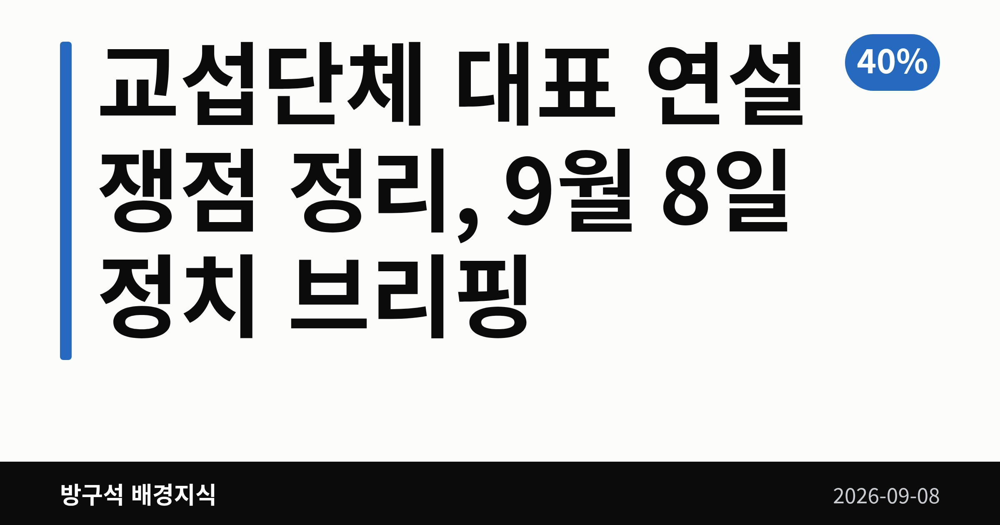
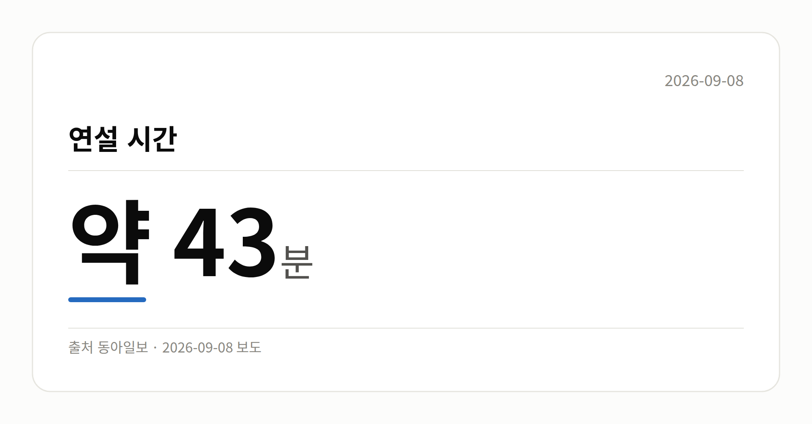
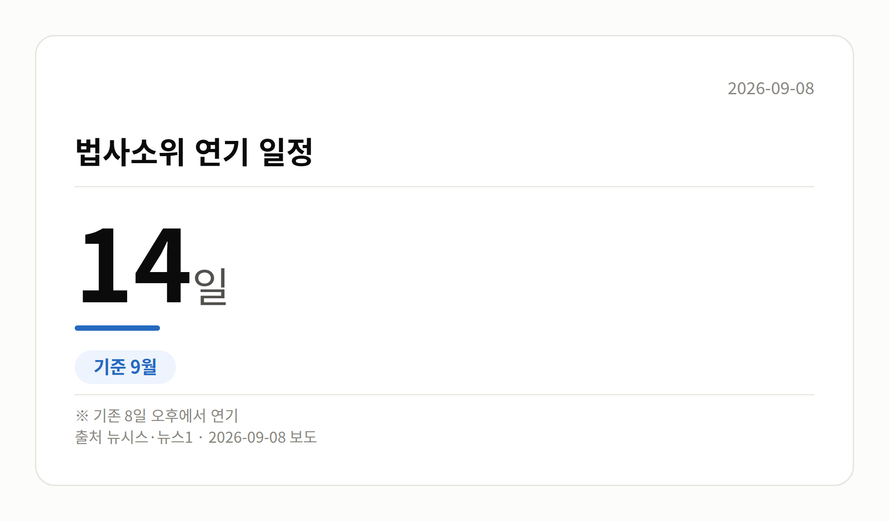

*이 글은 2026년 9월 8일 기준으로 정리한 내용입니다.*
**3줄 요약**

- 정점식 원내대표, 교섭단체 대표 연설서 개헌 거부
- 연설은 약 43분·A4 29장, 본회의장서 고성 오감
- 법사위 소위 14일, 장관 청문회 15~16일 예정
9월 8일 국회 본회의에서 열린 **교섭단체 대표 연설**에서 국민의힘 정점식 원내대표가 "이번 정부에서 개헌은 없다"고 밝혔습니다. 전날 더불어민주당 김민석 대표가 "현실 가능한 개헌을 추진하겠다"고 말한 것과 정면으로 엇갈립니다.

같은 날 국회 법사위는 검찰개혁 후속입법 처리 방식에 합의하며 소위 일정을 14일로 미뤘습니다.

[이미지: 국회 본회의장 전경 사진]

## 교섭단체 대표 연설에서 무슨 말이 나왔나

교섭단체 대표 연설은 각 교섭단체를 대표하는 의원이 국회 본회의에서 하는 정례 연설입니다. 이번은 정점식 원내대표의 취임 후 첫 연설이었습니다.

정 원내대표는 현 정부를 '국민암장정부'로 규정하며 부동산 정책, 레버리지 ETF, 검찰 수사권 폐지 등을 비판했습니다. 이재명 대통령의 재판 재개를 촉구하고, 레버리지 ETF와 관련해 특검 도입을 주장했습니다.

연설 도중 민주당 의원석에서는 "암장은 무슨 암장이냐"는 항의가 나오며 고성이 오갔습니다. 민주당의 별도 입장문이나 해명은 이날 자료에서 확인되지 않았습니다.

## 숫자로 본 이날 연설

| 항목 | 수치 |
| --- | --- |
| 연설 시간 | 약 43분 |
| 연설문 분량 | A4 29장 |
| 공소취소 모임 가입 의원(주장) | 105명 |
| 대법관 증원 규모(주장) | 26명 |

연설에서는 대통령 지지율이 40%를 밑돌았다는 언급과 34.7%라는 특정 여론조사 수치도 나왔습니다. 다만 조사기관·조사기간·오차범위가 자료에 없어, 이 수치들은 연설 중 발언으로만 보는 것이 정확합니다.

## 교섭단체 대표 연설 이후 개헌 논의는

개헌은 국회 재적 의원 3분의 2 이상의 찬성이 필요한 사안이어서, 한 당의 협조 없이는 진행이 어렵습니다. 정 원내대표의 이번 발언으로 국민의힘 참여를 전제한 논의는 당분간 멈춘 상태가 됐습니다.

민주당은 개헌 추진 의지를 유지하고 있습니다. 다만 구체적 논의 창구가 만들어질지, 국민의힘이 입장을 바꿀지는 현재 확인되지 않았습니다.

## 그 밖의 오늘 소식

- 법사위 법안심사1소위, 8일에서 14일로 연기
- 여야, 공소청법·형사소송법 개정안 처리 방식 합의
- 부칙 약 130개 중 내용 변화 부분만 별도 법안으로
- 김한규 의원 "국민의힘, 필리버스터 대신 개별 처리 동의"
- 필리버스터는 표결을 늦추려는 무제한 토론입니다
- 이소영 중기부 후보자 청문회 15일 개최 의결
- 이형일 경제부총리 후보자 청문회도 15일 확정
- 홍지선 국토부 후보자 청문회 16일 개최 의결
- 강민국 의원, 이형일 후보자 주택 이력 문제 제기
- 해당 지적에 대한 후보자 해명은 자료에 없음

## 오늘의 체크포인트

1. 여야 대표 연설에서 개헌 입장이 정면으로 갈렸습니다.
2. 검찰개혁 후속입법은 14일 법사위 소위가 다음 관문입니다.
3. 장관 후보자 청문회는 15일 두 곳, 16일 한 곳입니다.

**그래서 나는?**

- 개헌 관심 유권자라면, 양당 입장 차이를 함께 확인해 보세요
- 집값·정책 관심이라면, 15~16일 청문회 일정을 메모해 두세요
- 법 절차가 궁금하다면, 14일 법사위 소위 결과가 분기점입니다

**직접 센 숫자 — 국회·여론조사 (최근 7일)**

국회의원 발의 법률안 **147건**. 최근 발의: 한국발전공사법안(박해철의원 등 11인)

본회의 처리 법률안 **18건** — 철회 1건 · 원안가결 8건 · 수정가결 9건

이번 주 등록된 선거 여론조사 9건

- 전국 정기(정례)조사 정당지지도 대통령선거 — 여론조사공정(주) · 펜앤마이크 의뢰 · 2026-09-06~07 · 1,015명 · 무선 ARS · 응답률 2.1% · 95% 신뢰수준에 ±3.1%p
- 전국 전체 정기(정례)조사정당지지도대통령선거 — (주)여론조사꽃 · 2026-09-04~05 · 1,002명 · 무선전화면접 · 응답률 9.8% · 95% 신뢰수준에 ±3.1%p
- 전국 전체 정기(정례)조사정당지지도대통령선거 — (주)여론조사꽃 · 2026-09-04~05 · 1,005명 · 무선 ARS · 응답률 2.3% · 95% 신뢰수준에 ±3.1%p

*열린국회정보·중앙선거여론조사심의위원회 자료를 직접 셌습니다. 여론조사의 자세한 사항은 중앙선거여론조사심의위원회 홈페이지를 참조하세요.*

**오늘 나온 정부 발표 원문**

- [[보도자료] 한성숙 국무총리 주재 제17차 소비자정책위원회](https://www.korea.kr/briefing/pressReleaseView.do?newsId=156780719) ( )
  - 첨부 [260908_한성숙 국무총리 주재 제17차 소비자정책위원회 보도자료.hw](https://www.korea.kr/common/download.do?fileId=198548303&tblKey=GMN) · [260908_한성숙 국무총리 주재 제17차 소비자정책위원회 보도자료.pd](https://www.korea.kr/common/download.do?fileId=198548304&tblKey=GMN)
- [[보도자료] 기후대응위, 녹색전환금융 간담회 개최](https://www.korea.kr/briefing/pressReleaseView.do?newsId=156780718) (국무조정실 2026-09-08)
  - 첨부 [260908_기후대응위, 녹색전환금융 간담회 개최 보도자료(최종).pdf](https://www.korea.kr/common/download.do?fileId=198548302&tblKey=GMN) · [260908_기후대응위, 녹색전환금융 간담회 개최 보도자료(최종).hwp](https://www.korea.kr/common/download.do?fileId=198548301&tblKey=GMN)
- [김민재 행안부 차관, 미래대응기금 추진을 위한 지방정부 협조 요청](https://www.korea.kr/briefing/pressReleaseView.do?newsId=156780711) (행정안전부 2026-09-08)
**여러분은 개헌 논의가 이번 국회에서 다시 테이블에 오를 수 있다고 보시나요?**

---

### 참고한 기사

1. **국민의힘 정점식 원내대표가 8일 국회에서 열린 정기국회 제4차 본회의에서 교섭단체 대표 연설을 하고 있다. 2026.9.8 연합뉴스**
   - [전자신문](https://news.google.com/rss/articles/CBMihwlBVV95cUxNR09hZFdqcXdKQmF2al91NmVERUg4alZNQ2YtazFmUEFZTGhGM09peHBmSTRISWNDNjJkcjhlVHJickhvcV9CRTc0WUFveExvcGtuWHYzN2M0V0NpUkd5RnNCTWl5VWt3RGhiNENSTFlPR1lwc0JTYVZmZXM5NnZUSlM2OWkwaF9DVk1kZUhpTl9mcWVHWlU5M2IySFRkRVp5MkMxWUZZNXR0ejg2Q3RMWEZWQXNDQ3diekp0NjZjM3pVWFBCYWdrd3p2R2gyRTg4d05SMjkzcmRFeFdrdXUzQlllS01rWnpfYXVydDN3QmNSR3Nydmp4QVBlMXltVExadUVZQjF4NjdySWttcElURlZJS0k1RGJXbjRfb01neFpKRWhPSG9qXzdSSk5zWGxnV0g0VEtTTzFFVVgtNHVvdkhldlR5NmZGaVBPYWVodXVSQ1NwTng2aE0yWUZyR1k5NFpSQVFSMmFXS19oQWVXM2JROE92THNaQk1jR0hRbXk1UkhzQWlEeElaLU82RzcwRmFQWWFUaktMdy14YnRfbXAwb0hPekNkSUstRmJMY19VRGpJelBQbktwekNQXzFDNHdMX29rS3dtdGl4Rm1uXy10RmFtaTZUUnZsb3dSMVd2ZTlNTkZsSi1CUm5aRUpLUzJ1aEt1R19MODVwODVodWFJMWxmbGJwblBjbk5vWmxUQ2FQVFZkWWM2UktVWlF1ZG5nZ1ZKTVdfZGtuTlF6dmNWbGRlQ3d0UDhtZDB1MEYwZ3gxejJPT1BUYkllWDZRNGdXMElvWDhORXRPbkZTMy1MOV9YTnZGVXJQZXA1Q1plNWVIeGdfUVhMcWNCSTVHZ3J3UkFGbVdraUhXN1hWcG1lX2NlT1hEemZSX05JRzNwYW5fbWhHaUJ5TGMtaTBBWDlhYVlEbWp0dFdrQmgyNEpMLXoyVkVqanhQbXpPR1lEWHNoaC1LTkZOZ0FVRS1ucG5IZk5RTjJmcmlwRklEY2VqT2VvZ2xoYXdMR0RsWVhEUEZNTlpzNGpGbHYtbmVQVVZKb1UyZTRxdW9iNVdPU25DTE4yLVBSTVY0MHRIeWVYellkM0dsSEJsNmVPei0zX2VJQkxxaHZiQWljLW5rMnQxUkVsN3NQdHVvT0xhU04wc3pESXZadzAxeF83Q0EzUDRkYzlxaTBDc0Z5Q28tT0tqZlIwY3JJMFNzbF9KUmF6QWVYOFVCVDVnZW9XcDJxTEpGU3VTQkVqQlhfT0JVV3pkcklqUzlQTDR3aEhPR0l2SjF2S1JkQlFFWHFjdkhqZEVsZ3NjN213anVrWEpJQXhjYzlCSk5IV2dIWVpHS2I3MnRMS3pFcjByMVRvbmV6MFRoQW1ZMHAxZEItd2wzZThWdjA1ZkQxelFyNl8tam1uOVk1SGp6cnFzZ3RaVTF3TXRxY2Y0OWRHejNmN0U1WC1lMksxNk8wczMxcldLbndoMnhVYmhWVm5Cek5RdkpvZ1pKMllFYTFsWlNKTWE2VFowTWgwSmVYSWVETEhBcWplTHJpb3JN?oc=5)
   - [뉴시스](https://news.google.com/rss/articles/CBMieEFVX3lxTE0yU3AzQm1qR1AtV2lGOTNOQzlOS1hvelZqSXFWblo5dnFkbDBhTnZkdGNQNXNPblFhQVNzRFl1XzA1c2pQYWxQcXhVWHFQQ2tEbVR1a1Fyb0JoaTRJRW1sek9CRk1pUDIwY2NtSG80bzhMa0MtR2d2atIBeEFVX3lxTE0yU3AzQm1qR1AtV2lGOTNOQzlOS1hvelZqSXFWblo5dnFkbDBhTnZkdGNQNXNPblFhQVNzRFl1XzA1c2pQYWxQcXhVWHFQQ2tEbVR1a1Fyb0JoaTRJRW1sek9CRk1pUDIwY2NtSG80bzhMa0MtR2d2ag?oc=5)
   - [뉴시스·정치](https://www.newsis.com/view/NISX20260908_0003780732)
2. **정점식 “이번 정부서 개헌 없다…李, 자기재판 암장하려해”**
   - [동아일보·정치](https://www.donga.com/news/Politics/article/all/20260908/134627514/1)
   - [아주경제](https://news.google.com/rss/articles/CBMiWEFVX3lxTE9oMzZLM2hCOS1vaTZNcVQ5SjJlVUdPbTlMQU1oOGhJMWRPRmhtUHc1dVRmZFRMbFhhQldBUFVEZVJ2dy0wdUtZREJxZFBDRVRZVTZCNzluM0LSAVhBVV95cUxPaDM2SzNoQjktb2k2TXFUOUoyZVVHT205TEFNaDhoSTFkT0ZobVB3NXVUZmRUTGxYYUJXQVBVRGVSdnctMHVLWURCcWRQQ0VUWVU2Qjc5bjNC?oc=5)
   - [뉴스1](https://news.google.com/rss/articles/CBMiWkFVX3lxTE53dmhDaDVwa2JPamNoWWFoOUJZSE1NOURhZlBIOHdoVGtzVUNMZmg2V183WmJsbHp3ZWgyVTRUd0R1OUh5Q2VYMkRlQ0QxYnBXY044Qnc1OVBsZ9IBX0FVX3lxTE44NmQzM2o2dnBlYUM5OGxBOWU2VDFSblk2NHVsT2dvcGhFMjFtRVNocUFUeVo0YmxOaTNJMkFfNmVOTjFSSGx5b3pSb1g4d0F2ei1ZOEN5a2FSVDM5eXNB?oc=5)
   - [오마이뉴스·정치](https://www.ohmynews.com/NWS_Web/View/at_pg.aspx?CNTN_CD=A0003265555)
3. **정점식 "李정부에서 개헌은 없다…사적이익 도모 세력과 논의 안해"**
   - [한국경제·정치](https://www.hankyung.com/article/2026090820901)
   - [v.daum.net](https://news.google.com/rss/articles/CBMiT0FVX3lxTE56UFJuQ1NHTFBOck54elNVRVd3dXNUclRaM3AzdVJrZWI0V0lsWGJMSjV6WkI3RHA2Y1I3TlRXR2ZMMFhZT2JXWWFNNjhNbmM?oc=5)
   - [주간조선](https://news.google.com/rss/articles/CBMiakFVX3lxTE5YU01TLWx1NjhNLW9tZmpqRUxuVEYydDlMalBHYTNGdmlRYjZ0ZUhYeDR0eTlhdUtlcVRYeFhnNWJ2UDFJV2ZKSG9QT0RIRHhITmxfYnVuOWN1U2JySlBOa3ZUQWc0WTRXa2fSAW5BVV95cUxQcHJ3bEl3eGQ2T2RJSWhIR2g0SUtaRDdXQTRiVEZVOElZMEZBNEdTMHV4ZG1IeGlXVnJmWGdNY2JaNnpWdGdlSDR4X2VFTDBjTUhsSjJRVjRBR29Ka0NtaExCdDVZUDdGV0F5RXVnUQ?oc=5)
   - [뉴시스·정치](https://www.newsis.com/view/NISX20260908_0003780541)
4. **여야, 檢개혁 후속입법 처리 방식 합의…법사소위 14일로 연기**
   - [뉴시스·정치](https://www.newsis.com/view/NISX20260908_0003781439)
   - [뉴스1](https://news.google.com/rss/articles/CBMiX0FVX3lxTE9jY2ZQbmtYNEdEcGlYNXBuWXBfTVN5VjYyVzc0blo3LVMtaEVxQjdDWXNIWVFZMEtCMU1adzh2dUY3bTgzRld2Ym56eWQ2cDNXWXFUdXd2LU5GWVZ0SUZz0gFfQVVfeXFMT2NjZlBua1g0R0RwaVg1cG5ZcF9NU3lWNjJXNzRuWjctUy1oRXFCN0NZc0hZUVkwS0IxTVp3OHZ1RjdtODNGV3Zibnp5ZDZwM1dZcVR1d3YtTkZZVnRJRnM?oc=5)
5. **이소영 중기부장관 후보자 인사청문회 15일 개최**
   - [경인방송 뉴스](https://news.google.com/rss/articles/CBMiY0FVX3lxTE9YZERFTENUdG9NWFVjZnhpM09fTml6X3NtVC1qWWVia1lNNnpBbVJzRk5UeEdCMHFzT3pDTkxZdlVyNlBJdmtIZktUX1l3c2NzeE5kZWMtQlVEbjF0YlMzSUdqd9IBaEFVX3lxTFBOSVVDNDJoX3cyQUhJQkNYbTJqbmZFTmJFTnk1UURwYlZxQWs5bk41UXVRREs3ZngybFpvWUNueW1HbUlLQUoxUlVMc2xjVk91ZE52VWQyeTA0bmRBd3BfMGcxcFhib2xE?oc=5)
   - [연합뉴스·정치](https://www.yna.co.kr/view/AKR20260908082551030)
   - [뉴시스·정치](https://www.newsis.com/view/NISX20260908_0003781114)
   - [뉴시스·정치](https://www.newsis.com/view/NISX20260908_0003780944)

---

*본 글은 공개된 언론 보도를 정리한 것이며, 특정 정당·후보·인물을 지지하거나 반대하지 않습니다. 인용한 여론조사의 자세한 사항은 중앙선거여론조사심의위원회 홈페이지를 참조하세요.*
