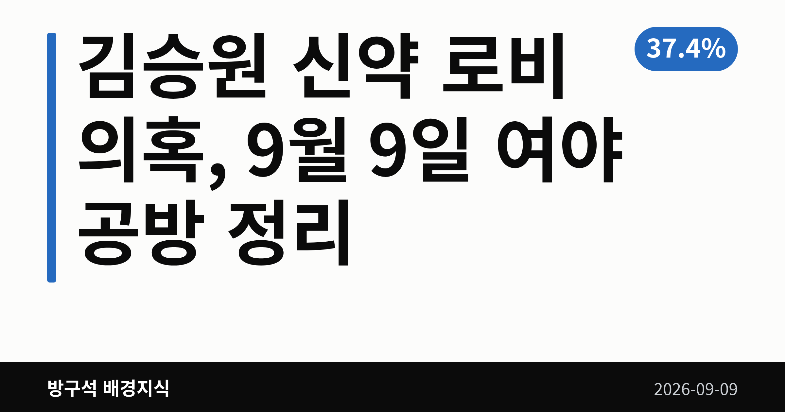
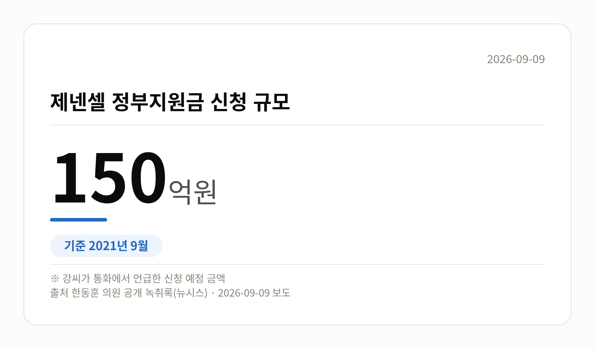
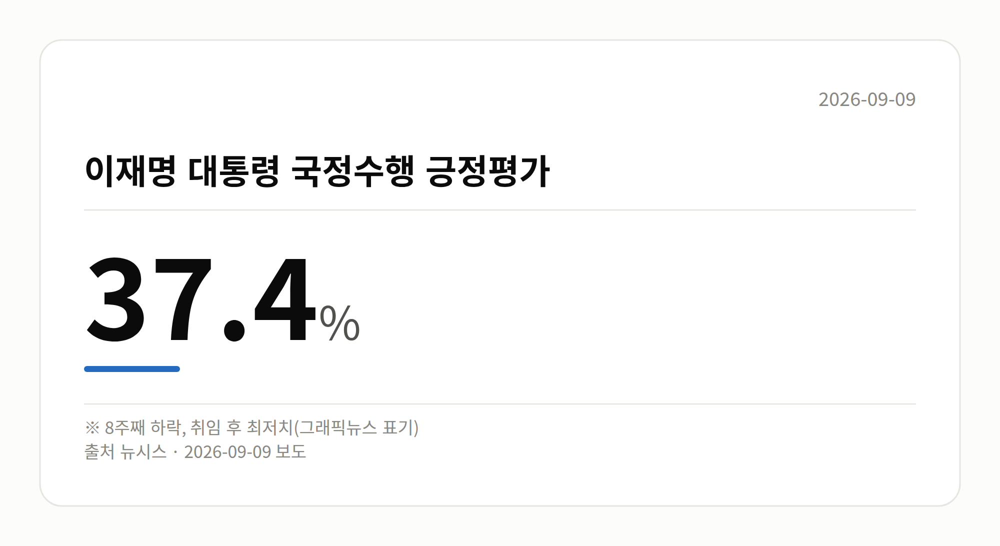

*이 글은 2026년 9월 9일 기준으로 정리한 내용입니다.*
**3줄 요약**

- 한동훈 의원, 김승원 후보자 관련 브로커 녹취록 공개
- 녹취 속 정부지원금 신청 규모는 150억원 언급
- 국민의힘은 사퇴 촉구, 박지원 의원은 자격 문제 제기
9월 8일 여의도의 하루는 **김승원 신약 로비 의혹**을 둘러싼 공방으로 채워졌습니다. 한동훈 무소속 의원이 통화 녹취록을 공개했고, 국민의힘은 후보자 사퇴를 요구했으며, 박지원 더불어민주당 의원은 이를 반박했습니다.

먼저 짚어 둘 점이 있습니다. 지금 나온 내용은 수사나 재판으로 확정된 사실이 아니라 '의혹' 단계입니다.

[이미지: 국회 본관 앞 전경과 취재진이 모여 있는 모습]

## 김승원 신약 로비 의혹, 공개된 녹취록에는 무엇이 담겼나

한동훈 의원은 9월 8일 페이스북에 김승원 법무부 장관 후보자의 신약 청탁 의혹과 관련된 브로커 양모씨의 통화 녹취록을 올렸습니다. 한동훈 의원에 따르면 2021년 9월 양씨와 신약업체 제넨셀 대표 강모씨가 나눈 통화입니다.

녹취록에서 양씨는 "식약처 원장이랑 최재성 국회의원이랑 되게 친해요", "한병도랑 최재성은 엄청 친하고, 한병도랑 송영길이 되게 친하다"고 말한 것으로 나타났습니다. 강씨는 150억원 규모 정부지원금 신청과 관련해 "민주당 이런 분들이 한마디라도 해주면 조금 수월해지지 않을까 싶다"고 말한 것으로 담겼습니다.

한동훈 의원은 "우연히 만난 최재성 전 수석에게 양씨가 도대체 왜 저런 은밀한 제넨셀 신약 진행 상황을 상의하는 것인가"라며 의혹을 제기했습니다. 다만 이는 브로커의 발언이고, 거론된 인사들이 실제로 개입했는지는 확인되지 않았습니다. 이들의 해명 역시 자료에서는 확인되지 않았습니다.

## 양쪽의 말: 사퇴 요구와 자격 논란

국민의힘은 같은 날 김승원 후보자와 용혜인 의원의 사퇴를 촉구했습니다. 또 '김현지 인사농단' 의혹과 관련해 관련자가 국회 증언대에 서야 한다고 주장했습니다. 이 의혹의 구체적 근거와 민주당·용혜인 의원 측 반응은 확인되지 않았습니다.

박지원 의원은 페이스북에서 한동훈 의원을 겨냥해 "법사위원으로 보임될 자격이 없음에도 청문위원이 되고 싶다고 앵벌이한다"고 적었습니다. 또 검사 11명이 3년간 수사하고도 기소하지 않았다는 점을 들며, 당시 수사 자체를 특검(별도로 임명된 특별검사가 맡는 수사) 대상으로 삼아야 한다고 주장했습니다. 한동훈 의원 측의 직접 반론은 확인되지 않았습니다.

| 항목 | 수치 | 말한 사람 |
|---|---|---|
| 제넨셀 정부지원금 신청 규모 | 150억원 | 녹취 속 강씨(한동훈 의원 공개) |
| 과거 수사 기간 | 3년 | 박지원 의원 |
| 수사 참여 검사 | 11명 | 박지원 의원 |

## 그 밖의 오늘 소식

- 뉴시스 그래픽뉴스, 이재명 대통령 긍정평가 37.4%·8주째 하락
- 해당 수치는 조사기관·기간·오차범위가 자료에 없어 확인 불가
- 이재명 대통령, 마크롱 대통령과 회담…호르무즈 해협 공조 논의
- 청와대 "파병 아닌 기여 방안을 논의했다"
- 8일 정치 분야 대정부질문, 개각·개헌·대법관 제청 놓고 충돌

## 오늘의 체크포인트

1. 김승원 신약 로비 의혹은 녹취록 공개로 검증 범위가 넓어졌지만, 아직 확인되지 않은 의혹 단계입니다.
2. 국민의힘은 사퇴를, 박지원 의원은 과거 수사에 대한 특검을 각각 요구하며 주장이 맞서 있습니다.
3. 다음에 볼 것은 김승원 후보자에 대한 재수사 여부 결정과 인사청문 절차의 진행입니다.

**그래서 나는?**

- 뉴스만 훑는 유권자라면, 아직 '의혹' 단계라는 점부터 확인하세요
- 인사청문회를 지켜보는 분이라면, 위원 명단과 일정이 달라질 수 있습니다
- 여론조사 수치를 보는 분이라면, 조사기관과 오차범위를 함께 찾아보세요

**직접 센 숫자 — 국회·여론조사 (최근 7일)**

이번 주 등록된 선거 여론조사 8건

- 전국 정당지지도 정기(정례)조사 — 한길리서치 · 쿠키뉴스 의뢰 · 2026-09-05~07 · 1,018명 · 무선 ARS · 응답률 2.5% · 95% 신뢰수준에 ±3.1%p
- 전국 정기(정례)조사 정당지지도 대통령선거 — 조원씨앤아이 · 스트레이트뉴스 의뢰 · 2026-09-05~07 · 2,001명 · 무선 ARS · 응답률 4% · 95% 신뢰수준에 ±2.2%p
- 전국 정기(정례)조사 정당지지도 대통령선거 — 여론조사공정(주) · 펜앤마이크 의뢰 · 2026-09-06~07 · 1,015명 · 무선 ARS · 응답률 2.1% · 95% 신뢰수준에 ±3.1%p

*열린국회정보·중앙선거여론조사심의위원회 자료를 직접 셌습니다. 여론조사의 자세한 사항은 중앙선거여론조사심의위원회 홈페이지를 참조하세요.*
**여러분은 이런 의혹 보도를 볼 때, 어디까지가 확인된 사실이고 어디부터가 주장인지 어떻게 구분해서 보시나요?**

---

### 참고한 기사

1. **행정안전부(9월9일 수요일)**
   - [뉴시스·정치](https://www.newsis.com/view/NISX20260908_0003781543)
   - [뉴시스·정치](https://www.newsis.com/view/NISX20260908_0003781610)
   - [뉴시스·정치](https://www.newsis.com/view/NISX20260908_0003781606)
2. **국회 정치 분야 대정부질문…與野, 개각·개헌·대법관 제청 등 정면충돌**
   - [OBC 뉴스](https://news.google.com/rss/articles/CBMiaEFVX3lxTE93Sm1WSHZmd3JPcDhaRXR4Wm1FNnYyTUR5eDB1WXZQMmozNEhzTmpZdjhpbmJXWjhSbk0ycXBnNUhCSUVpdS1VMk1TckNOc0JnUGFQMzg1d3V4SWFETF9rdVV5bjlROUJU?oc=5)
   - [v.daum.net](https://news.google.com/rss/articles/CBMiT0FVX3lxTE9VOEotTkpVeG9ZSFoyNlhMdzlXV3VVUWJnNHA0Q1VBZ2ltVHFhSmJuVUxZT0lxVEtLa1JydTZwQ1RQSThLYldoMzhFSHRDTnc?oc=5)
   - [뉴시스·정치](https://www.newsis.com/view/NISX20260908_0003781503)
3. **한동훈, 김승원 브로커 녹취 공개…"최재성, 식약처 원장이랑 친해"(종합2보)**
   - [뉴시스·정치](https://www.newsis.com/view/NISX20260908_0003781631)
4. **국힘, 김승원·용혜인 사퇴 촉구 공세…"김현지 인사농단, 국회 증언대 서야"**
   - [뉴시스·정치](https://www.newsis.com/view/NISX20260908_0003781476)
5. **박지원 "한동훈, 청문위원 하고 싶다고 앵벌이…그럴 거면 복당했어야"**
   - [뉴시스·정치](https://www.newsis.com/view/NISX20260908_0003781604)

---

*본 글은 공개된 언론 보도를 정리한 것이며, 특정 정당·후보·인물을 지지하거나 반대하지 않습니다. 인용한 여론조사의 자세한 사항은 중앙선거여론조사심의위원회 홈페이지를 참조하세요.*
