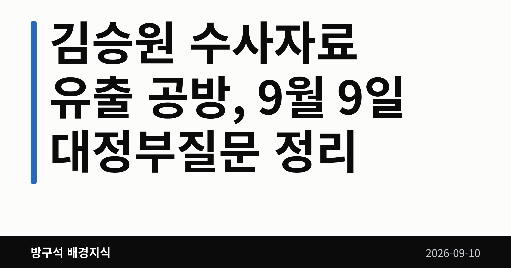
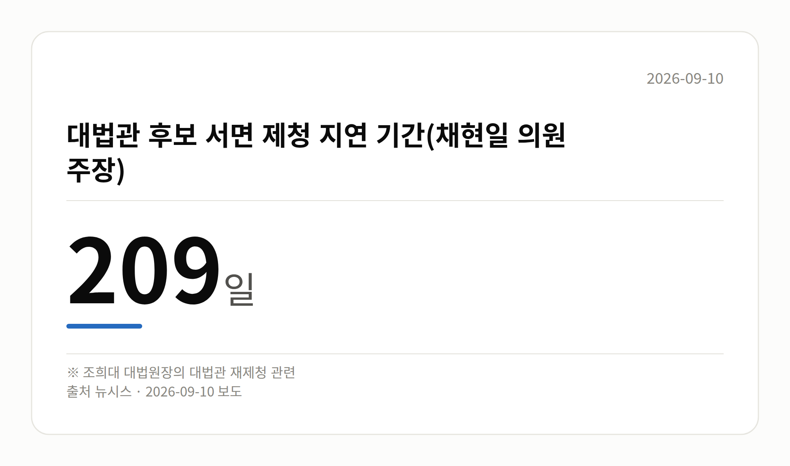

*이 글은 2026년 9월 10일 기준으로 정리한 내용입니다.*
**3줄 요약**

- 9일 대정부질문 쟁점은 김승원 수사자료 유출 공방
- 채현일 의원은 대법관 제청 209일 지연을 주장
- 총리·법무차관의 유출 경위 확인 결과가 다음 관전 포인트
9일 국회 대정부질문에서 김승원 수사자료 유출 문제를 놓고 여야가 맞붙었습니다. 한성숙 국무총리와 이진수 법무부 장관 직무대행은 유출 경위와 위법 여부를 확인하겠다고 밝혔습니다. 다만 유출이 실제로 있었는지, 위법인지는 아직 확인되지 않은 단계입니다.

[이미지: 국회 본회의장에서 대정부질문이 진행되는 모습]

## 김승원 수사자료 유출, 대정부질문에서 오간 말

대정부질문(국회의원이 총리·장관에게 국정 현안을 따져 묻는 절차) 첫날 쟁점은 김승원 법무부 장관 후보자의 '신약 임상시험 승인 청탁' 의혹이었습니다. 이 의혹은 아직 수사나 사실 확정 단계가 아닙니다.

- 더불어민주당 이해식 의원은 한동훈 무소속 의원이 녹취록을 "가위질·짜깁기"했다며 감찰과 관련자 처벌을 요구했습니다.
- 같은 당 전용기 의원은 검찰 내부 수사자료가 특정 정치인에게 전달됐다는 취지로 문제를 제기했습니다.
- 국민의힘 나경원 의원은 김현지 청와대 실장 등 인사검증 시스템 문제와 용혜인 성평등가족부 장관 후보자의 의원직 유지 문제를 제기했습니다.
- 한동훈 의원은 같은 날 "검찰로부터 자료를 받은 거 없다"며 김민석 더불어민주당 대표를 고발하겠다고 밝혔습니다(뉴시스 헤드라인). 구체적 반박 내용은 자료로 확인되지 않았습니다.

## 정부는 뭐라고 답했나

이진수 법무부 장관 직무대행은 공개된 녹취록 등이 "검찰 내부에서 유출됐다면 범죄"라고 말했습니다. 이어 "공개된 내용 상당 부분이 검찰의 사건 처리 예정 보고서와 상당히 동일하다는 보고를 받았다"고 답했습니다.

경향신문에 따르면 이 직무대행은 수사 자료 제공이 공무상 비밀누설과 개인정보보호법 위반에 해당할 수 있다며 "수사 담당자와 대검 보고라인이 특정된 상태"라고 말했습니다. 이는 직무대행의 발언일 뿐, 수사 결과나 기소가 확정된 것은 아닙니다.

한성숙 총리는 "관계 기관을 통해 유출 경위와 위법 여부, 사실관계를 면밀히 확인하도록 지시하겠다"고 밝혔습니다.

## 오늘 나온 숫자, 209일

민주당 채현일 의원은 조희대 대법원장이 대법관 후보 서면 제청을 209일 동안 미뤘다고 비판했습니다(뉴시스). 이 기간은 채 의원 측 주장이며, 조희대 대법원장 측 설명은 이 자료에서 확인되지 않았습니다.

[이미지: 회의장 책상 위에 놓인 수첩과 펜 근접 사진]

## 그 밖의 오늘 소식

- 김민석 대표 수첩의 '서울시장 후보' 메모가 포착됐습니다.
- '훈식' '원식' '청래'로 보이는 이름이 적혔다는 보도입니다.
- 일부 글씨는 흐릿해 식별이 어렵다는 지적도 있습니다.
- 정청래 의원은 페이스북에 "불쾌하다"고 적었습니다.
- 김민석 대표 본인의 공식 설명은 확인되지 않았습니다.
- 오세훈 서울시장 형 확정 여부와 시점은 미정입니다.
- 한 총리는 5·18 토론회 논란에 "참담하다"고 말했습니다.
- 경찰개혁은 총리실이 최종안을 낸다고 밝혔습니다.

## 오늘의 체크포인트

- 10일 오후 2시 대정부질문(외교·통일·안보)이 이어집니다.
- 같은 날 국회 국방위원회 전체회의가 열립니다.
- 김승원 수사자료 유출 경위 확인 결과 발표 여부가 남았습니다.

**그래서 나는?**

- 뉴스만 훑는 분이라면, 오늘은 '확인 지시' 단계라는 점만 기억하세요
- 서울에 사는 유권자라면, 보궐선거 가능성은 아직 미정입니다
- 국회 일정 챙기는 분이라면, 10일 대정부질문과 국방위를 보세요

**직접 센 숫자 — 국회·여론조사 (최근 7일)**

국회의원 발의 법률안 **216건**. 최근 발의: 국회법 일부개정법률안(박정하의원 등 10인)

본회의 처리 법률안 **18건** — 철회 1건 · 원안가결 8건 · 수정가결 9건

이번 주 등록된 선거 여론조사 9건

- 전국 정기(정례)조사 대통령선거 정당지지도 국정현안 등 — (주)코리아정보리서치 · 천지일보 의뢰 · 2026-09-07~08 · 1,000명 · 무선 ARS · 응답률 3.6% · 95% 신뢰수준에 ±3.1%p
- 전국 정기(정례)조사 정당지지도 — 미디어토마토 · 뉴스토마토 의뢰 · 2026-09-07~08 · 1,035명 · 무선 ARS · 응답률 2.4% · 95% 신뢰수준에 ±3.0%p
- 전국 정당지지도 정기(정례)조사 — 한길리서치 · 쿠키뉴스 의뢰 · 2026-09-05~07 · 1,018명 · 무선 ARS · 응답률 2.5% · 95% 신뢰수준에 ±3.1%p

*열린국회정보·중앙선거여론조사심의위원회 자료를 직접 셌습니다. 여론조사의 자세한 사항은 중앙선거여론조사심의위원회 홈페이지를 참조하세요.*

**오늘 나온 정부 발표 원문**

- [우리 가족의 사생활, 관계기관이 손잡고 더 촘촘히 지킨다](https://www.korea.kr/briefing/pressReleaseView.do?newsId=156780900) (행정안전부 2026-09-09)
  - 첨부 [260910 (16시) 우리 가족의 사생활 관계기관이 손잡고 더 촘촘히 ](https://www.korea.kr/common/download.do?fileId=198549076&tblKey=GMN) · [260910 (16시) 우리 가족의 사생활 관계기관이 손잡고 더 촘촘히 ](https://www.korea.kr/common/download.do?fileId=198549077&tblKey=GMN)
- [경주지진 10년, 지진방재의 미래 10년을 논하다](https://www.korea.kr/briefing/pressReleaseView.do?newsId=156780888) (행정안전부 2026-09-09)
- [구혁채 제1차관, 국회에서 양자 분야 발전방향 논의](https://www.korea.kr/briefing/pressReleaseView.do?newsId=156780851) (과학기술정보통신부 2026-09-09)
**여러분은 이번 공방에서 어떤 부분이 가장 먼저 정리돼야 한다고 보시나요?**

---

### 참고한 기사

1. **행정안전부(9월10일 목요일)**
   - [연합뉴스](https://news.google.com/rss/articles/CBMiW0FVX3lxTFBndlRabUNqM3E1V1UtUkFfNUw3RjJUX2dEb2JSOWVrdEJQLTFhMmlkODdZTGdLaXZGbGYxQXFOdmgtbFpRb0tzeG82TVdDZnViVW9PVmtoQl9uelnSAWBBVV95cUxQS2pZZXNPSkFVTjhncUdkcWp2MVh0blF5b2gxUnNEQzFMMXBFOS12MVFZMkFGeVBwbzN1TTcxWGtuaHhoa3lRamRYei1mMU9fLVJXSERyZ0lOd0NhcHVPN0Y?oc=5)
   - [뉴시스·정치](https://www.newsis.com/view/NISX20260909_0003783324)
   - [뉴스1](https://news.google.com/rss/articles/CBMiYEFVX3lxTE9rRHNYaVlGVXF2dEZvTC1BOVVJa25xeFNKRUlzRnhCQXhUajV5YzhTM3R3UENzb3VLN3dnSi1DdF95TUx5bWc2QjV0OGpXbGdKRTNET2NuWTFxR2JMU2lKLdIBYEFVX3lxTE9rRHNYaVlGVXF2dEZvTC1BOVVJa25xeFNKRUlzRnhCQXhUajV5YzhTM3R3UENzb3VLN3dnSi1DdF95TUx5bWc2QjV0OGpXbGdKRTNET2NuWTFxR2JMU2lKLQ?oc=5)
   - [뉴시스·정치](https://www.newsis.com/view/NISX20260909_0003783362)
2. **김민석 수첩에 ‘서울시장 후보 훈식 원식 청래’… 정청래 “불쾌하다”**
   - [동아일보·정치](https://www.donga.com/news/Politics/article/all/20260910/134639480/2)
   - [조선일보](https://news.google.com/rss/articles/CBMihgFBVV95cUxOT3l0aVNuU2EzRXJ2eXBNc0ZOVFZTRklIT3NNZlRqbnpLbmZGVW5ZVVNFaGFVdWJHNm5DRV9fSUJWajQ4UWQybUdPaWk3aVNVbXBMZUpGYnJzSTR5Z3dzSGp2czg1SDViVVZ3RVlrYWkzVXNfY0JaYlNuZlFPUU9aR202ZzFrUQ?oc=5)
   - [주간조선](https://news.google.com/rss/articles/CBMia0FVX3lxTFB6OUxwbDZReTFxMjVKbWFmRGM3d1NkSTJHYjVtMzhOd1hYR00yZzV6bVVUU3k3VWJuSFRiNnVjRjZXQjZCeEIxMEY0ckpDUzJxNncwVExXaGdLUVFKMm1mNGxKVUdMV0JWRmIw0gFuQVVfeXFMTVYyWXRyLUN4bWw2Ym4tNXAzR3RySUUyVUdveVdQSGRPeXRrTkY1ZHd4T1o1aVZ1V2htUzRac0U3UWJvMTE1MXp6U2VEMEJqUTFHNFpSMjVkWDU4THVxdDBTajdlYVJ0d1FGcGY3LVE?oc=5)
   - [경향신문·정치](https://www.khan.co.kr/article/202609092005001)
3. **여야, 대정부질문 첫날 '김승원 격돌'…與 "수사자료 공개 위법" vs 野 "명심 개각 바꿔야"**
   - [뉴시스·정치](https://www.newsis.com/view/NISX20260909_0003783259)
   - [경향신문·정치](https://www.khan.co.kr/article/202609091813011)
4. **법무장관 대행 “한동훈 ‘김승원 檢수사자료’ 유출됐다면 범죄…수사해야”**
   - [동아일보·정치](https://www.donga.com/news/Politics/article/all/20260909/134636306/1)
   - [경향신문·정치](https://www.khan.co.kr/article/202609091622021)
   - [연합뉴스·정치](https://www.yna.co.kr/view/AKR20260909134200004)
5. **韓총리, 한동훈 녹취록 공개 논란에 "유출경위·위법여부 확인"(종합)**
   - [연합뉴스·정치](https://www.yna.co.kr/view/AKR20260909126851001)
   - [BBS불교방송](https://news.google.com/rss/articles/CBMia0FVX3lxTFBMd2wyUlJFSHcxQ0tYWEpCamd4bGlYbFlrcThJUkwwenF0SEJMN0R2WVY0aVdzUm5RSTFhNzhUc0c4Sm9ibVVYQ2pxUUR1OWk4UHZ5cUQ1Q3VrMkZhTFBnR0x0X29YeWxjZ0hz?oc=5)
   - [동아일보·정치](https://www.donga.com/news/Politics/article/all/20260909/134635540/1)
   - [연합뉴스·정치](https://www.yna.co.kr/view/AKR20260909126800001)

---

*본 글은 공개된 언론 보도를 정리한 것이며, 특정 정당·후보·인물을 지지하거나 반대하지 않습니다. 인용한 여론조사의 자세한 사항은 중앙선거여론조사심의위원회 홈페이지를 참조하세요.*
