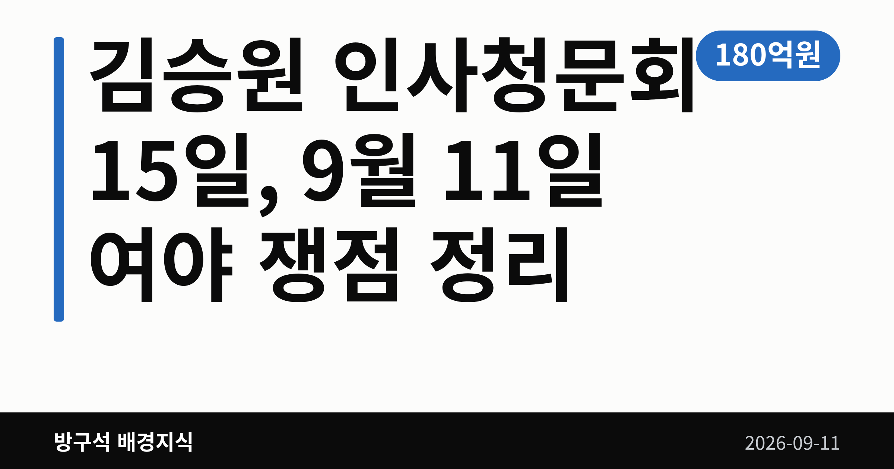
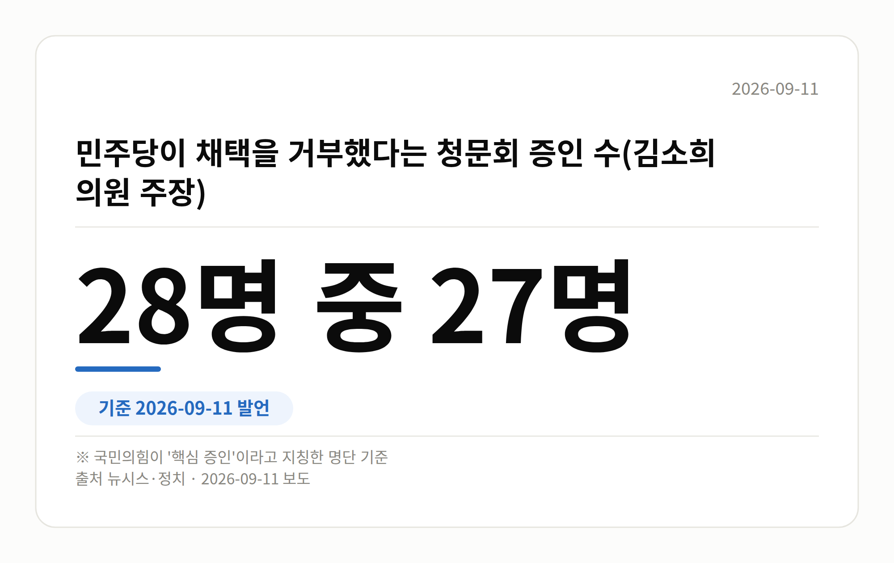

*이 글은 2026년 9월 11일 기준으로 정리한 내용입니다.*
**3줄 요약**

- 김승원 인사청문회를 두고 여야가 정면으로 맞섰습니다
- 증인 28명 중 27명 거부 주장, 청문회는 9월 15일 예정
- 증인 명단 협의 결과부터 확인하면 흐름이 보입니다
9월 11일 정치권의 중심은 김승원 인사청문회였습니다. 국민의힘은 청문회 대신 국정조사를 하자고 했고, 더불어민주당은 후보자를 지키겠다고 맞섰습니다. 청문회는 오는 9월 15일로 예정돼 있습니다.

[이미지: 국회의사당 외경을 담은 사진]

## 김승원 인사청문회, 무엇을 두고 부딪쳤나

정점식 국민의힘 원내대표는 11일 오전 국회 원내대책회의에서 "김승원 후보자는 인사청문회가 아니라 국정조사를 받아야 한다"고 말했습니다.

국정조사(국회가 특정 사안을 정해 따로 조사하는 절차)는 인사청문회보다 다루는 범위가 넓습니다. 정 원내대표는 "단순한 개인 비리가 아니라 로비와 주가조작이 등장하는 게이트"라고 주장했습니다.

그는 KH필룩스를 언급하며 배상윤 KH그룹 회장을 "인터폴 적색수배자"라고 표현하기도 했습니다. 모두 회의에서 나온 주장이고, 수사나 판결로 확인된 내용은 오늘 자료에 없습니다.

같은 날 김민석 더불어민주당 대표는 충북 청주 충북도청 최고위원회의에서 "지켜보면 지켜볼수록 잘된 인사"라며 "지킬 것"이라고 말했습니다. 청문회는 안정적으로 진행하면 된다는 취지입니다.

김 대표는 한동훈 전 대표를 겨냥해 "관종 정치는 검찰 잔당의 내란 연속 행위"라고도 했습니다. 이에 대한 한 전 대표의 반응은 오늘 자료에서 확인되지 않았습니다.

## 숫자로 보는 김승원 인사청문회 공방

| 항목 | 수치 |
|---|---|
| 청문회 예정일 | 9월 15일 |
| 작전 세력 추정 수익 | 180억원 |
| 손실을 봤다는 개미투자자 | 3만명 |
| 증인 채택 거부 | 28명 중 27명 |
| 용혜인 후보 부정 응답 | 72.2% |

위 두 수치는 정점식 원내대표가 회의에서 밝힌 내용입니다. 아래 두 줄은 국민의힘 김소희 의원이 말한 숫자입니다.

특히 72.2%는 조사기관과 조사 기간, 오차범위가 오늘 자료에 나오지 않습니다. 숫자 자체로만 받아들이시는 편이 안전합니다.

## 김승원 인사청문회까지 남은 절차

지금 정해진 것은 15일이라는 날짜뿐입니다. 국정조사나 특검은 국민의힘이 요구한 단계이고, 실제로 열리려면 국회 의결을 거쳐야 합니다.

증인 채택도 여야 간사 협의 사항이라 청문회 직전까지 조정될 수 있습니다. 의혹은 아직 제기된 단계이며, 김승원 후보자 본인의 해명은 오늘 자료에서 확인되지 않았습니다.

[이미지: 국회 청문회장 빈 좌석과 명패를 담은 사진]

## 그 밖의 오늘 소식

- 민주당, 용혜인 후보 겸직 논란에는 거리 두기
- 국민의힘 "임명 강행은 민심과의 전면전 선포"
- 정점식 "증인 없는 청문회로 밝힐 것 없다"
- 김민석 "한동훈, 반드시 처벌" 발언

## 오늘의 체크포인트

- 김승원 인사청문회는 9월 15일로 예정돼 있습니다.
- 증인 채택 협의 결과가 청문회 진행 방식을 좌우합니다.
- 국정조사와 특검 요구는 아직 주장 단계에 있습니다.

**그래서 나는?**

- 뉴스를 처음 따라가는 분이라면, 9월 15일 날짜만 기억하셔도 됩니다
- 주식 투자자라면, 언급된 수치가 아직 주장 단계라는 점을 보세요
- 이번 정기국회 관심 유권자라면, 증인 채택 협의 결과를 확인해 보세요

**직접 센 숫자 — 국회·여론조사 (최근 7일)**

국회의원 발의 법률안 **219건**. 최근 발의: 공항시설법 일부개정법률안(임문영의원 등 10인)

본회의 처리 법률안 **1건** — 철회 1건

이번 주 등록된 선거 여론조사 11건

- 전국 정기(정례)조사 정당지지도 — 한국갤럽조사연구소 · 한국갤럽 자체 조사 의뢰 · 2026-09-08~10 · 1,000명 · 무선전화면접 · 응답률 9.4% · 95% 신뢰수준에 ±3.1%p
- 전국 정기(정례)조사 정당지지도 — (주)엠브레인퍼블릭 · ㈜엠브레인퍼블릭, 케이스탯리서치, ㈜코리아리서치인터내셔널, ㈜한국리서치 의뢰 · 2026-09-07~09 · 1,002명 · 무선전화면접 · 응답률 15.4% · 95% 신뢰수준에 ±3.1%p
- 전국 정기(정례)조사 대통령선거 정당지지도 국정현안 등 — (주)코리아정보리서치 · 천지일보 의뢰 · 2026-09-07~08 · 1,000명 · 무선 ARS · 응답률 3.6% · 95% 신뢰수준에 ±3.1%p

*열린국회정보·중앙선거여론조사심의위원회 자료를 직접 셌습니다. 여론조사의 자세한 사항은 중앙선거여론조사심의위원회 홈페이지를 참조하세요.*

**오늘 나온 정부 발표 원문**

- [지역공동체 살리는 「사회연대경제기본법」제정 성과에 3천만 원 특별성과포상금 수여](https://www.korea.kr/briefing/pressReleaseView.do?newsId=156781298) (행정안전부 2026-09-11)
  - 첨부 [260912 (조간) 지역공동체 살리는 「사회연대경제기본법」 제정 성과에](https://www.korea.kr/common/download.do?fileId=198550827&tblKey=GMN) · [260912 (조간) 지역공동체 살리는 「사회연대경제기본법」 제정 성과에](https://www.korea.kr/common/download.do?fileId=198550828&tblKey=GMN)
- [신임 국립어린이청소년극단 단장 겸 예술감독에 어연선 씨 임명](https://www.korea.kr/briefing/pressReleaseView.do?newsId=156781285) (문화체육관광부 2026-09-11)
- [조현 외교부 장관, 우간다 제2부총리 면담(9.10.)](https://www.korea.kr/briefing/pressReleaseView.do?newsId=156781215) (외교부 2026-09-10)
**여러분은 인사청문회에서 증인 채택이 왜 매번 쟁점이 된다고 느끼시나요?**

---

### 참고한 기사

1. **국힘 "김승원·용혜인 임명 강행은 민심과의 전면전 선포" 총공세**
   - [뉴시스·정치](https://www.newsis.com/view/NISX20260911_0003785570)
2. **정점식 "김승원 의혹, 단순비리 아닌 게이트…인청 아닌 국조해야"**
   - [대전일보](https://news.google.com/rss/articles/CBMib0FVX3lxTE9BbEVuV2lmR2xIa0I4MWltSkltWGJuNHZQVFk2UGNvNlhzb2JQZ3VDbEh4T3MtUGNGQkpLbmotNzBNXzBndDA2Y1BvczBNdnRjOUpiRE5VcFplSi1fS3lmcEtnYjdjSVZiTHR2UEU4RQ?oc=5)
   - [BBS불교방송](https://news.google.com/rss/articles/CBMia0FVX3lxTE01MkVZNTBRSkdvVmZxemlxN1ZsYVVaTzYwS0xjSkF2RV81UFE1V2NxSUFCT0x0QlR5SG1qbURVbzhKR2h2cXQyZEpkTFFYYnFhZGxRTzk0TjlTUV9MWm1JbUxRc01taEJmOHMw?oc=5)
   - [연합뉴스·정치](https://www.yna.co.kr/view/AKR20260911038200001)
   - [뉴시스·정치](https://www.newsis.com/view/NISX20260911_0003785394)
3. **김민석 "김승원, 보면 볼수록 잘된 인사…한동훈, 반드시 처벌"**
   - [BBS불교방송](https://news.google.com/rss/articles/CBMia0FVX3lxTFBWTS1sYlBfc2VhN0MwZjNTV2twcjBpNjVLem9jOXVsZkJIY0g3ZVB5WXROQXNNWm9kblNMdjJnUGpqdmJtOV8tbmR2QkxIaXplenQwWTZMVnpBNzFQdk45ZTFGUjJKeExfdHNv?oc=5)
   - [v.daum.net](https://news.google.com/rss/articles/CBMiT0FVX3lxTE5OUzNnUkJ3NG9pX090eFZpcGktRENzb244aHBLelBUWjlGTERHLWM2Ui1WVWw0TDZkeXhmODYwSTB4Y2x3TWZtWDNYV0JGMms?oc=5)
   - [한국경제·정치](https://www.hankyung.com/article/2026091186547)
   - [연합뉴스·정치](https://www.yna.co.kr/view/AKR20260911070200001)
4. **與 "김승원 후보 지킬 것" 엄호 지속…용혜인은 '거리두기'(종합)**
   - [뉴시스·정치](https://www.newsis.com/view/NISX20260911_0003785715)
5. **국힘 "與, 청문회 증인 거부하며 용혜인·김승원 방탄…맹탕청문회 만들려 해"**
   - [뉴시스·정치](https://www.newsis.com/view/NISX20260911_0003785708)

---

*본 글은 공개된 언론 보도를 정리한 것이며, 특정 정당·후보·인물을 지지하거나 반대하지 않습니다. 인용한 여론조사의 자세한 사항은 중앙선거여론조사심의위원회 홈페이지를 참조하세요.*
