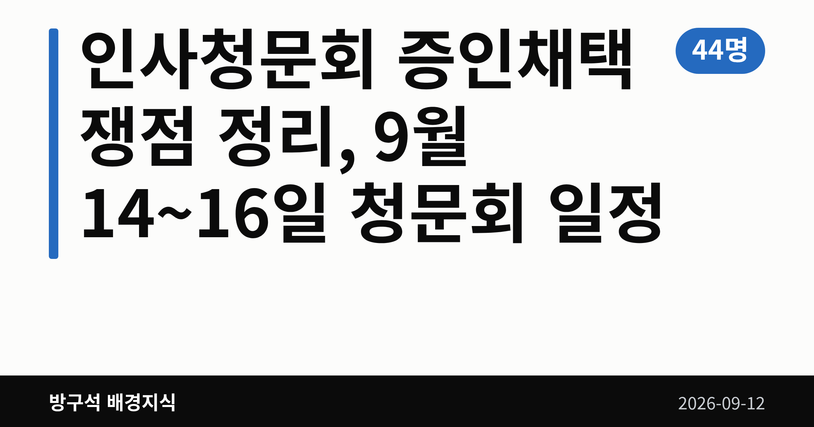
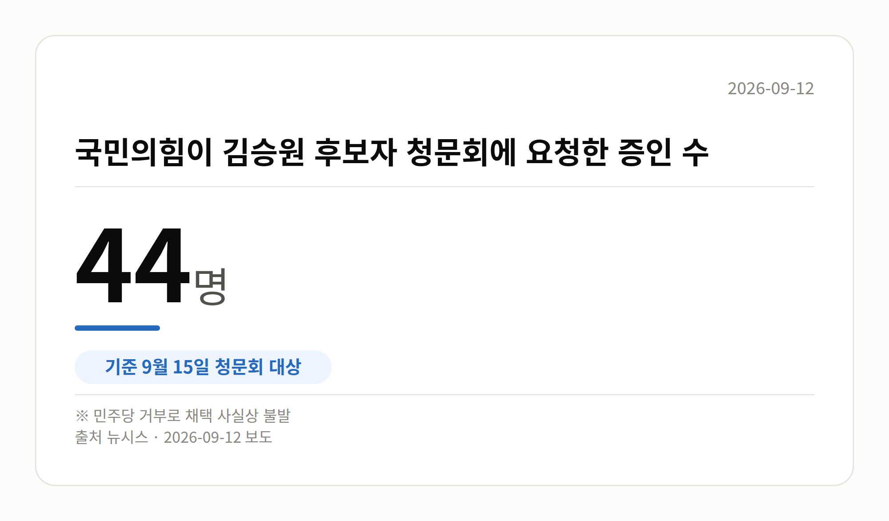

*이 글은 2026년 9월 12일 기준으로 정리한 내용입니다.*
**3줄 요약**

- 여야가 인사청문회 증인채택을 놓고 막판까지 대치 중입니다.
- 국민의힘 요청 증인 44명·참고인 4명은 채택이 불발됐습니다.
- 9월 14~16일 청문회 일정과 용혜인 후보자 일정 확정을 보면 됩니다.
- 여야가 인사청문회 증인채택을 놓고 막판까지 대치 중입니다.
- 국민의힘 요청 증인 44명·참고인 4명은 채택이 불발됐습니다.
- 9월 14~16일 청문회 일정과 용혜인 후보자 일정 확정을 보면 됩니다.

다음주 인사청문회 증인채택 문제를 놓고 여야가 이견을 좁히지 못하고 있습니다. 14~16일 대법관 1명과 장관 후보자 5명의 청문회가 연달아 예정돼 있습니다.

다만 국민의힘이 요청한 증인들은 더불어민주당의 거부로 채택되지 못한 상태입니다. 용혜인 성평등가족부 장관 후보자 청문회는 아직 날짜조차 잡히지 않았습니다.

[이미지: 국회 인사청문회장 전경 사진]

## 인사청문회 증인채택이 왜 쟁점인가요

인사청문회는 국회가 고위공직 후보자의 자질과 경력을 검증하는 절차입니다. 이때 관련자를 불러 직접 묻는 것이 증인 채택인데, 여야가 명단에 합의하지 못하면 서면 자료 위주로 검증이 진행됩니다.

15일 김승원 법무부 장관 후보자 청문회가 대표적입니다. 국민의힘은 증인 44명과 참고인 4명을 요청했지만, 민주당 거부로 채택이 사실상 불발됐습니다.

| 구분 | 국민의힘 요청 | 결과 |
| --- | --- | --- |
| 증인 | 44명 | 채택 사실상 불발 |
| 참고인 | 4명 | 채택 사실상 불발 |

김 후보자는 브로커 양모 씨의 청탁을 받고 식약처에 신약 임상시험 승인 로비를 벌였다는 의혹을 받고 있습니다. 아직 확인 단계이며 확정된 사실은 아닙니다.

## 후보자별 인사청문회 증인채택 상황

14일 김성수 대법관 후보자 청문회에서는 처남 소유 강남 아파트에 시세보다 낮은 전세금을 내고 살아 탈세했다는 의혹이 다뤄질 전망입니다. 국민의힘은 처남을 증인으로 요청했지만, 민주당은 서면 자료로 충분히 검증할 수 있다며 거부했습니다.

16일 강신철 국방부 장관 후보자에게는 주소지 이전 후 철거민 자격으로 서초구 아파트를 특별분양받았다는 의혹과 아들의 분당 아파트 상가 매입 의혹이 제기돼 있습니다. 국민의힘은 대통령 비서실장 등을 증인으로 요청했으나 받아들여지지 않았습니다.

국방위 여당 간사인 김병주 민주당 의원은 "청문회장이 정치 공세의 장으로 변질될 수 있어 받아들일 수 없다"고 말했습니다. 국민의힘은 검증에 필요한 증인이라는 입장입니다.

[이미지: 달력에 9월 14일·15일·16일이 표시된 일정 이미지]

## 그 밖의 오늘 소식

- 김성수 후보자, 서면답변서 "대통령도 일반 국민과 동일한 재판"
- 김 후보자, 임기 중 재판 정지 문제엔 "의견 밝히기 부적절"
- 조국 원장, 민주당 신주류 겨냥 "지지층 교체 시도" 주장
- 청와대 "용혜인 후보자에 설명 기회 필요", 철회 여부는 즉답 안 해
- 강유정 수석대변인, 지지율 부정 평가 상회에 "복합적 결과"

조 원장 발언에 대한 민주당 신주류 측 반론은 이번 자료에 없습니다. 지지율 언급도 조사기관·기간·오차범위·수치가 함께 제시되지 않아, 앞섰다는 표현의 근거는 확인되지 않았습니다.

## 오늘의 체크포인트

1. 14일 대법관 후보자를 시작으로 16일까지 청문회가 이어집니다.
2. 증인 채택 불발로 서면 자료 중심 검증이 될 가능성이 있습니다.
3. 용혜인 후보자 청문회 일정 확정 여부가 다음 관전 포인트입니다.

제기된 의혹들은 모두 검증 단계이며, 유죄 등으로 확정된 사안이 아니라는 점을 함께 기억해 주세요.

**그래서 나는?**

- 뉴스를 따라가는 유권자라면, 14~16일 청문회 중계 일정을 확인해 보세요.
- 공직 검증에 관심 있다면, 증인 없이 서면 검증만으로 진행되는 점을 보세요.
- 정책 변화를 기다린다면, 각 부처 장관 임명 시점이 늦춰질 수 있습니다.

**직접 센 숫자 — 국회·여론조사 (최근 7일)**

국회의원 발의 법률안 **222건**. 최근 발의: 미등기 사정토지 정비를 위한 특별법안(박균택의원 등 10인)

이번 주 등록된 선거 여론조사 11건

- 전국 정기(정례)조사 국회의원선거 대통령선거 — 리서치웰 · 뉴데일리 의뢰 · 2026-09-09~10 · 1,001명 · 무선 ARS · 응답률 2.7% · 95% 신뢰수준에 ±3.1%p
- 전국 정기(정례)조사 정당지지도 — 한국갤럽조사연구소 · 한국갤럽 자체 조사 의뢰 · 2026-09-08~10 · 1,000명 · 무선전화면접 · 응답률 9.4% · 95% 신뢰수준에 ±3.1%p
- 전국 정기(정례)조사 정당지지도 — (주)엠브레인퍼블릭 · ㈜엠브레인퍼블릭, 케이스탯리서치, ㈜코리아리서치인터내셔널, ㈜한국리서치 의뢰 · 2026-09-07~09 · 1,002명 · 무선전화면접 · 응답률 15.4% · 95% 신뢰수준에 ±3.1%p

오늘 이슈에 나온 법안은 지금 어디에

- 선거법 — 제22대 발의 322건 · 최근 「공직선거법 일부개정법률안」(김민전의원 등 14인, 2026-09-10) · 소관위 회부

*열린국회정보·중앙선거여론조사심의위원회 자료를 직접 셌습니다. 여론조사의 자세한 사항은 중앙선거여론조사심의위원회 홈페이지를 참조하세요.*

**오늘 나온 정부 발표 원문**

- [[보도자료] 한성숙 국무총리, 주한미국상공회의소 간담회 참석](https://www.korea.kr/briefing/pressReleaseView.do?newsId=156781330) (국무조정실 2026-09-11)
  - 첨부 [260911_주한미국상공회의소 간담회 보도자료.hwpx](https://www.korea.kr/common/download.do?fileId=198551018&tblKey=GMN) · [260911_주한미국상공회의소 간담회 보도자료.pdf](https://www.korea.kr/common/download.do?fileId=198551019&tblKey=GMN)
- ["지역 청년의 꿈, 키운다"... 행안부-KB국민카드, 함께 청년마을 사업 지원](https://www.korea.kr/briefing/pressReleaseView.do?newsId=156781324) (행정안전부 2026-09-11)
- [지역공동체 살리는 「사회연대경제기본법」제정 성과에 3천만 원 특별성과포상금 수여](https://www.korea.kr/briefing/pressReleaseView.do?newsId=156781298) (행정안전부 2026-09-11)
**여러분은 청문회에서 후보자 검증이 제대로 되려면 무엇이 가장 필요하다고 보시나요?**

---

### 참고한 기사

1. **이번주 국회에는 무슨 일이? [뉴시스국회토pic]**
   - [뉴시스·정치](https://www.newsis.com/view/NISX20260911_0003785884)
2. **다음주 청문회 슈퍼위크, 與野 증인채택 줄다리기…"정치공세" "맹탕"**
   - [뉴시스·정치](https://www.newsis.com/view/NISX20260911_0003786460)
3. **김성수 대법관 후보자 “대통령도 공정한 재판 받아야”**
   - [callnews.co.kr](https://news.google.com/rss/articles/CBMibEFVX3lxTE8xc2g5RnpxdVJTYUxhQ0UydjlZZ2l4eFkxb2YydldIdU40bXFxckVzeEltVURhZ3BzZUZveWZXd29tTi1wYl95M180WGtjemYwbzhqLS1YdVpCYmlQcy0zTmktemp1NTZvall3Zw?oc=5)
   - [뉴시스·정치](https://www.newsis.com/view/NISX20260911_0003786567)
   - [뉴시스·정치](https://www.newsis.com/view/NISX20260911_0003786563)
   - [한국경제·정치](https://www.hankyung.com/article/2026091198527)
4. **조국 "與 신주류, '반명' 제조 정치…지지층 교체하려는 것 같아"**
   - [뉴시스·정치](https://www.newsis.com/view/NISX20260911_0003786420)
5. **靑, 용혜인 논란에 “국민 목소리 듣고 있다…소명 기회 줘야”**
   - [동아일보·정치](https://www.donga.com/news/Politics/article/all/20260911/134652360/2)
   - [뉴시스·정치](https://www.newsis.com/view/NISX20260911_0003786327)
   - [뉴시스·정치](https://www.newsis.com/view/NISX20260911_0003786386)
   - [이투데이](https://news.google.com/rss/articles/CBMiVEFVX3lxTFBucExqb3EzeXduX1A3bGp2WTF4TS0zbmZPS3hZdnlzZ1ByTTUwOGhET19lZEZPX2taTTZjcDZhQnFxMjFZZ1VPa2d4WEhaTTNiTmlMag?oc=5)

---

*본 글은 공개된 언론 보도를 정리한 것이며, 특정 정당·후보·인물을 지지하거나 반대하지 않습니다. 인용한 여론조사의 자세한 사항은 중앙선거여론조사심의위원회 홈페이지를 참조하세요.*
