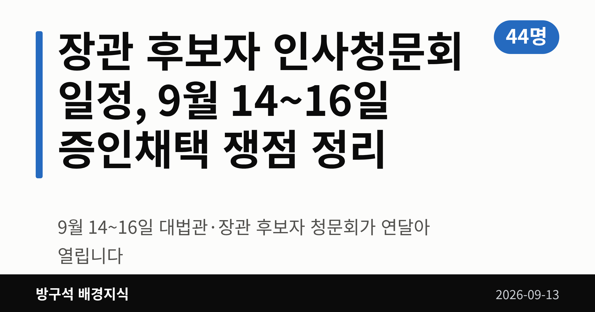
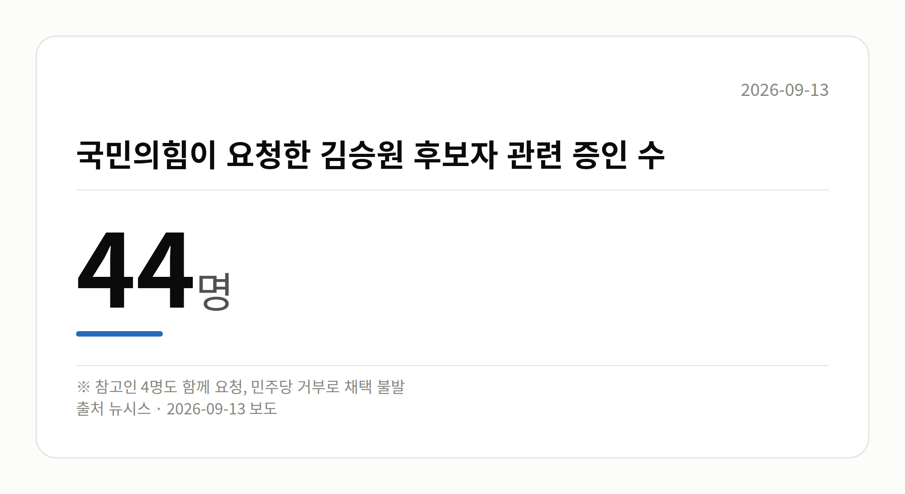

*이 글은 2026년 9월 13일 기준으로 정리한 내용입니다.*
**3줄 요약**

- 9월 14~16일 대법관·장관 후보자 청문회가 연달아 열립니다
- 국민의힘 요청 증인 44명·참고인 4명은 채택되지 않았습니다
- 용혜인 후보자 청문회 날짜 확정 여부를 지켜보면 됩니다
장관 후보자 인사청문회 일정이 9월 14일부터 16일까지 사흘 연속으로 잡혔습니다. 대법관 1명과 장관·부총리 후보자 5명이 차례로 국회에 섭니다.

다만 여야가 증인 채택에 합의하지 못하면서, 이번 청문회는 서면 답변과 제출 자료 위주로 진행될 전망입니다.

[이미지: 국회 인사청문회장 전경]

## 장관 후보자 인사청문회 일정, 언제 누가 나오나

인사청문회는 대통령이 지명한 고위 공직 후보자를 국회가 불러 자질과 의혹을 따져 묻는 절차입니다. 이번 장관 후보자 인사청문회 일정은 아래와 같습니다.

| 날짜 | 후보자 |
|---|---|
| 9월 14일 | 김성수 대법관 |
| 9월 15일 | 김승원 법무부·이소영 중기부·이형일 경제부총리 |
| 9월 16일 | 홍지선 국토부·강신철 국방부 |

용혜인 성평등가족부 장관 후보자 청문회는 증인 채택 이견으로 아직 날짜가 정해지지 않았습니다.

## 증인채택은 왜 막혔나

국민의힘은 김승원 법무부 장관 후보자의 식약처 신약 임상시험 승인 로비 의혹을 따지겠다며 증인 44명과 참고인 4명을 요청했습니다. 민주당이 거부하면서 사실상 채택은 불발됐습니다.

김성수 대법관 후보자를 두고도 국민의힘은 처남 소유 강남 아파트 임대차 의혹 검증을 위해 처남을 증인으로 요청했지만, 민주당은 서면자료로 충분히 검증할 수 있다며 받아들이지 않았습니다.

강신철 국방부 장관 후보자의 부동산 투기 의혹과 관련해서도 국민의힘은 대통령 비서실장 등을 증인으로 요청했으나 받아들여지지 않았습니다. 국방위 여당 간사인 김병주 민주당 의원은 "청문회장이 정치 공세의 장으로 변질될 수 있다"고 말했습니다.

여기서 거론된 탈세·로비·부동산 투기는 모두 청문 단계에서 제기된 의혹이며, 확정된 사실은 아닙니다.

## 김승원 후보자는 공소취소 질문에 뭐라 답했나

김승원 후보자는 9월 12일 주진우 국민의힘 의원에게 보낸 서면답변에서, 이재명 대통령 관련 형사사건의 공소취소(검찰이 이미 제기한 재판 청구를 스스로 거둬들이는 것) 검토를 지시할 것인지 묻는 질문에 답했습니다.

김 후보자는 "검찰이 정치적 중립성을 지키며 공정하게 업무를 수행할 수 있도록 철저히 지휘·감독하겠다"고 밝혔습니다. 직무회피 의향에는 "국회의원으로서의 정치적 활동과 장관의 직무는 구분하겠다"고 답했습니다.

김 후보자는 민주당 내 '이재명 대통령 사건 공소취소와 국정조사 추진을 위한 의원모임' 공동대표를 맡은 바 있습니다. 이 답변에 대한 국민의힘 등 상대측 반응은 확인되지 않았습니다.

[이미지: 법무부 청사 외경]

## 그 밖의 오늘 소식

- 김승원 후보자, 검사 직접수사권 전면 폐지에 "타당하다" 기존 입장 유지
- 9월 9일 법사위에서 서영교 위원장, 김 후보자 불기소 처분 결정서 제시
- 국회 본회의장에서 김민석 민주당 대표의 서울시장 후보군 메모 포착
- 박성훈 국민의힘 수석대변인 "보궐선거 기정사실화는 정치적 겁박"
- 이용우 민주당 대변인 "메모 한 줄 붙잡고 호들갑, 이중잣대" 반박

## 오늘의 체크포인트

1. 9월 14~16일 사흘간 대법관·장관 후보자 청문회가 연이어 열립니다.
2. 국민의힘이 요청한 증인 다수가 채택되지 않아 서면 검증 위주가 됩니다.
3. 용혜인 후보자 청문회 일정 확정 여부가 남은 협의 과제입니다.

**그래서 나는?**

- 뉴스를 챙겨 보는 유권자라면, 14~16일 청문회 중계 일정을 확인해 보세요
- 부동산에 관심 있다면, 16일 국토교통부 장관 후보자 청문회를 함께 보세요
- 정책 변화가 궁금하다면, 후보자 서면답변 공개 여부를 살펴보세요

**직접 센 숫자 — 국회·여론조사 (최근 7일)**

이번 주 등록된 선거 여론조사 9건

- 전국 정기(정례)조사 국회의원선거 대통령선거 — 리서치웰 · 뉴데일리 의뢰 · 2026-09-09~10 · 1,001명 · 무선 ARS · 응답률 2.7% · 95% 신뢰수준에 ±3.1%p
- 전국 정기(정례)조사 정당지지도 — 한국갤럽조사연구소 · 한국갤럽 자체 조사 의뢰 · 2026-09-08~10 · 1,000명 · 무선전화면접 · 응답률 9.4% · 95% 신뢰수준에 ±3.1%p
- 전국 정기(정례)조사 정당지지도 — (주)엠브레인퍼블릭 · ㈜엠브레인퍼블릭, 케이스탯리서치, ㈜코리아리서치인터내셔널, ㈜한국리서치 의뢰 · 2026-09-07~09 · 1,002명 · 무선전화면접 · 응답률 15.4% · 95% 신뢰수준에 ±3.1%p

*열린국회정보·중앙선거여론조사심의위원회 자료를 직접 셌습니다. 여론조사의 자세한 사항은 중앙선거여론조사심의위원회 홈페이지를 참조하세요.*
**여러분은 인사청문회에서 후보자의 어떤 부분을 가장 먼저 확인하고 싶으신가요?**

---

### 참고한 기사

1. **'청문 정국' 공방 주말에도 계속...다음 주 청문회 슈퍼위크**
   - [YTN](https://news.google.com/rss/articles/CBMiXkFVX3lxTE5wRTVjMjZvRUlHcHBTMF9PX3ByWV9kenZLYU5teGFiRmVUVnlsbmJmLTJxSlR2d2ctWGFUU0YzODlkYXFIcDdoMFZhVVJDVEVXd19sNHByNmUycldlU3c?oc=5)
   - [YTN](https://news.google.com/rss/articles/CBMidkFVX3lxTE5pTkZod3BHSXJGNnhxOGJtNXQwLTRucXgyVFBhU1BROE43OUlSLWFXVnZzekl1NHRCQktKR0h6R19qV0djR0wyXzhJMHRsUDVIUzgzbUhOaGxpOTVWZlRUNHk5Rk5BcDV1cHZDbi1GZmRCY3d4Umc?oc=5)
   - [뉴시스·정치](https://www.newsis.com/view/NISX20260911_0003786460)
2. **김승원, '李재판 공소취소' 질문에 "검찰, 정치적 중립성 지키도록 지휘"**
   - [뉴시스·정치](https://www.newsis.com/view/NISX20260912_0003786842)
   - [조선일보](https://news.google.com/rss/articles/CBMihgFBVV95cUxNMFFxS21YSkFhZE9NeU42Vm5GcFpYalRvQkNJNkdTMHEtY2NRSnVjU0NIbzI4UzZOZzBXQW5zTmNfRHZMZzZJX2R0WGtOU0lZM1VMOExvdGFMUTBvVkdoazdfREVvNlVvOG5wOUcwOUE4T2I5NW8yT2NzbEduNzRwSWpPeTI2Zw?oc=5)
   - [뉴시스·정치](https://www.newsis.com/view/NISX20260912_0003786792)
   - [경향신문·정치](https://www.khan.co.kr/article/202609121347001)
3. **이번주 국회에는 무슨 일이? [뉴시스국회토pic]**
   - [뉴시스·정치](https://www.newsis.com/view/NISX20260911_0003785884)
4. **김승원 법무장관 후보자 금주 인사청문회…여야 대공방 예고**
   - [뉴시스·정치](https://www.newsis.com/view/NISX20260911_0003786566)
5. **김민석 “서울시장 선거 99.99% 있다”에 국힘 “사법부 겁박” 민주 “억지 호들갑”**
   - [조선일보·정치](https://www.chosun.com/politics/assembly/2026/09/12/PGB4EYLOSBH7TGSVD7HPM27UN4)
   - [뉴데일리](https://news.google.com/rss/articles/CBMigAFBVV95cUxQSElpSDhyc19xcVFVQ3hiYlZCVm5SNWN0cEJBY2dYeENSSm9lNlZ5eXpIaXJzaElZdG5EclROWmVhZzVobnFZeGJjYTRxMWtsR29iU1pBQUtnTGMyM09YYkJ2cTJTbkNEUlhxWU5UZjRvWUFQTFlDUTBObG1VY2NpcdIBgAFBVV95cUxQSElpSDhyc19xcVFVQ3hiYlZCVm5SNWN0cEJBY2dYeENSSm9lNlZ5eXpIaXJzaElZdG5EclROWmVhZzVobnFZeGJjYTRxMWtsR29iU1pBQUtnTGMyM09YYkJ2cTJTbkNEUlhxWU5UZjRvWUFQTFlDUTBObG1VY2NpcQ?oc=5)
   - [뉴시스·정치](https://www.newsis.com/view/NISX20260912_0003786794)
   - [hidomin.com](https://news.google.com/rss/articles/CBMiakFVX3lxTE9hbTRuNmRpMTFheVdHVkRlN2RyUEpnZ0NacnFRalFLNTlOYXIyLUhkTm5RWHIwQlAzb19QeDhBRWsyRVZKREpaQl8yZktGZkhrXzNfU1Z0VjZEWlYyS0VGOU52SE1idDJjYnc?oc=5)

---

*본 글은 공개된 언론 보도를 정리한 것이며, 특정 정당·후보·인물을 지지하거나 반대하지 않습니다. 인용한 여론조사의 자세한 사항은 중앙선거여론조사심의위원회 홈페이지를 참조하세요.*
