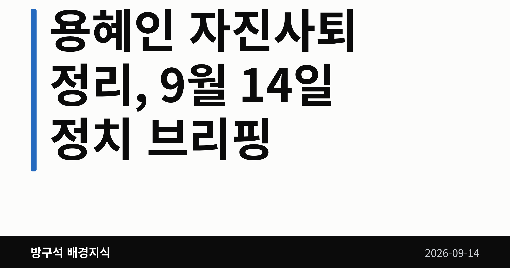
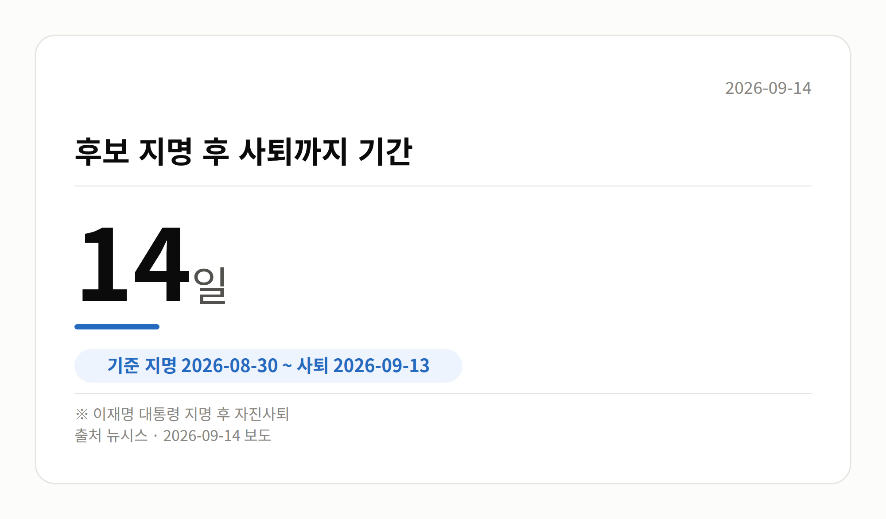

*이 글은 2026년 9월 14일 기준으로 정리한 내용입니다.*
**3줄 요약**

- 용혜인 성평등가족부 장관 후보자가 13일 자진 사퇴했습니다.
- 지난달 30일 지명 이후 14일 만이며, 청문회는 열리지 않았습니다.
- 15일 김승원 후보자 인사청문회와 10월 2일 공소청 출범을 보면 됩니다.
용혜인 자진사퇴 소식이 13일 나왔습니다. 성평등가족부 장관 후보자 자리에서 스스로 물러난 것으로, 지명 14일 만입니다.

인사청문회는 열리지 않은 채 절차가 끝났고, 이제 새 후보 지명 절차가 남았습니다. 오늘 글은 이 사안을 중심으로 정리해 보겠습니다.

[이미지: 국회 소통관 기자회견장 모습]

## 용혜인 자진사퇴, 무슨 일이 있었나

용혜인 후보자는 13일 국회 소통관에서 기자회견을 열고 후보직에서 물러났습니다. 이재명 대통령이 지난달 30일 지명한 뒤 딱 2주 만입니다.

배우자 및 기본소득당을 둘러싼 의혹, 비례대표 의원직 겸직 논란이 이어지던 상황이었습니다. 여기서 '의혹'은 아직 사실로 확인된 단계가 아니라는 뜻입니다.

| 항목 | 내용 |
| --- | --- |
| 지명일 | 2026년 8월 30일 |
| 사퇴일 | 2026년 9월 13일 |
| 경과 | 14일 |

## 양측은 각각 뭐라고 했나

용 후보자는 "지금 여기서 멈추는 게 민주당과 기본소득당, 민주 진보 진영 내 연대정신을 이어나가는 데 필요하다고 판단했다"고 말했습니다.

이어 "소수정당의 어려운 형편을 조롱하고 폄하하는 국민의힘 의원들의 행태와 반론권조차 보장하지 않은 일부 언론들의 악의적인 왜곡 보도가 이어졌다"며 "국민의힘이 끝내 인사청문회 일정 잡기를 거부했다"고 했습니다.

국민의힘 측이 청문회 일정을 잡지 않은 사유나, 제기된 의혹의 사실관계에 대한 반박 입장은 제공된 자료에서 확인되지 않았습니다. 한쪽 발언만 있다는 점을 감안해 읽어 주시면 좋겠습니다.

민주당 쪽 설명도 나왔습니다. 김민석 대표 비서실장인 김태선 의원은 페이스북에 "비례대표 겸직 문제가 법적 위반은 아닐지라도, 국민적 눈높이와 정서에 온전히 부합하지 못한 면이 있었다"며 김 대표의 자진 사퇴 권유를 전달했다고 적었습니다.

기본소득당은 "어제 전달받았다. 민주당 지도부 측으로부터 의견을 전해받은 것"이라고 밝혔습니다.

[이미지: 정부서울청사 외경 사진]

## 용혜인 자진사퇴 이후 절차는

장관 후보자가 사퇴하면 인선은 원점으로 돌아갑니다. 제기됐던 의혹들은 인사청문회를 거치지 않은 채 마무리됐습니다.

다음 일정은 15일 김승원 법무부 장관 후보자 인사청문회입니다. 야당은 '코로나19 신약 임상시험 승인 청탁 의혹'을 제기하고 있고, 김민석 대표는 11일 "지켜보면 지켜볼수록 잘된 인사라고 판단된다"고 말했습니다.

## 그 밖의 오늘 소식

- 당정, 공소청 '사법통제부'를 '불송치 사건 심사부'로 변경 검토
- 형사기획관·중대범죄수사기획관 직제 폐지도 검토 대상
- 13일 고위당정협의회는 총리공관에서 100분간 진행
- 공소청은 10월 2일 출범 예정, 명칭·직제는 미확정
- 14일 오후 2시 국회 본회의 대정부질문(교육·사회·문화)

## 오늘의 체크포인트

1. 용혜인 자진사퇴로 성평등가족부 장관 인선은 다시 처음부터입니다.
2. 15일 김승원 후보자 인사청문회가 이번 주 최대 분수령입니다.
3. 공소청 명칭·직제 최종안은 10월 2일 출범 전까지 정리돼야 합니다.

**그래서 나는?**

- 뉴스를 따라가는 유권자라면, 15일 인사청문회 일정부터 확인해 보세요
- 정부 부처 업무가 필요한 분이라면, 성평등가족부 장관 공석이 길어질 수 있습니다
- 수사·형사 절차에 관심 있다면, 10월 2일 공소청 출범 내용을 살펴보세요

**직접 센 숫자 — 국회·여론조사 (최근 7일)**

국회의원 발의 법률안 **222건**. 최근 발의: 미등기 사정토지 정비를 위한 특별법안(박균택의원 등 10인)

이번 주 등록된 선거 여론조사 13건

- 전국 정기(정례)조사 정당지지도 대통령선거 — (주)비전코리아 · 올리서치 의뢰 · 2026-09-12~13 · 1,020명 · 무선 ARS · 응답률 3.6% · 95% 신뢰수준에 ±3.1%p
- 전국 정기(정례)조사 정당지지도 — (주)여론조사꽃 · 2026-09-11~12 · 1,002명 · 무선전화면접 · 응답률 10.1% · 95% 신뢰수준에 ±3.1%p
- 전국 정기(정례)조사 정당지지도 — (주)여론조사꽃 · 2026-09-11~12 · 1,007명 · 무선 ARS · 응답률 2.6% · 95% 신뢰수준에 ±3.1%p

*열린국회정보·중앙선거여론조사심의위원회 자료를 직접 셌습니다. 여론조사의 자세한 사항은 중앙선거여론조사심의위원회 홈페이지를 참조하세요.*

**오늘 나온 정부 발표 원문**

- [구윤철 부총리, 「한-우즈벡 지방정부 협력 포럼」 축사](https://www.korea.kr/briefing/pressReleaseView.do?newsId=156781400) (재정경제부 2026-09-13)
  - 첨부 [(보도자료) 구윤철 부총리, 한-우즈벡 지방정부 협력 포럼 축사v1.42](https://www.korea.kr/common/download.do?fileId=198551410&tblKey=GMN) · [(보도자료) 구윤철 부총리, 한-우즈벡 지방정부 협력 포럼 축사v1.42](https://www.korea.kr/common/download.do?fileId=198551411&tblKey=GMN)
**여러분은 장관 후보자 검증이 청문회 전에 끝나는 지금 방식을 어떻게 보고 계신가요?**

---

### 참고한 기사

1. **공소청 내 ‘사법통제부’→‘불송치 사건 심사부’ 변경 검토**
   - [동아일보·정치](https://www.donga.com/news/Society/article/all/20260914/134660831/2)
   - [뉴시스·정치](https://www.newsis.com/view/NISX20260913_0003787512)
   - [경향신문·정치](https://www.khan.co.kr/article/202609132054015)
   - [lawleader.co.kr](https://news.google.com/rss/articles/CBMibEFVX3lxTE9iRFctUHlKOTBEMGxKNkFaV0l3eUF4NHJwbVAxUU5rZVN3TkhQQ3dJdzZUN2Q3dkw3SWN4NGpxaEtEOXlocDhtTzNJODJHTzROV1pZSkM3M3k3MjlJSHNxdWs1a0xkR3hMdVpRZdIBcEFVX3lxTE96YlBaaTNuLUtyTlhpWk1GWkJkMkxnV0ZUek9IRmJWZVFibC1aQzYxT2RJT25HUnpFdjBjTENIU01OM3l6TFdvelFBYUpsUWlqZzBtSFhhOWRnYzhsZkNXem1TZVVVaXRPXzhXdkdCZ18?oc=5)
2. **행정안전부(9월14일 월요일)**
   - [뉴시스·정치](https://www.newsis.com/view/NISX20260913_0003787231)
   - [뉴시스·정치](https://www.newsis.com/view/NISX20260913_0003787525)
   - [뉴시스·정치](https://www.newsis.com/view/NISX20260913_0003787526)
   - [newspim.com](https://news.google.com/rss/articles/CBMiXEFVX3lxTE9ObHVaRW9QSF95aGxvQXJqYWRmdURvbHhuem45MUxwcGsydHBlaWVJTm1HSEN3YklOVVNnendZVzZJYVhVZVh3MmxGQ3lwQjZzUnlNMW5xT0ZiWDdJ?oc=5)
3. **김민석 “후보 사퇴 용혜인 등 진보세력과 연대·정치 개혁 논의”**
   - [동아일보·정치](https://www.donga.com/news/Politics/article/all/20260913/134658891/2)
   - [뉴스웍스](https://news.google.com/rss/articles/CBMib0FVX3lxTE93cWVocmhZWDdlc2U3bVhyTDdLTVpYYTQ5R1VPZFhQMEM5d29PbHpoQ1FJR283a0Z6OU9YQTRiX2NJbVVSYUxiRkhwNXQzTnFiYmxJb2tfZ01NWmdEX3R0VzVvaTdDSkFuQmMybTJ6UQ?oc=5)
   - [매일신문](https://news.google.com/rss/articles/CBMiYkFVX3lxTFB0b01aU1VWUlFWeEZpcER6d0pJQklzcnRsNVJpTnNXT0RpUElveEQ0Z1ZReTByalRrdUxUWThzTHNQSnNybFF0eGdfWE1wazVGdGJkZHlqVzlHWXFBb2ZVRzd3?oc=5)
   - [채널A](https://news.google.com/rss/articles/CBMiXkFVX3lxTE5FYThMRUhwYWtCejdzSmxYcHY1WEJKazBWQWZvVjJXTVJaeTFZVGoydVlDaWdlSWpiQTRjcG9ETmxLcExIb2o5V2dGTTFQRlhfaFVDUHBSelZtanc5UHfSAWNBVV95cUxONnBmaC14UnY0UHB5aVYzck5TR3ZUU0czUTVpQnF3ekR3czNsNGtHbTgzTHkwbWF0U1p6cUpxek5sa18xRWJFNzRnSWdiTmphTVliRkVLNGttTzEzME10Z2tEUUU?oc=5)
4. **용혜인 성평등부 장관 후보자, 지명 14일 만에 자진 사퇴…“여당 우려, 직 수행 어려워”**
   - [경향신문·정치](https://www.khan.co.kr/article/202609131654001)
   - [연합뉴스·정치](https://www.yna.co.kr/view/AKR20260913039100704)
   - [연합뉴스·정치](https://www.yna.co.kr/view/AKR20260913036600704)
   - [v.daum.net](https://news.google.com/rss/articles/CBMiT0FVX3lxTE4xbDJ3V3NEbUNCWXY4eTlqempCMFBySkFxd1JzYTNhNWRkS1VLRHJ2Slg4R05IN2pSVTdNbkVEQTBRN2JZSjVnei1RWENYZjA?oc=5)
5. **용혜인 압박해 자진사퇴 이끌어낸 김민석…김승원 방어에 총력**
   - [뉴시스·정치](https://www.newsis.com/view/NISX20260913_0003787354)
   - [연합뉴스·정치](https://www.yna.co.kr/view/AKR20260912040351001)

---

*본 글은 공개된 언론 보도를 정리한 것이며, 특정 정당·후보·인물을 지지하거나 반대하지 않습니다. 인용한 여론조사의 자세한 사항은 중앙선거여론조사심의위원회 홈페이지를 참조하세요.*
