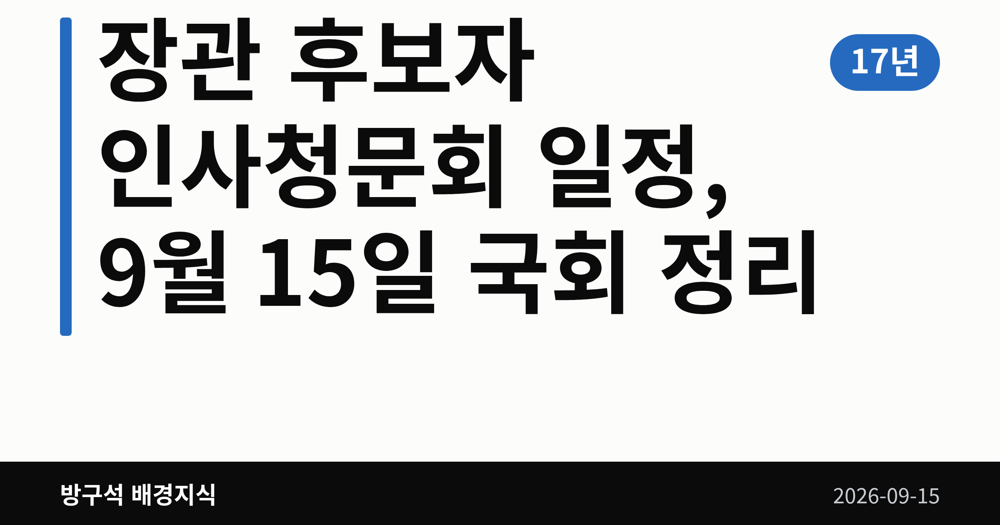
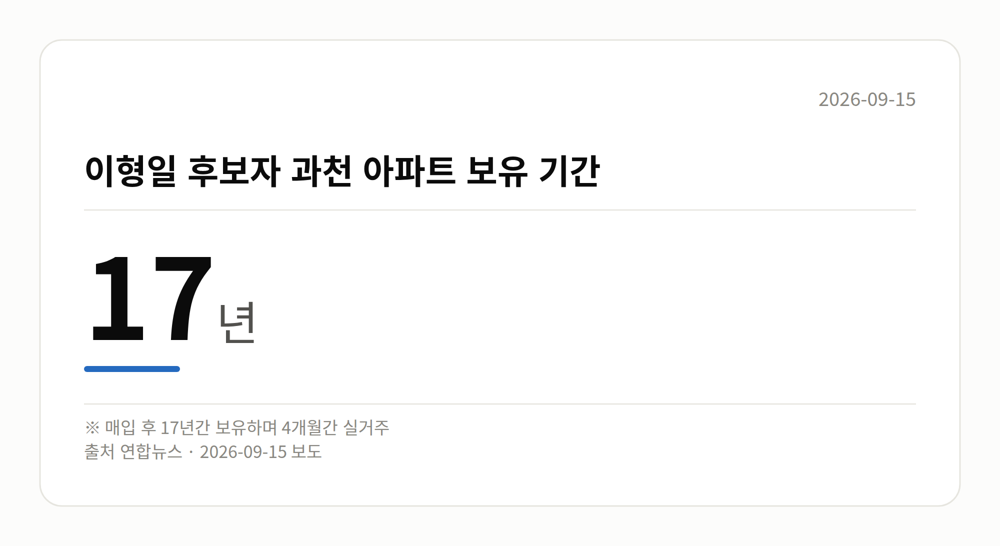

*이 글은 2026년 9월 15일 기준으로 정리한 내용입니다.*
**3줄 요약**

- 9월 15일 세 부처 장관 후보자 인사청문회가 동시에 열립니다.
- 과천 아파트 17년 보유·4개월 실거주, 용역비 7천만원이 쟁점입니다.
- 증인 채택 불발과 청문 이후 절차를 함께 보면 됩니다.
장관 후보자 인사청문회 일정이 오늘(9월 15일) 하루에 몰렸습니다. 이형일 경제부총리 겸 재정경제부 장관, 김승원 법무부 장관, 이소영 중소벤처기업부 장관 후보자가 각각 국회에 출석합니다. 부동산과 청탁 의혹을 두고 여야 질의가 예고돼 있습니다.

[이미지: 국회 본관 외부 전경 사진]

## 장관 후보자 인사청문회 일정, 오늘 어디서 열리나

인사청문회는 국회가 장관 등 고위공직 후보자의 자질과 도덕성을 따져 보는 절차입니다. 김승원 후보자 청문회는 법제사법위원회 주관으로 오전 10시 국회 본관에서 열립니다.

같은 날 이형일 후보자와 이소영 후보자에 대한 청문회도 각각 소관 상임위에서 진행됩니다. 같은 시각 법사위·정무위·행안위 등 여러 상임위 전체회의도 예정돼 있어 국회 일정이 촘촘합니다.

## 과천 아파트와 7천만원, 숫자로 본 쟁점

| 항목 | 수치 |
| --- | --- |
| 이형일 후보자 과천 아파트 보유 기간 | 17년 |
| 이형일 후보자 과천 아파트 실거주 기간 | 4개월 |
| 이소영 후보자 공실 업체 용역비 의혹 | 7,000만원 |

국민의힘은 이형일 후보자가 경기 과천 아파트를 매입한 뒤 오랜 기간 보유하는 동안 실거주는 넉 달에 그쳤다며 부동산 관련 의혹을 제기하고 있습니다.

이소영 후보자에 대해서는 서울 홍제동 '비거주 1주택' 차익 논란과 공실 업체 용역비 의혹, 전문성 부족을 지적했습니다. 민주당은 이 후보자가 예산결산특별위원회 여당 간사를 지낸 점을 들어 전문성에는 문제가 없다고 맞섰습니다. 두 후보자 본인의 구체적 반박 내용은 이번 자료에서 확인되지 않았습니다.

## 김승원 후보자 의혹, 양측 주장은

'제넨셀 신약 청탁 의혹'은 검찰이 기소유예(혐의가 있다고 보되 검사가 재판에 넘기지는 않는 처분)로 마무리한 사안으로, 유죄가 확정된 사건은 아닙니다.

국민의힘은 김 후보자가 김강립 당시 식약처장에게 임상시험 계획 승인을 빨리 처리해 달라고 요청한 사실을 청탁으로 규정하며, 검찰 처분이 잘못됐다고 보고 국정조사와 특별검사(특검) 도입을 촉구하고 있습니다. 무소속 한동훈 의원은 관련 녹취록을 공개했습니다.

민주당은 대가성을 입증할 새 증거가 없는 한 낙마 요인이 없다며, 해당 요청이 청탁금지법상 허용된 '공익 민원'이라는 입장입니다. 또 한 의원이 검찰에서 수사자료를 불법으로 넘겨받았다고 역공했는데, 이 주장의 사실관계는 자료로 확인되지 않았습니다.

전날 대정부질문에서 한성숙 국무총리는 지명 철회나 사퇴 건의 의향을 묻는 질문에 "청문회를 통해 소명하는 절차를 밟는 것이 적절하다"고 답했습니다. 뉴시스는 식약처 로비 등 의혹 관련 증인 채택이 이뤄지지 않아 검증이 제한적일 수 있다고 보도했습니다.

[이미지: 국회 상임위원회 회의장에서 진행되는 청문회 장면]

## 그 밖의 오늘 소식

- 이재명 대통령, 김지용 중수청장 후보자 추가 검증 지시
- 인사청문요청서 미제출로 행안위 일정 순연 분위기
- 중대범죄수사청은 10월 2일 출범 예정
- 추미애 경기지사 비판에 김민석 대표 "황당" 반박
- 조국 원장, 김 대표의 탄핵 언급에 "도움 안 돼"

## 오늘의 체크포인트

1. 세 후보자 청문회에서 부동산·청탁 의혹 질의가 어떻게 오가는지
2. 김지용 후보자 인사청문요청서가 국회에 제출되는지
3. 청문회 이후 국정조사·특검 추진 움직임이 이어지는지

**그래서 나는?**

- 정치 뉴스가 낯선 유권자라면, 인사청문회는 임명 전 검증 절차임을 기억해 두세요.
- 물가와 세금이 걱정이라면, 경제부총리 후보자 청문회 답변을 확인해 보세요.
- 중소기업·소상공인이라면, 중기부 장관 후보자 청문회 일정을 챙겨 보세요.

**직접 센 숫자 — 국회·여론조사 (최근 7일)**

국회의원 발의 법률안 **223건**. 최근 발의: 제9회 전국동시지방선거 투표용지 부족 사태 등 국민참정권 침해 의혹 진상규명을 위한 특별검사의 임명 등에 관한 법률 일부개정법률안(김용민의원 등 10인)

이번 주 등록된 선거 여론조사 13건

- 전국 정기(정례)조사 정당지지도 대통령선거 — (주)비전코리아 · 올리서치 의뢰 · 2026-09-12~13 · 1,020명 · 무선 ARS · 응답률 3.6% · 95% 신뢰수준에 ±3.1%p
- 전국 정기(정례)조사 정당지지도 — (주)여론조사꽃 · 2026-09-11~12 · 1,002명 · 무선전화면접 · 응답률 10.1% · 95% 신뢰수준에 ±3.1%p
- 전국 정기(정례)조사 정당지지도 — (주)여론조사꽃 · 2026-09-11~12 · 1,007명 · 무선 ARS · 응답률 2.6% · 95% 신뢰수준에 ±3.1%p

오늘 이슈에 나온 법안은 지금 어디에

- 형사소송법 — 제22대 발의 163건 · 최근 「형사소송법 일부개정법률안」(박은정의원 등 10인, 2026-09-11) · 소관위 회부

*열린국회정보·중앙선거여론조사심의위원회 자료를 직접 셌습니다. 여론조사의 자세한 사항은 중앙선거여론조사심의위원회 홈페이지를 참조하세요.*

**오늘 나온 정부 발표 원문**

- [[보도자료] 2026 전국 현장소통 시리즈 '제1차 부산지역 소상공인 지원정책 간담회' 개최](https://www.korea.kr/briefing/pressReleaseView.do?newsId=156781565) (국무조정실 2026-09-14)
  - 첨부 [260914_2026 전국 현장소통 시리즈 &#039;제1차 부산지역 소](https://www.korea.kr/common/download.do?fileId=198551997&tblKey=GMN) · [260914_2026 전국 현장소통 시리즈 &#039;제1차 부산지역 소](https://www.korea.kr/common/download.do?fileId=198551998&tblKey=GMN)
- ["특별한 희생 공무원에 대한 보상 예우 강화"](https://www.korea.kr/briefing/pressReleaseView.do?newsId=156781526) (인사혁신처 2026-09-14)
  - 첨부 [260914 (재해보상정책담당관 등) “특별한 희생 공무원에 대한 보상 ](https://www.korea.kr/common/download.do?fileId=198551888&tblKey=GMN) · [260914 (재해보상정책담당관 등) “특별한 희생 공무원에 대한 보상 ](https://www.korea.kr/common/download.do?fileId=198551889&tblKey=GMN)
- [불공정은 단호하게, 민생경제는 살뜰히 범정부 추석 명절 합동점검 실시](https://www.korea.kr/briefing/pressReleaseView.do?newsId=156781537) (행정안전부 2026-09-14)
**여러분은 장관 후보자를 볼 때 능력과 도덕성 중 어느 쪽을 먼저 보게 되시나요?**

---

### 참고한 기사

1. **(15일·화)**
   - [연합뉴스·정치](https://www.yna.co.kr/view/AKR20260914161300001)
   - [뉴시스·정치](https://www.newsis.com/view/NISX20260914_0003789198)
   - [뉴스1](https://news.google.com/rss/articles/CBMiWkFVX3lxTE54bnd1ZklSSUR1T1pBZ0RrLUpNb2tOYlBGT2hNRWFjSG13ZjdyRnItU2lJRjRhVWJSMjRnZm5TQ2JKWFd4enhfOC1pNFJaSlhWWHR6alJ6cWh2UdIBX0FVX3lxTE1SRndZbXY2MjI2TVZMcTRWdHZyUFZlU3Mta3pOczBrYlRXYkg4Z2dMMXNwZUhBNmhPbnYtRkttemp4eWhmMU8xNUVDQUNWcFBMdF8tSTlfYXcwRy02dUlB?oc=5)
   - [뉴시스·정치](https://www.newsis.com/view/NISX20260914_0003789265)
2. **李, 강경파 거센 반발에… “중수청장 후보 추가검증”**
   - [동아일보·정치](https://www.donga.com/news/Politics/article/all/20260915/134668486/2)
   - [경향신문·정치](https://www.khan.co.kr/article/202609142147015)
   - [뉴시스·정치](https://www.newsis.com/view/NISX20260914_0003789145)
   - [한국경제·정치](https://www.hankyung.com/article/2026091437027)
3. **김민석 “盧탄핵 전조와 비슷”… 강경파 겨눠**
   - [동아일보·정치](https://www.donga.com/news/Politics/article/all/20260915/134668268/2)
   - [조선일보·정치](https://www.chosun.com/politics/assembly/2026/09/15/PMFPGETOPRBCHG7TS4KMAFQAHE)
   - [경향신문·정치](https://www.khan.co.kr/article/202609142138005)
   - [한국경제·정치](https://www.hankyung.com/article/2026091439661)
4. **대정부질문 마지막 날도 '김승원 공방'...'수시 먹통' 질타도**
   - [YTN](https://news.google.com/rss/articles/CBMiXkFVX3lxTE5URzU1SGRNTEpiOEJBM1lZb0dKMEtTb25Mem9TeERrc3NFX1VWcHdMWGNTTjVBMjNDMElmTThUcVhySllwczRuU2VXeHdkRjRiemFRU3FXaTJoRk9pX1E?oc=5)
   - [v.daum.net](https://news.google.com/rss/articles/CBMiRkFVX3lxTE1GRE96TUpUSnNlTUNDTDlBbFQ1TDduLXBJc3cyY3lsT1YxeWV5S0tEZHpUWXhLUVR0NVpuaGpJa0I4aURpR1E?oc=5)
   - [뉴시스·정치](https://www.newsis.com/view/NISX20260914_0003789124)
   - [연합뉴스](https://news.google.com/rss/articles/CBMiYEFVX3lxTE5xdnRBb2doQ1o5Tk13MnNsWElBeVc0YzFkY1lhOUNpV2V4STJGMkJBOV9RNUFKWk8yVDlDbnVySzFabS1ON0RnckdOZUpGRV9nemV6UVJha2UweGVEN3VtTtIBYEFVX3lxTE5xdnRBb2doQ1o5Tk13MnNsWElBeVc0YzFkY1lhOUNpV2V4STJGMkJBOV9RNUFKWk8yVDlDbnVySzFabS1ON0RnckdOZUpGRV9nemV6UVJha2UweGVEN3VtTg?oc=5)
5. **국회, 오늘 이형일·김승원·이소영 인사청문회…여야 대격돌**
   - [연합뉴스·정치](https://www.yna.co.kr/view/AKR20260914169900001)
   - [뉴시스·정치](https://www.newsis.com/view/NISX20260914_0003789117)

---

*본 글은 공개된 언론 보도를 정리한 것이며, 특정 정당·후보·인물을 지지하거나 반대하지 않습니다. 인용한 여론조사의 자세한 사항은 중앙선거여론조사심의위원회 홈페이지를 참조하세요.*
