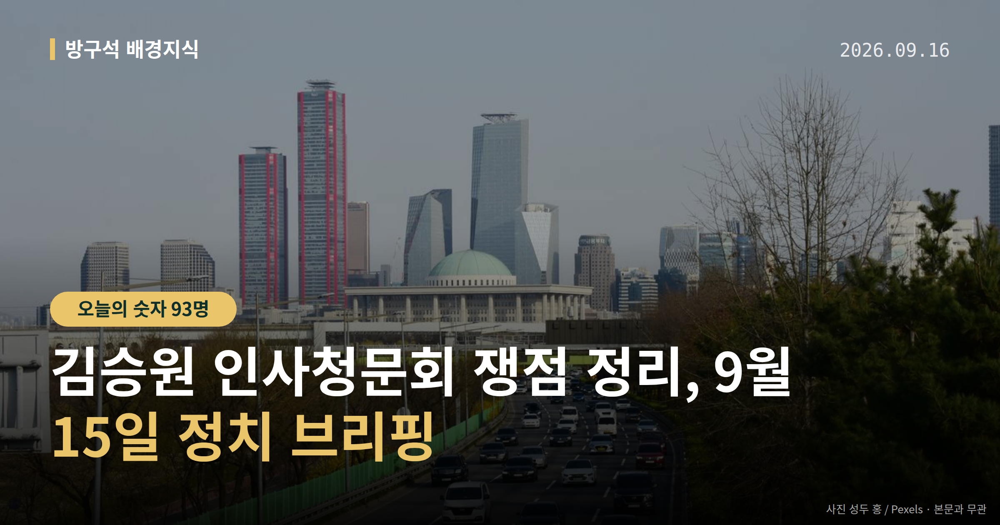
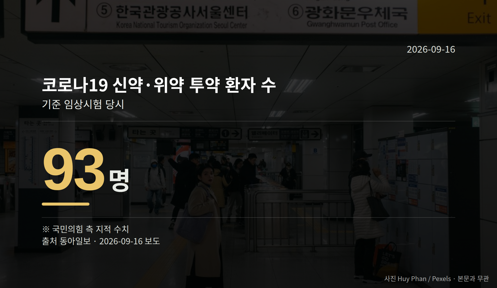

*이 글은 2026년 9월 16일 기준으로 정리한 내용입니다.*
**3줄 요약**

- 김승원 인사청문회가 증인 한 명 없이 열려 여야가 충돌했습니다
- 국민의힘은 신약 투약 환자 93명을 지적, 후보자는 민원이라 해명
- 다음은 법사위 인사청문경과보고서 채택 여부를 보면 됩니다
김승원 인사청문회가 9월 15일 국회 법제사법위원회에서 열렸습니다. 증인은 한 명도 채택되지 않은 채 진행됐고, 두 가지 의혹을 놓고 여야가 고성을 주고받으며 여러 차례 정회했습니다.

오늘은 이 자리에서 무엇이 오갔는지, 절차상 다음은 무엇인지만 차분히 짚어 보겠습니다.

[이미지: 국회 상임위원회 회의장 전경]

## 김승원 인사청문회, 무엇이 쟁점이었나

쟁점은 두 가지였습니다. 코로나19 '신약 청탁 의혹', 그리고 후보자 가족이 근무하는 사회적협동조합의 '특혜 의혹'입니다. 두 사안 모두 아직 확정된 사실이 아니라 의혹 단계입니다.

김남희 더불어민주당 의원과 주진우 국민의힘 의원은 협동조합을 두고 '혈세 빨대'라는 표현을 놓고 설전을 벌였습니다. 김동아 의원의 '악마' 발언이 마이크로 송출되며 공방이 커졌고, '독사' 같은 표현도 오갔습니다.

김승원 후보자는 배우자가 근무하는 발달장애인 돌봄 협동조합 의혹을 해명하던 중 울먹이기도 했습니다. 다만 일부 기사 제목에 등장한 자극적 표현은 누가 언제 한 말인지 본문에서 확인되지 않았습니다.

## "문과라 치료제 몰라" 양측 주장은

국민의힘은 동물실험이 조작된 신약이 임상시험 승인을 통과했고, 실제 환자 93명이 해당 신약이나 위약을 투약받았다고 지적했습니다.

김 후보자는 "저는 문과다. 치료제 성능은 알 수 없다"며, 자신이 전달한 것은 "절차 불공정을 살펴봐 달라는 민원"이었다고 답했습니다. 브로커 양모씨의 진술은 "과장되거나 거짓"이라고 반박했고, 자신에 대한 수사와 기소유예를 두고는 "쪼개기 기소"라고 주장했습니다.

| 항목 | 수치 | 출처·맥락 |
| --- | --- | --- |
| 신약·위약 투약 환자 | 93명 | 국민의힘 측 지적(동아일보) |
| 치료제 공급가 주장 | 10만원대 | 후보자 언급, 외국계 70~80만원대와 대비(뉴시스) |

청탁 의혹의 사실관계는 재판이나 수사로 확정되지 않았습니다. 위 내용은 각각 한쪽의 지적과 본인 해명이라는 점을 기억해 두시면 좋겠습니다.

## 김승원 인사청문회 다음 절차는

남은 절차는 법사위의 인사청문경과보고서(국회가 후보자 적격 여부 심사 결과를 정리해 채택하는 문서) 채택 여부, 그리고 대통령의 임명 여부입니다.

김 후보자는 녹취록과 문건을 공개한 한동훈 무소속 의원을 겨냥해 "검찰 캐비닛 자료를 유출해 정치적 목적에 쓴 자가 있는지 감찰하겠다"고 밝혔습니다. 박지원 민주당 의원도 감찰을 요구했습니다. 한 의원 측 반론은 제공된 자료에서 확인되지 않았습니다.

[이미지: 대통령 기자회견장 마이크와 취재진]

## 그 밖의 오늘 소식

- 이재명 대통령, 18일 기자회견 예고(6월 8일 이후 100여일 만)
- 뉴시스 보도 국정 지지율 33.8%, 9주째 하락(조사기관·오차범위 미확인)
- 용혜인 성평등가족부 장관 후보자, 겸직 논란 끝 13일 사퇴

**그래서 나는?**

- 정치 뉴스 입문자라면, '경과보고서 채택' 절차부터 알아두면 편합니다
- 발달장애인 가족이라면, 협동조합 지원 구조 논의를 지켜볼 만합니다
- 이번 주 유권자라면, 18일 대통령 기자회견 일정을 확인해 보세요

**직접 센 숫자 — 국회·여론조사 (최근 7일)**

국회의원 발의 법률안 **155건**. 최근 발의: 법규명령기본법안(김형연의원 등 12인)

이번 주 등록된 선거 여론조사 10건

- 전국 정기(정례)조사 정당지지도 대통령선거 — (주)비전코리아 · 올리서치 의뢰 · 2026-09-12~13 · 1,020명 · 무선 ARS · 응답률 3.6% · 95% 신뢰수준에 ±3.1%p
- 전국 정기(정례)조사 정당지지도 — (주)여론조사꽃 · 2026-09-11~12 · 1,002명 · 무선전화면접 · 응답률 10.1% · 95% 신뢰수준에 ±3.1%p
- 전국 정기(정례)조사 정당지지도 — (주)여론조사꽃 · 2026-09-11~12 · 1,007명 · 무선 ARS · 응답률 2.6% · 95% 신뢰수준에 ±3.1%p

*열린국회정보·중앙선거여론조사심의위원회 자료를 직접 셌습니다. 여론조사의 자세한 사항은 중앙선거여론조사심의위원회 홈페이지를 참조하세요.*
**여러분은 인사청문회에서 후보자의 무엇을 가장 먼저 확인하고 싶으신가요?**

---

### 참고한 기사

1. **행정안전부(9월16일 수요일)**
   - [뉴시스·정치](https://www.newsis.com/view/NISX20260915_0003790883)
   - [뉴스핌](https://news.google.com/rss/articles/CBMiXEFVX3lxTFA3YmNxZXNpRTdWNEsxYnZ6aEo3a0xUTTRMLTdaaTF6R3MwdjRiVzdrMTVaaVg4eE16UGRCbVJOWlA5b2FLaG1URG5XNGl0RTBtTmhxUENvZjgxUkZ5?oc=5)
2. **김승원 청문회 종료…'청탁 의혹'에 與 "盧논두렁 시계 악몽" 野 "독약 게이트"(종합3보)**
   - [뉴시스·정치](https://www.newsis.com/view/NISX20260916_0003791011)
   - [연합뉴스·정치](https://www.yna.co.kr/view/AKR20260915089652001)
3. **위기 속 '기자회견' 택한 李대통령…지지율 반전 카드 통할까**
   - [코리아리포트](https://news.google.com/rss/articles/CBMicEFVX3lxTE9mdDl3WmU5dGxWQ3p6Q2NROHVnUjVXVGJBWkZRRGZBY2wxOWxSQkE3V1V3U3RlcXNPQ1h0RjExcmRpbnMyRlRYMjVTcmxoOHowQ0dUbGZuSU8xeXVJbnRnQW9RQWNUYnVGaEtQaTlXZXM?oc=5)
   - [뉴시스·정치](https://www.newsis.com/view/NISX20260914_0003788786)
4. **김승원 “문과라 치료제 성능 몰라”… 여야는 “악마” “뱀의 눈” 공방**
   - [동아일보·정치](https://www.donga.com/news/Politics/article/all/20260916/134676987/2)
   - [뉴시스·정치](https://www.newsis.com/view/NISX20260915_0003790985)
5. **김승원 청문회에 한동훈 자료 요구한 의원, 내준 선관위**
   - [조선일보](https://news.google.com/rss/articles/CBMihgFBVV95cUxOMEpGazJDVHpHUG5BMGQ5d1VwVEx0YTl0UHdOTWRMWlhLNDFNMktZS2U1TlRyeWlkdHdScWNVeXhIMWM1MFpIbEc2Y2MtSEVUVzRiT3I1dmdqTmhySjZXY1paYWpYREltaE9TVjVBLS1BS19uSm9IY3dGTl9pWkVvc3F3aF9xdw?oc=5)
   - [뉴시스·정치](https://www.newsis.com/view/NISX20260915_0003790918)

---

*본 글은 공개된 언론 보도를 정리한 것이며, 특정 정당·후보·인물을 지지하거나 반대하지 않습니다. 인용한 여론조사의 자세한 사항은 중앙선거여론조사심의위원회 홈페이지를 참조하세요.*
