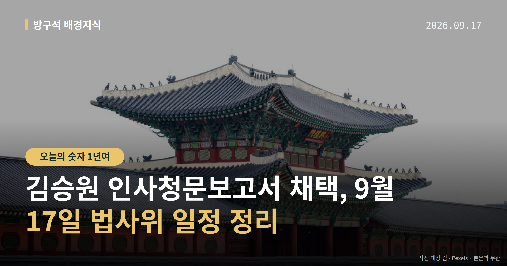
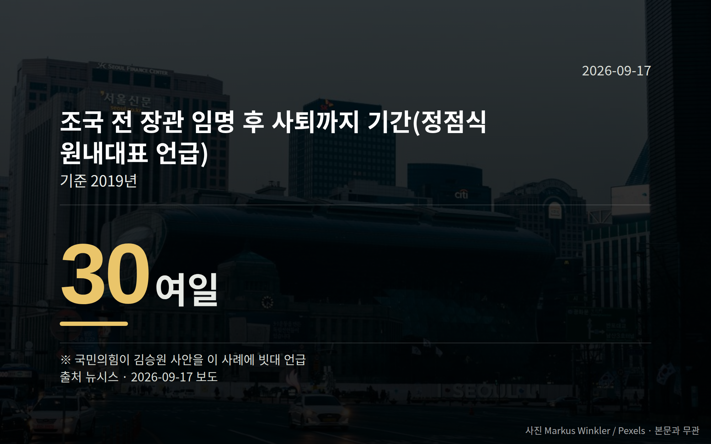

*이 글은 2026년 9월 17일 기준으로 정리한 내용입니다.*
**3줄 요약**

- 김승원 인사청문보고서 채택 건, 17일 법사위 심사
- 국민의힘은 22일 국회 앞 보고대회, 1년여 만의 장외
- 채택되면 다음은 대통령의 임명 여부 결정 단계
김승원 인사청문보고서 채택 건이 9월 17일 국회 법제사법위원회에서 심사됩니다. 16일 여야는 이 문제를 놓고 정면으로 부딪쳤습니다.

채택 여부에 따라 다음 절차가 갈립니다. 오늘은 이 한 가지를 중심으로 정리해 보겠습니다.

[이미지: 국회 본관 전경 사진]

## 김승원 인사청문보고서 채택, 무슨 일이 있었나

인사청문경과보고서는 국회가 후보자 검증 결과를 정리해 대통령에게 보내는 문서입니다. 채택이 되든 안 되든 임명 여부의 최종 결정은 대통령이 합니다.

국회 법사위원장 서영교 의원과 여당 간사 김의겸·김기표 의원(더불어민주당)은 16일 국회 소통관 기자회견에서 김 후보자를 "역량을 갖춘 적임자"라고 평가하며 국민의힘에 채택 협조를 요청했습니다.

여당 법사위원들은 제넨셀 신약 관련 의혹에 대해 "녹취 일부와 제3자의 말을 후보자의 청탁과 약속으로 연결한 주장"이라고 반박했습니다. 주가조작 의혹에는 "관여했다는 근거가 전혀 제시되지 않았다"고 밝혔습니다.

협동조합 관련 의혹에 대해서는 "배우자와 자녀는 실제 교육·돌봄 업무를 수행한 근로자"라며, 일부 회계상 오류는 있으나 편취로 몰아가는 것은 왜곡이라고 주장했습니다. 이 사안들은 모두 의혹 제기 단계이며 사실로 확정된 것은 아닙니다.

## 국민의힘은 왜 장외투쟁을 말했나

국민의힘은 정부·여당의 임명 강행 기류에 장외투쟁을 포함한 강경 대응을 시사했습니다. 9월 22일 국회 본관 앞 계단에서 '이재명 정부 실정 대국민 보고대회'를 열 계획입니다.

정점식 원내대표는 2019년 조국 전 법무부 장관이 임명 30여 일 만에 사퇴한 사례를 언급하며 추가 장외투쟁 가능성을 열어뒀습니다. 장외투쟁이 재개되면 마지막 이후 1년여 만입니다.

반면 청와대 관계자는 김 후보자 등 5명에 대한 임명 기류가 바뀐 것은 없다고 밝혔고, 청문회에서 "팩트로 확인된 의혹은 없다"는 입장을 보였습니다.

| 항목 | 내용 |
| --- | --- |
| 법사위 심사 | 9월 17일 |
| 국민의힘 보고대회 | 9월 22일, 국회 본관 앞 |
| 언급된 과거 사례 | 2019년, 임명 30여 일 만 사퇴 |
| 장외투쟁 공백 | 1년여 |

## 그래서 다음은 무엇을 보면 되나

김승원 인사청문보고서 채택이 여야 합의로 이뤄질지, 여당 단독 채택으로 갈지는 아직 정해지지 않았습니다. 채택되면 절차상 대통령의 임명 여부 결정 단계로 넘어갑니다.

국민의힘의 실제 장외투쟁 개시 여부와 시점은 추석 연휴 이후 당 차원 논의를 거쳐 결정될 예정입니다. 지금 단계에서 결과를 단정할 근거는 없습니다.

참고로 한 매체가 김 후보자 관련 반대 여론을 보도했으나, 조사기관·조사기간·오차범위가 확인되지 않아 여기서는 수치를 옮기지 않았습니다.

[이미지: 인사청문회장 모습을 담은 사진]

## 그 밖의 오늘 소식

- 16일 본회의에 김성수 대법관 임명동의안 상정, 표결 결과 미확인
- 윤호중 장관, 김지용 중수청장 후보 "패거리 규정 과도" 발언
- 홍지선 국토부 장관 후보 청문회서 '경기·성남 라인' 의혹 제기

**그래서 나는?**

- 뉴스가 낯선 유권자라면, 청문보고서 다음 단계는 대통령 결정입니다
- 국회 일정을 챙기는 분이라면, 17일 법사위와 22일 집회를 보세요
- 제도에 관심 있다면, 10월 2일 중수청 출범 일정도 함께 확인해 보세요

**직접 센 숫자 — 국회·여론조사 (최근 7일)**

이번 주 등록된 선거 여론조사 9건

- 전국 정기(정례)조사 대통령선거 정당지지도 국정현안 등 — (주)코리아정보리서치 · 천지일보 의뢰 · 2026-09-14~15 · 1,009명 · 무선 ARS · 응답률 3.8% · 95% 신뢰수준에 ±3.1%p
- 전국 정기(정례)조사 정당지지도 — 케이에스오아이 주식회사(한국사회여론연구소) · 2026-09-14~15 · 1,001명 · 무선 ARS · 응답률 5.9% · 95% 신뢰수준에 ±3.1%p
- 전국 정당지지도 기타 주요 인물 및 정당 신뢰도, 정부대응 신뢰도, 정책 신뢰도, 정당지지도 — 한국갤럽조사연구소 · 시사IN 의뢰 · 2026-09-06~08 · 1,013명 · 무선전화면접 · 응답률 8.7% · 95% 신뢰수준에 ±3.1%p

*열린국회정보·중앙선거여론조사심의위원회 자료를 직접 셌습니다. 여론조사의 자세한 사항은 중앙선거여론조사심의위원회 홈페이지를 참조하세요.*
**여러분은 인사청문회에서 가장 먼저 확인하고 싶은 항목이 무엇인가요?**

---

### 참고한 기사

1. **“적임자” 임명 강행 분위기에 “장외 투쟁”…김승원 청문회 여진 계속**
   - [뉴시스·정치](https://www.newsis.com/view/NISX20260916_0003792704)
   - [동아일보·정치](https://www.donga.com/news/Politics/article/all/20260917/134684852/2)
2. **與, 오늘 법사위서 김승원 인사청문보고서 채택 건 심사**
   - [뉴시스·정치](https://www.newsis.com/view/NISX20260917_0003792942)
   - [경향신문·정치](https://www.khan.co.kr/article/202609161802001)
3. **정기국회 본회의…김성수 임명동의안 표결 外**
   - [연합뉴스TV](https://news.google.com/rss/articles/CBMiZ0FVX3lxTE12ZVZyazRHYi1mbjFHTG9kMzZFR2laZG54aFozOGlHU3lmd1dXSzVIOWpHSExYWmRaMGtwbGtDSVlqOUlFNUlGQnJiM0NhMUo5MVdUQkhCdGhueWozRzBGTUNoTEc4WlU?oc=5)
   - [YTN](https://news.google.com/rss/articles/CBMiXkFVX3lxTE5aa1RmU2RQWDhUU1RxNThYZU51NGw3c3VVbG1tbE0xNEdDT3BNeWoxTzZrZ0l2UkplTGpCUjZkLXBicmdzOTdNdUJVZFB3ZlZKa1Q3dXJHX0V3WVh4amc?oc=5)
4. **윤호중 "김지용 후보자, 윤석열·한동훈 패거리 간주 과도"**
   - [한국경제·정치](https://www.hankyung.com/article/2026091798977)
   - [동아일보·정치](https://www.donga.com/news/Politics/article/all/20260916/134683264/1)
5. **"인사 시스템이 '현지 시스템'인가?" 청문회에 소환된 그 이름**
   - [오마이뉴스·정치](https://www.ohmynews.com/NWS_Web/View/at_pg.aspx?CNTN_CD=A0003267891)
   - [연합뉴스·정치](https://www.yna.co.kr/view/AKR20260916094151001)

---

*본 글은 공개된 언론 보도를 정리한 것이며, 특정 정당·후보·인물을 지지하거나 반대하지 않습니다. 인용한 여론조사의 자세한 사항은 중앙선거여론조사심의위원회 홈페이지를 참조하세요.*
