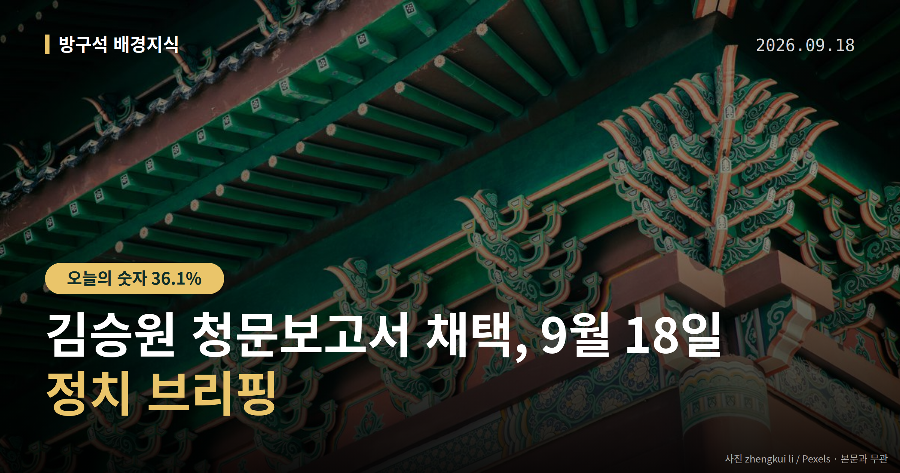
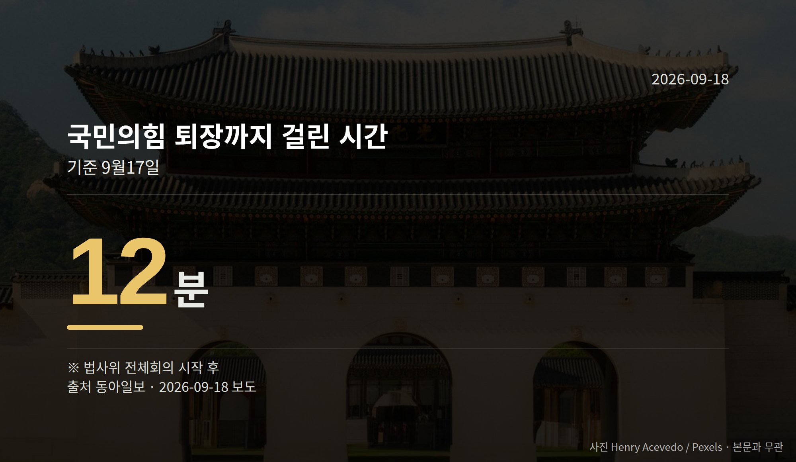
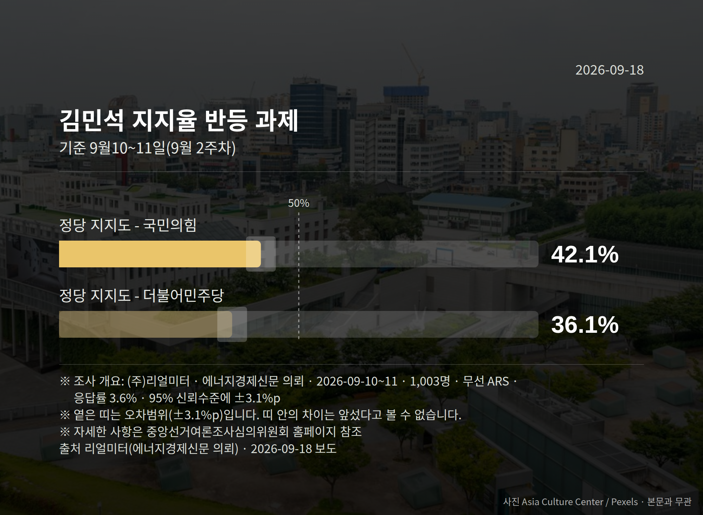

*이 글은 2026년 9월 18일 기준으로 정리한 내용입니다.*
**3줄 요약**

- 김승원 청문보고서 채택, 국민의힘 퇴장 속 법사위 단독 의결
- 국민의힘 퇴장까지 12분, 청문회 끝난 지 이틀 만의 처리
- 다음 절차는 대통령의 임명 여부와 22일 국회 앞 집회
김승원 청문보고서 채택이 17일 국회 법제사법위원회에서 이뤄졌습니다. 국민의힘 의원들이 퇴장한 가운데 더불어민주당 등 범여권 의원들이 단독으로 처리했습니다.

남은 절차는 대통령의 임명 여부 결정입니다. 오늘 지켜볼 지점도 바로 여기입니다.

[이미지: 국회 법제사법위원회 전체회의장 전경]

## 김승원 청문보고서 채택, 법사위에서 무슨 일이 있었나

인사청문경과보고서는 국회가 후보자 검증 결과를 정리해 대통령에게 보내는 문서입니다. 이 보고서가 채택되면 대통령은 임명을 진행할 절차적 요건을 갖추게 됩니다.

국민의힘은 코로나19 신약 임상시험 청탁 의혹 등을 이유로 지명 철회를 요구하며 회의 시작 12분 만에 회의장을 떠났습니다.

이 사안은 현재 '의혹'으로 제기된 단계입니다. 김 후보자 측의 구체적인 해명 내용은 자료에서 확인되지 않았습니다.

국민의힘 박형수 의원은 퇴장 전 "보고서 채택 안건 상정은 지금까지의 청문회 자체가 요식 행위였다는 것을 증명해 준다"고 말했습니다.

같은 당 곽규택 의원은 "내일 (대통령) 기자회견 하니까 오늘 (채택)하는 것 아니냐"고 항의했습니다. 이에 대한 민주당 측의 반박 발언은 자료에 담겨 있지 않습니다.

같은 날 국방위원회도 강신철 국방부 장관 후보자 청문 절차를 진행했습니다. 강 후보자를 두고는 철거민 특별분양, 아들의 '이모 찬스' 논란이 제기된 상태입니다.

## 숫자로 본 김승원 청문보고서 채택

| 항목 | 수치 |
|---|---|
| 국민의힘 퇴장까지 걸린 시간 | 12분 |
| 청문회 종료 후 보고서 채택까지 | 2일 |

(출처: 동아일보, 9월 17일 기준)

## 김승원 청문보고서 채택 다음에 볼 것

국민의힘은 임명이 강행될 경우 추가 대응을 예고했습니다. 자당 소속 의원이 위원장인 국토교통위원회와 산업통상자원중소벤처기업위원회 회의는 이미 취소됐습니다.

22일에는 국회 본관 앞 계단에서 '이재명 정부 실정 대국민 보고대회'를 열 계획입니다. 인사 검증, 부동산, 검찰 보완수사권 폐지 등을 다룰 예정이라고 합니다.

정점식 원내대표는 "현재 내각은 주요 인사의 전과 총합이 34범"이라며 "임명을 강행하면 35범 범죄 내각으로 강화될 것"이라고 말했습니다.

이 수치의 산출 근거와, 여당·후보자 측의 반박은 자료에 없습니다. 한편 국민의힘 내부에서도 투쟁 수위를 조절하자는 신중론이 나온다고 자료는 전하고 있습니다.

## 그 밖의 오늘 소식

- 이재명 대통령, 18일 오전 10시 일곱 번째 기자회견(90분)
- 리얼미터 조사 민주 36.1%·국힘 42.1%, 오차 ±3.1%p
- 김민석 민주당 대표, 20일 기자간담회 예정

**그래서 나는?**

- 뉴스만 보는 유권자라면, 보고서 채택과 임명은 다른 단계라는 점을 확인해 두세요
- 국회 일정을 챙기는 분이라면, 18일 오전 10시 기자회견 시간을 메모해 두세요
- 추석 연휴 계획이 있다면, 22일 국회 앞 집회 일정도 함께 살펴보세요

**직접 센 숫자 — 국회·여론조사 (최근 7일)**

국회의원 발의 법률안 **107건**. 최근 발의: 진실·화해를 위한 진실규명결정사건 피해자 명예회복과 보상 등에 관한 법률안(이개호의원 등 10인)

본회의 처리 법률안 **70건** — 원안가결 40건 · 수정가결 30건

이번 주 등록된 선거 여론조사 8건

- 전국 전체 정기(정례)조사대통령선거정당지지도 국정현안, 국회의원선거 등 — (주)코리아정보리서치 · 천지일보 의뢰 · 2026-09-14~15 · 1,009명 · 무선 ARS · 응답률 3.8% · 95% 신뢰수준에 ±3.1%p
- 전국 정기(정례)조사 정당지지도 — 케이에스오아이 주식회사(한국사회여론연구소) · 2026-09-14~15 · 1,001명 · 무선 ARS · 응답률 5.9% · 95% 신뢰수준에 ±3.1%p
- 전국 정당지지도 기타 주요 인물 및 정당 신뢰도, 정부대응 신뢰도, 정책 신뢰도, 정당지지도 — 한국갤럽조사연구소 · 시사IN 의뢰 · 2026-09-06~08 · 1,013명 · 무선전화면접 · 응답률 8.7% · 95% 신뢰수준에 ±3.1%p

*열린국회정보·중앙선거여론조사심의위원회 자료를 직접 셌습니다. 여론조사의 자세한 사항은 중앙선거여론조사심의위원회 홈페이지를 참조하세요.*
**여러분은 인사청문회 결과를 볼 때 후보자의 어떤 부분을 가장 먼저 확인하시나요?**

---

### 참고한 기사

1. **與 ‘김승원 청문보고서’ 단독 채택… 임명 강행 수순**
   - [동아일보·정치](https://www.donga.com/news/Politics/article/all/20260918/134692484/2)
   - [조선일보·정치](https://www.chosun.com/politics/assembly/2026/09/18/PEVEWFNNMFGR7ELCXQTT2MXX6A)
2. **(18일·금)**
   - [연합뉴스·정치](https://www.yna.co.kr/view/AKR20260917197100001)
   - [뉴시스·정치](https://www.newsis.com/view/NISX20260917_0003794603)
3. **국힘, 김승원 임명 강행 등 고리로 대여 공세…당 일각 '장외투쟁' 속도 조절 의견도**
   - [뉴시스·정치](https://www.newsis.com/view/NISX20260917_0003794578)
4. **與, 지지율 하락에 반등 계기 고심…'취임 한 달' 김민석, 지지율 회복·지지층 통합 숙제**
   - [뉴시스·정치](https://www.newsis.com/view/NISX20260917_0003794135)
   - [뉴데일리](https://news.google.com/rss/articles/CBMie0FVX3lxTE1PVk96NVZqY3Z1bWhqaUFvMVZfR2JwdGJ4cjlmdXVrckk4eUVlNzJRZDVkdEFYbERoSEt3VDVlTEZxOFhQb3RUMUpMZG96Q0JkdXk2c0FvMEkwT1JxUURGZ3dJdzdkRlZnME5MT3hxbTNjM1UyVW9oTFRoc9IBgAFBVV95cUxQZTNJT0t2ZXJjSTRVUl9DWHMyOHNkRzlXd19INHVlN0cycnhFN3R4aW5sRUFBN0dvTk9nWWxWdDVoeDFUOTNJSkVkMkpGNWs5d3NVSlY4X1lOZGk4LXZOTjZwZFpMYW9tQ29ZeFliNHZfVm1NdGdqbDdJamFaejlkcw?oc=5)
5. **李대통령, 오늘 취임 후 7번째 회견…연임·파병 입장 주목**
   - [한국경제·정치](https://www.hankyung.com/article/2026091825377)
   - [연합뉴스·정치](https://www.yna.co.kr/view/AKR20260917182100001)

---

*본 글은 공개된 언론 보도를 정리한 것이며, 특정 정당·후보·인물을 지지하거나 반대하지 않습니다. 인용한 여론조사의 자세한 사항은 중앙선거여론조사심의위원회 홈페이지를 참조하세요.*
