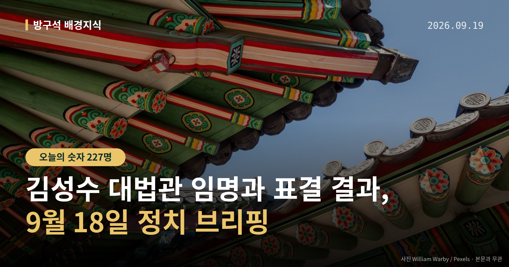
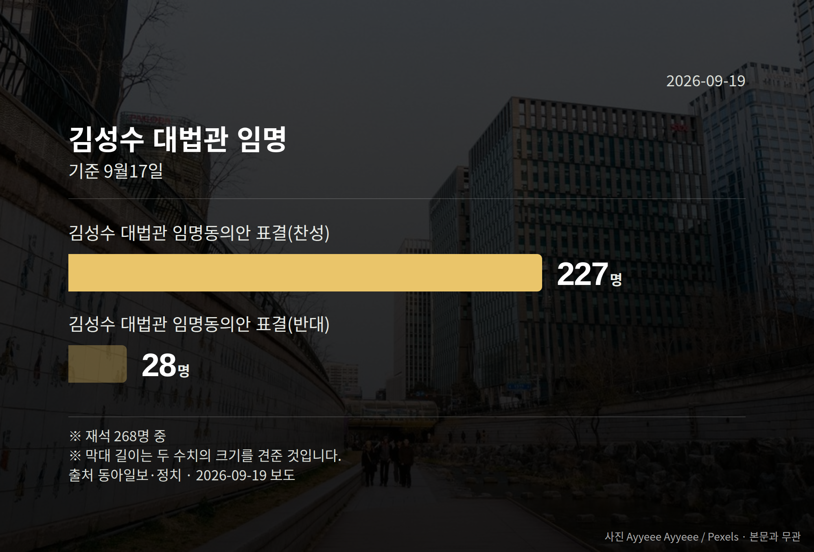

*이 글은 2026년 9월 19일 기준으로 정리한 내용입니다.*
**3줄 요약**

- 9월 18일 김성수 대법관 임명안이 재가돼 취임했습니다.
- 국회 표결은 재석 268명 중 찬성 227명으로 가결됐습니다.
- 노태악 대법관 후임 재제청 문제는 아직 결론이 없습니다.
여러분, 9월 18일 김성수 대법관 임명 절차가 마무리됐습니다. 이재명 대통령이 임명안을 재가해, 김성수 대법관은 현 정부 출범 후 취임하는 첫 대법관이 됐습니다. 다만 또 다른 대법관 후임 인선은 아직 매듭이 지어지지 않았습니다.

[이미지: 대법원 건물 외관 사진]

## 김성수 대법관 임명, 어떤 절차를 거쳤나

대법관은 대법원장이 임명 제청을 하고, 국회가 임명동의안을 표결한 뒤 대통령이 임명하는 순서로 정해집니다.

조희대 대법원장은 지난달 18일 김성수 후보자를 이흥구 대법관 후임으로 제청했습니다. 국회는 9월 17일 본회의에서 임명동의안을 가결했고, 다음 날 대통령 재가로 6년 임기가 시작됐습니다.

| 구분 | 표결 결과 |
|---|---|
| 찬성 | 227명 |
| 반대 | 28명 |
| 기권 | 13명 |

9월 17일 본회의, 재석 268명 기준입니다. 반대와 기권을 합친 수보다 찬성이 크게 많았던 표결이었습니다.

## 김성수 대법관 임명 뒤에도 남은 쟁점

조희대 대법원장은 노태악 대법관 후임으로 손봉기 판사도 함께 제청했습니다. 그러나 청와대는 8월 28일 재제청(대법원장에게 다른 후보자를 다시 제청해 달라고 요구하는 것)을 요구했습니다.

이 때문에 손봉기 판사에 대한 임명 절차는 아직 진행되지 않고 있습니다. 조 대법원장은 9월 18일 시점까지 재제청 요구에 대한 입장을 밝히지 않았습니다. 김성수 대법관 임명으로 공백이 부분적으로만 해소된 상태라는 뜻입니다.

## 같은 날 대통령 회견, 여야 입장은

이재명 대통령은 9월 18일 기자회견에서 국회에 계류된 '조작기소 특검법'의 공소취소권(검찰이 이미 낸 재판 청구를 거두는 권한) 조항을 삭제해 달라고 요청했습니다. "기존 기소 사건의 이송 또는 처분에 관한 조항을 삭제하고 진상 규명에만 집중해 주길 바란다"고 말했습니다. 김승원 법무부 장관 후보자 임명 여부에는 "아직 최종 결론을 내리지 못했다"고 했습니다.

장동혁 국민의힘 대표는 "조항이 들어가든 안 들어가든 마음만 먹으면 언제든지 공소취소는 가능하다"고 말했습니다. 정점식 원내대표는 "국정 기조 전환의 의지가 전혀 없다"며 김승원 후보자 임명 철회를 요구했습니다. 장 대표는 임명이 강행되면 "22일 국민보고대회보다 더 강력한 투쟁 수단"도 검토하겠다고 했습니다.

[이미지: 국회 본회의장 내부 사진]

## 그 밖의 오늘 소식

- 법사위, 최길수 특별감찰관 후보자 청문회 개최
- 감찰 대상에 김현지 제1부속실장 포함 여부 공방
- 정점식 원내대표, 레버리지 ETF 관련 특검법 추진 예고

특별감찰관 청문회에서 국민의힘 주진우 의원은 이재명 대통령 아들 관련 의혹도 제기했는데, 더불어민주당 박지원 의원은 "의혹을 제기해 놓고 수사하라고 하는 것은 있을 수 없는 일"이라고 반박했습니다. 이 사안은 의혹 제기 단계이며, 당사자 해명은 확인되지 않았습니다.

정점식 원내대표는 ETF 도입과 관련해 "54조원의 국민 손실"을 주장했습니다. 이 수치는 정 원내대표의 주장이며, 정부·여당 측 반박은 확인되지 않았습니다.

**그래서 나는?**

- 재판을 기다리는 당사자라면, 대법관 공백 해소 여부를 확인해 보세요.
- 국회 일정을 챙기는 유권자라면, 9월 22일 전후 일정을 살펴보세요.
- ETF 투자자라면, 특검법 발의 여부에 따라 논의가 달라질 수 있습니다.

**직접 센 숫자 — 국회·여론조사 (최근 7일)**

국회의원 발의 법률안 **97건**. 최근 발의: 선거관리위원회법 일부개정법률안(한동훈의원 등 20인)

본회의 처리 법률안 **71건** — 철회 1건 · 원안가결 40건 · 수정가결 30건

이번 주 등록된 선거 여론조사 7건

- 전국 정기(정례)조사 정당지지도 — 한국갤럽조사연구소 · 한국갤럽 자체 조사 의뢰 · 2026-09-15~17 · 1,002명 · 무선전화면접 · 응답률 9.8% · 95% 신뢰수준에 ±3.1%p
- 전국 전체 정기(정례)조사대통령선거정당지지도 국정현안, 국회의원선거 등 — (주)코리아정보리서치 · 천지일보 의뢰 · 2026-09-14~15 · 1,009명 · 무선 ARS · 응답률 3.8% · 95% 신뢰수준에 ±3.1%p
- 전국 정기(정례)조사 정당지지도 — 케이에스오아이 주식회사(한국사회여론연구소) · 2026-09-14~15 · 1,001명 · 무선 ARS · 응답률 5.9% · 95% 신뢰수준에 ±3.1%p

*열린국회정보·중앙선거여론조사심의위원회 자료를 직접 셌습니다. 여론조사의 자세한 사항은 중앙선거여론조사심의위원회 홈페이지를 참조하세요.*
**여러분은 대법관 임명이나 특검법 같은 소식을 들을 때, 어떤 부분이 가장 이해하기 어려우셨나요?**

---

### 참고한 기사

1. **李 대통령, 김성수 임명안 재가…현 정부 첫 대법관 취임**
   - [한국경제·정치](https://www.hankyung.com/article/2026091847821)
   - [진일보](https://news.google.com/rss/articles/CBMib0FVX3lxTE5zazlkeFZXazBZd2t3Q1RpaXpidWs5UjlnaEUzWDl2SjJ4V2FoWVNBSWFXQi1wZXRjNlUzSW5sNC1NQWRlekh1QmZlRjcyM1BhWG9FRXMyNzl2SmJZUFBwTnhHSV80NXlVNXRKWmc1UQ?oc=5)
2. **李대통령 “공소취소 삭제”…김승원 거취 ‘이목’**
   - [동방일보](https://news.google.com/rss/articles/CBMic0FVX3lxTE9EcGNpQ1ZBenVFSDUtekIyUVJsVkw1ZFotLUtrRlpVTDRrU1Q0eUQwNkFJbzZ0TEw3VHNTYW00Nll4NENGWDZGTE5tYUpwNWd4NEs5QjdDM2ZUV24td3VERUV2UFkzcV9xb3lCQTZXTUtvcUE?oc=5)
   - [채널A](https://news.google.com/rss/articles/CBMiY0FVX3lxTE9MbnZ3ZUR5ZWZjNUdOczRLN1J0d2FiNWhuQ2xfajRHcTc3QmxWaGJxNGd5bXVKZXplMEdYYUtBWjd3MUZuOHR3cEJ6ejJTQXVCTS1oZl9Id09pZTdQYXZvbjBDNNIBY0FVX3lxTE9MbnZ3ZUR5ZWZjNUdOczRLN1J0d2FiNWhuQ2xfajRHcTc3QmxWaGJxNGd5bXVKZXplMEdYYUtBWjd3MUZuOHR3cEJ6ejJTQXVCTS1oZl9Id09pZTdQYXZvbjBDNA?oc=5)
3. **최길수 특별감찰관 후보자 청문회…여야 감찰 범위 놓고 거센 공방**
   - [뉴스핌](https://news.google.com/rss/articles/CBMiXEFVX3lxTE1DZzgtd1NZUDA4WUZrRWRaNDRZRUFTSVRNbXNSMVFIS2Z4Nk1Ja21QX1FDdjYzT1Q5eF91TTVVTjNPOFdDUF92bWk4d2tpeXZPbnllUXJyOXRxVVJN?oc=5)
   - [BBS불교방송](https://news.google.com/rss/articles/CBMia0FVX3lxTE11REJSNzVPSTNYZmxtalh5cjd2bW1vMzlLWGFUYkpydnp4bi03dVphWXBheDJnMFBKZ2tiVUZyeW9WQThFX0dlN2g4RUdHdXhqSmpjR3RkVWJNSDI1NFE2bVl1TmFnZ3ZMR0U4?oc=5)
4. **野 "李, 반성 없이 남 탓만…'공소취소 않겠다'는 말 끝내 안 해" [뉴시스Pic]**
   - [뉴시스·정치](https://www.newsis.com/view/NISX20260918_0003796283)
5. **정점식 "李, 국정기조 전환 의지 전혀 없어…레버리지 ETF 특검법 추진"**
   - [뉴시스·정치](https://www.newsis.com/view/NISX20260918_0003795914)

---

*본 글은 공개된 언론 보도를 정리한 것이며, 특정 정당·후보·인물을 지지하거나 반대하지 않습니다. 인용한 여론조사의 자세한 사항은 중앙선거여론조사심의위원회 홈페이지를 참조하세요.*
