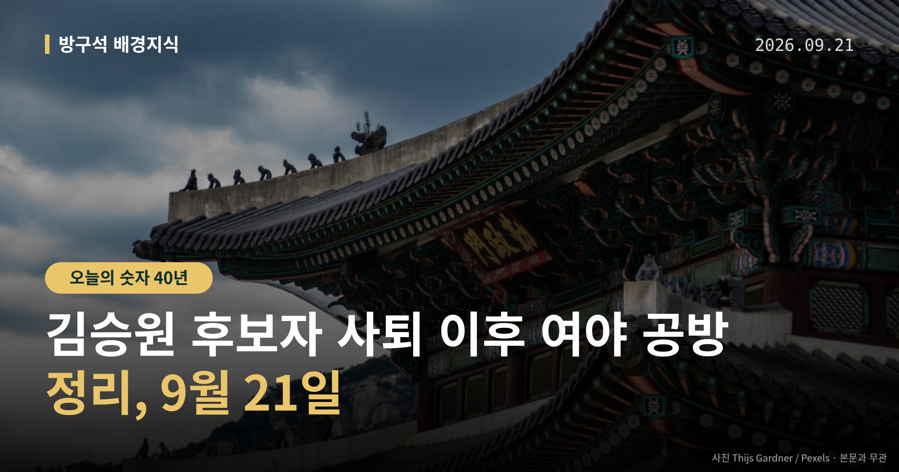
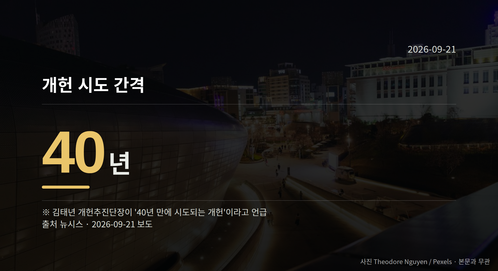

*이 글은 2026년 9월 21일 기준으로 정리한 내용입니다.*
**3줄 요약**

- 민주당 김승원 의원이 19일 법무부 장관 후보직에서 자진사퇴했습니다.
- 국민의힘은 22일 보고대회를, 민주당은 40년 만의 개헌 추진을 예고했습니다.
- 수사 착수 여부와 김현지 부속실장 국정감사 출석 여부를 보면 됩니다.
더불어민주당 김승원 의원이 지난 19일 법무부 장관 후보직에서 스스로 물러났습니다. 김승원 후보자 사퇴 이후 여야는 수사 요구와 맞불 의혹 제기를 주고받고 있습니다.

오늘은 이 공방이 어떤 구조인지, 절차상 다음이 무엇인지만 차분히 짚어보겠습니다.

[이미지: 국회 본관 전경 사진]

## 김승원 후보자 사퇴, 무슨 일이 있었나

김 의원은 19일 자진사퇴(후보자가 스스로 지명을 반납하는 것)했습니다. 사퇴 이틀 전인 17일, 성추행·음주운전·보좌진 욕설과 폭언 등 추가 의혹이 담긴 탄원서가 청와대에 전달됐다는 보도가 나왔습니다.

다만 탄원서의 구체적 내용과 청와대 접수 경위는 공개된 자료로 확인되지 않았습니다. 아직 확인·수사 절차를 거치지 않은 의혹 단계라는 점은 짚어둬야 합니다.

김 의원은 사퇴 기자회견에서 "직은 내려놓아도 진실은 포기하지 않겠다"며 "윤석열·한동훈 정치 검찰의 표적 수사와 한동훈 수사 기밀 불법 유출 짜깁기 사태 전모를 끝까지 밝히겠다"고 말했습니다.

## 김승원 후보자 사퇴 뒤, 여야는 무엇을 주고받았나

국민의힘은 김 의원이 의원직을 사퇴하고 수사를 받아야 한다고 주장했습니다. 장동혁 대표는 19일 "장관의 시간은 끝났고 수사의 시간이 시작됐다"고 말했고, 20일에는 "국민이 용혜인과 김승원을 쫓아냈다"고 말했습니다.

최보윤 수석대변인은 탄원서의 접수 여부와 전달 경로, 검증 라인 공유 시점을 즉각 공개하라고 요구했습니다.

[이미지: 국회 기자회견장에서 발언하는 정치인 모습]

민주당은 한동훈 무소속 의원을 겨냥했습니다. 의혹 제기에 쓰인 녹취록 등이 불법 유출된 자료라는 주장입니다. 서영교 법제사법위원장은 "조작·표적수사, 그 진실은 밝혀질 것"이라고 했고, 김병주 의원은 "이제 한동훈 차례"라고 말했습니다.

한동훈 의원 측의 구체적 반론은 이번 자료에서 확인되지 않았고, 유출 경위에 대한 수사 결과도 아직 나오지 않았습니다. 여당 안에서는 청와대 인사 검증 시스템을 다시 점검해야 한다는 목소리도 익명으로 나왔습니다.

## 김승원 후보자 사퇴 다음 절차는 무엇인가

남은 갈래는 세 가지입니다. 실제 수사 착수 여부, 청와대의 탄원서 접수·검증 라인 공개 여부, 그리고 국민의힘이 요구한 김현지 대통령제1부속실장의 국정감사(국회가 정부 기관의 일을 따지는 연례 감사) 출석 여부입니다.

장동혁 대표는 강신철 국방부 장관 후보자 지명도 즉각 철회하라고 촉구했습니다. 강 후보자 본인의 해명은 아직 확인되지 않았습니다.

## 그 밖의 오늘 소식

- 국민의힘, 22일 국회 본관 앞 계단에서 대국민 보고대회 예정
- 민주당 개헌추진단 출범, 김민석 대표 "진지한 개헌 논의로 전환할 때"
- 김태년 단장, "40년 만의 개헌"·내년 상반기 국민투표 목표 제시

**그래서 나는?**

- 정치 뉴스를 챙기는 분이라면, 22일 국회 앞 일정부터 확인해 보세요.
- 국정감사에 관심 있다면, 출석 대상 협상 결과를 지켜볼 시점입니다.
- 유권자라면, 내년 상반기 국민투표 목표 일정이 생활과 닿을 수 있습니다.

**직접 센 숫자 — 국회·여론조사 (최근 7일)**

국회의원 발의 법률안 **97건**. 최근 발의: 선거관리위원회법 일부개정법률안(한동훈의원 등 20인)

본회의 처리 법률안 **71건** — 철회 1건 · 원안가결 40건 · 수정가결 30건

이번 주 등록된 선거 여론조사 8건

- 전국 정당지지도 — (주)에스티아이 · 한국일보 의뢰 · 2026-09-14~17 · 2,000명 · 스마트폰앱조사 · 응답률 4.6% · 95% 신뢰수준에 ±2.2%p
- 전국 정기(정례)조사 정당지지도 — (주)여론조사꽃 · 2026-09-18~19 · 1,003명 · 무선전화면접 · 응답률 9.6% · 95% 신뢰수준에 ±3.1%p
- 전국 정기(정례)조사 정당지지도 — (주)여론조사꽃 · 2026-09-18~19 · 1,007명 · 무선 ARS · 응답률 2.6% · 95% 신뢰수준에 ±3.1%p

*열린국회정보·중앙선거여론조사심의위원회 자료를 직접 셌습니다. 여론조사의 자세한 사항은 중앙선거여론조사심의위원회 홈페이지를 참조하세요.*
**여러분은 장관 후보자 검증에서 어떤 기준이 가장 먼저 확인돼야 한다고 보시나요?**

---

### 참고한 기사

1. **(21일·월)**
   - [연합뉴스·정치](https://www.yna.co.kr/view/AKR20260920040500001)
   - [뉴시스·정치](https://www.newsis.com/view/NISX20260920_0003796986)
2. **국힘 “김승원 의원직 사퇴하고 수사 받아야”**
   - [동아일보·정치](https://www.donga.com/news/Society/article/all/20260921/134706879/2)
   - [조선일보·정치](https://www.chosun.com/politics/assembly/2026/09/20/RU3YOA64XBFEDFZ6RAGYVJII6I)
3. **與, 김승원 낙마 ‘한동훈 차례’ 역공…자성론도**
   - [동방일보](https://news.google.com/rss/articles/CBMic0FVX3lxTE1IQ1Zrc01feGVBN3ZIVklYX1lmSEVHczRrTTJab2pqN2hScjBqRkdZVHBVX2NkeXcyWE1LZ2FQQ08zQlMtX1NJUmFESlphN1I4NmtocjBlUnZ4aERnaGNLZ0tzT2w0bGhveE9MRUNPTlJGa3c?oc=5)
   - [뉴시스·정치](https://www.newsis.com/view/NISX20260919_0003796693)
4. **국힘, 李정부 '인사 실패' 고리 대여 공세…'정권 실정 대국민 보고대회' 22일 개최**
   - [뉴시스·정치](https://www.newsis.com/view/NISX20260920_0003797210)
5. **취임 한 달 김민석, 개헌 추진 본격화…"국힘, 말꼬리 잡기 보다 진진한 논의로 전환할 때"(종합)**
   - [뉴시스·정치](https://www.newsis.com/view/NISX20260920_0003797309)

---

*본 글은 공개된 언론 보도를 정리한 것이며, 특정 정당·후보·인물을 지지하거나 반대하지 않습니다. 인용한 여론조사의 자세한 사항은 중앙선거여론조사심의위원회 홈페이지를 참조하세요.*
