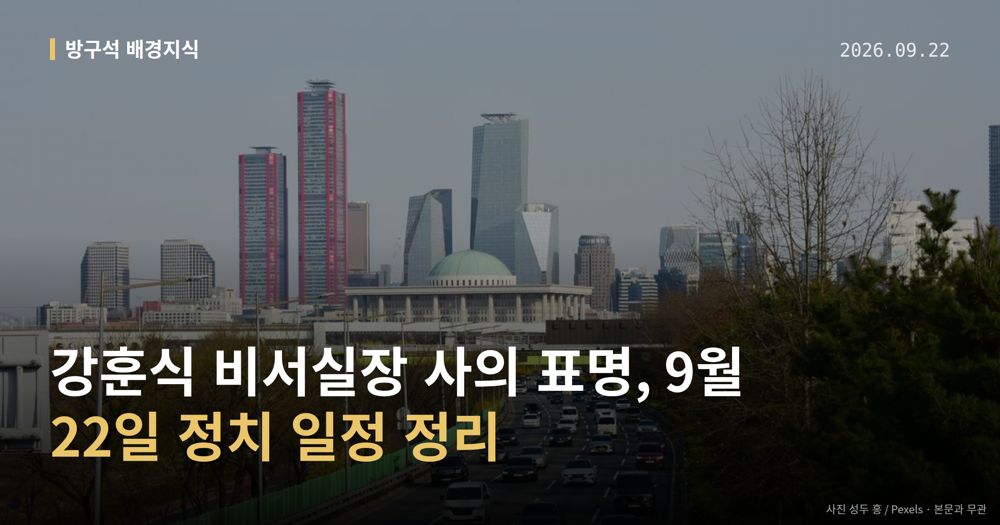

*이 글은 2026년 9월 22일 기준으로 정리한 내용입니다.*
**3줄 요약**

- 9월 21일 강훈식 대통령비서실장이 사의를 표명했습니다.
- 22일 국무회의 오전 8시, 국민의힘 보고대회 오전 10시 30분입니다.
- 대통령 순방 중이라 사의 수리 여부는 귀국 이후로 넘어갔습니다.
9월 21일 강훈식 대통령비서실장이 사의를 표명했습니다. 이재명 대통령이 미국 순방 중이어서, 사의를 받아들일지 여부는 순방 이후로 넘어간 상태입니다.

그 사이 국민의힘은 22일 국회 앞 행사를, 더불어민주당은 인천 지역 일정을 각각 예고했습니다. 오늘 글에서는 이 흐름을 차례대로 정리해 보겠습니다.

[이미지: 국회 본관 앞 중앙계단 전경 사진]

## 강훈식 비서실장 사의, 지금 어디까지 왔나

사의 표명은 "물러나겠다"는 뜻을 밝히는 단계입니다. 임명권자가 이를 수리해야 사퇴가 확정되기 때문에, 지금은 아직 직이 정리된 상태가 아닙니다.

대통령이 순방 중인 만큼 **강훈식 비서실장 사의**의 수리 여부는 귀국 이후 결정될 것으로 전해졌습니다. 후임 비서실장과 정책실장 인선 방향도 함께 거론되고 있습니다.

이재명 대통령은 "국정 책임자로서 무거운 책임감, 낮은 자세로 국정 세밀히 다듬을 것"이라고 말한 것으로 소개됐습니다. 다만 이 발언의 정확한 시점과 맥락은 자료에서 확인되지 않았습니다.

## 강훈식 비서실장 사의에 국민의힘은 뭐라고 했나

장동혁 국민의힘 대표는 페이스북에 "정말로 책임을 져야 할 사람들은 청와대를 좌지우지한다는 '경기·성남 라인' 아닌가"라고 적었습니다. 이어 "내각과 청와대를 전면 쇄신해야 한다"며 "'종합적인 책임'을 질 사람은 바로 이재명 대통령"이라고 했습니다.

정점식 원내대표는 기자회견에서 "강 비서실장은 이번 인사 참사에 대한 책임을 지고 사퇴했어야 마땅하다"며 한성숙 국무총리의 사퇴도 요구했습니다. 또 김현지 청와대 제1부속실장과 정진상 전 민주당 정무조정실장을 국정감사(국회가 정부 기관의 한 해 업무를 따져 묻는 절차) 증인으로 불러야 한다고 촉구했습니다.

박성훈 수석대변인은 논평에서 "고작 비서실장 한 사람에게 책임을 떠넘기는 것이 쇄신인가"라고 물었습니다. 이상은 모두 국민의힘 측 주장이며, **강훈식 비서실장 사의**에 대한 더불어민주당 등 여당의 직접 반응은 이번 자료에서 확인되지 않았습니다.

[이미지: 정당 브리핑룸 마이크와 연단 사진]

## 9월 22일 일정은 이렇게 잡혀 있습니다

| 시각 | 일정 | 장소 |
|---|---|---|
| 오전 8시 | 국무회의(총리실 주재) | 정부세종청사 |
| 오전 10시 30분 | 국민의힘 '이재명 정권 실정 대국민 보고대회' | 국회 본관 앞 중앙계단 |
| 시각 미표기 | 민주당 예산정책협의회·모래내시장 방문 | 인천 남동구 |
| 시각 미표기 | 김건희 '매관매직' 사건 항소심 선고 | 자료에 미표기 |

항소심 선고는 뉴시스 기사 목록에 표기된 내용으로, 세부 사항은 자료에 담겨 있지 않습니다.

[이미지: 9월 22일 하루 정치 일정 타임라인 그래픽]

## 그 밖의 오늘 소식

- 김민석 대표, 오준호 기본소득당 대표 접견 뒤 "용혜인 선택 이해"
- 기본소득당은 "여당도 연합정치 책임 보여야" 입장(기사 제목 기준)
- 여당, 김지용 중대범죄수사청장 후보자 관련 당내 이견 관리 움직임

**그래서 나는?**

- 뉴스만 보는 유권자라면, 사의와 사퇴는 다른 단계라는 점을 기억해 두세요
- 인천 거주자라면, 22일 남동구 일대 정당 일정으로 혼잡할 수 있습니다
- 국정감사 관심 있다면, 증인 채택 협의 결과를 함께 확인해 보세요

**직접 센 숫자 — 국회·여론조사 (최근 7일)**

국회의원 발의 법률안 **116건**. 최근 발의: 조세특례제한법 일부개정법률안(정태호의원 등 10인)

본회의 처리 법률안 **71건** — 철회 1건 · 원안가결 40건 · 수정가결 30건

이번 주 등록된 선거 여론조사 8건

- 전국 정당지지도 — (주)에스티아이 · 한국일보 의뢰 · 2026-09-14~17 · 2,000명 · 스마트폰앱조사 · 응답률 4.6% · 95% 신뢰수준에 ±2.2%p
- 전국 정기(정례)조사 정당지지도 — (주)여론조사꽃 · 2026-09-18~19 · 1,003명 · 무선전화면접 · 응답률 9.6% · 95% 신뢰수준에 ±3.1%p
- 전국 정기(정례)조사 정당지지도 — (주)여론조사꽃 · 2026-09-18~19 · 1,007명 · 무선 ARS · 응답률 2.6% · 95% 신뢰수준에 ±3.1%p

*열린국회정보·중앙선거여론조사심의위원회 자료를 직접 셌습니다. 여론조사의 자세한 사항은 중앙선거여론조사심의위원회 홈페이지를 참조하세요.*
**여러분은 이번처럼 고위직 인사가 바뀔 때, 어떤 기준으로 그 변화를 판단하시나요?**

---

### 참고한 기사

1. **행정안전부(9월22일 화요일)**
   - [뉴스핌](https://news.google.com/rss/articles/CBMiXEFVX3lxTE4yekQ2ZGlBVHBZQ2RYWHNQYUJtVnlEQWhIRWplcWJrUl9OU2FTQnVKbWN6MGdQbW5oNWZ5RDlBbTlxaW44X2lZa3JkYUN0SDhzaU1JcHg5Z1BjVDJD?oc=5)
   - [뉴시스·정치](https://www.newsis.com/view/NISX20260921_0003799115)
2. **국힘, 강훈식 사의에 "당연한 처신…'경기·성남 라인'이 책임져야"(종합)**
   - [뉴시스·정치](https://www.newsis.com/view/NISX20260921_0003798636)
3. **국힘, 오늘 '李정권 실정 대국민 보고대회'…인사·부동산·공소취소 등 공세**
   - [뉴시스·정치](https://www.newsis.com/view/NISX20260921_0003799117)
4. **김민석 "용혜인 선택 이해"…기본소득당 달래기 나선 민주당**
   - [한국경제·정치](https://www.hankyung.com/article/2026092192907)
   - [동아일보·정치](https://www.donga.com/news/Politics/article/all/20260921/134712482/1)
5. **與, 당내 '김지용 이견' 추스르기…인사 논란 추가 확산 차단**
   - [뉴시스·정치](https://www.newsis.com/view/NISX20260921_0003799113)

---

*본 글은 공개된 언론 보도를 정리한 것이며, 특정 정당·후보·인물을 지지하거나 반대하지 않습니다. 인용한 여론조사의 자세한 사항은 중앙선거여론조사심의위원회 홈페이지를 참조하세요.*
