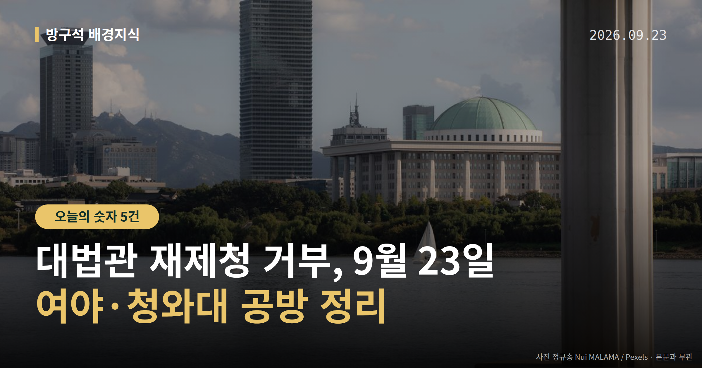
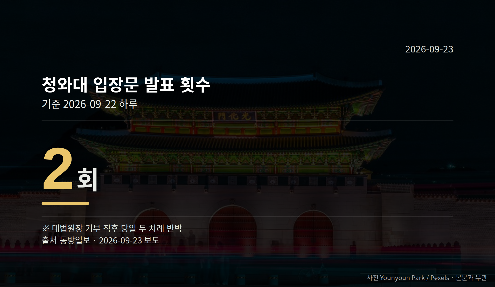

*이 글은 2026년 9월 23일 기준으로 정리한 내용입니다.*
**3줄 요약**

- 조희대 대법원장이 22일 대법관 재제청 거부 입장을 냈습니다
- 청와대는 같은 날 두 차례 입장문, 민주당은 논평 5건을 냈습니다
- 다음은 헌재 권한쟁의심판 청구와 국정감사 출석 요구 여부입니다
오늘 정리할 소식은 **대법관 재제청 거부**입니다. 조희대 대법원장이 22일 청와대의 대법관 후보 재제청 요구에 응하지 않겠다고 밝혔습니다.

청와대는 유감을 표명하며 헌법재판소 권한쟁의심판 청구를 검토 중이고, 대법관 자리는 200일 넘게 비어 있습니다.

[이미지: 대법원 청사 외관 사진]

## 대법관 재제청 거부, 무슨 일이 있었나

대법관은 대법원장이 후보를 제청하고 대통령이 국회 동의를 받아 임명합니다. 제청은 "이 사람을 임명해 달라"고 공식 추천하는 절차입니다.

청와대는 지난달 28일 조 대법원장에게 다른 후보를 다시 제청해 달라고 요청했습니다. 조 대법원장은 25일 뒤인 22일 "응할 수 없다"고 답했습니다.

| 항목 | 수치 |
| --- | --- |
| 재제청 요구~거부까지 | 25일(8/28~9/22) |
| 청와대 입장문 | 하루 2회 |
| 민주당 규탄 논평 | 당일 5건 |

조 대법원장은 청와대 문서에 구체적 사유와 헌법적 근거가 없었다고 밝혔습니다. 또 대통령의 국법상 행위는 국무총리 등이 부서(서명)한 문서로 한다는 헌법 82조를 근거로 들었습니다.

반면 청와대는 헌법 104조 2항과 법원조직법 41조 2항을 근거로 재제청을 요청했다고 전해졌습니다. 강유정 청와대 수석대변인은 "대법원장의 제청권은 대통령의 임명권을 대체하거나 무력화하는 권한이 아니"라고 주장했습니다.

## 여야는 각각 어떻게 말했나

김민석 민주당 대표는 22일 국회 규탄대회에서 이를 "대통령의 헌법적 임명권을 침해하는 도발"이라고 말했습니다. 서영교 국회 법사위원장은 기자들에게 "나는 탄핵이라고 몇 번씩 말했다"고 말했습니다.

한민수 민주당 최고위원은 SNS에 "사퇴하지 않는다면 탄핵을 포함한 모든 대응책을 검토할 것"이라고 적었습니다. 다만 뉴시스 보도에 따르면 당내에도 신중론이 있어, 탄핵 추진은 지도부의 공식 결정이 아닙니다.

장동혁 국민의힘 대표는 같은 날 기자회견에서 "헌법에 따른 지극히 당연한 결정"이라고 반박했습니다. 국민의힘 법사위 소속 박형수·김민전·주진우 의원은 "즉각 손봉기 대법관 후보자에 대한 국회 임명동의 절차를 밟으라"고 대통령 측에 촉구했습니다.

김민전 의원은 "대장동 판사를 대법관으로 지명하려는 것 아니냐는 의혹을 가질 수밖에 없다"고 말했습니다. 이는 의혹 제기이며, 사실로 확인된 내용은 아닙니다.

[이미지: 국회 본청 전경 사진]

## 대법관 재제청 거부, 다음 절차는

권한쟁의심판은 국가기관끼리 "이 권한은 누구 것이냐"를 헌법재판소가 가려 주는 절차입니다. 청와대는 현재 청구를 "검토" 중이며, 청구 여부와 시점은 정해지지 않았습니다.

조 대법원장은 후임 인선을 위한 후속 방안을 내놓지 않았습니다. 뉴시스는 갈등이 심화되면 조 대법원장 퇴임까지 공석이 이어질 수 있다는 우려가 커질 전망이라고 보도했습니다.

동아일보는 대통령이 재제청을 요구하고 대법원장이 거부한 사례는 헌정사상 사실상 처음이라고 전했습니다. 양측의 헌법 해석이 정반대라 절차적 교착이 이어지고 있습니다.

## 그 밖의 오늘 소식

- 국회 법사위, 조 대법원장 국정감사 출석 요구 검토(일정 미정)
- 대통령의 손봉기 후보자 임명동의안 국회 제출 여부 미정
- 23일 민주당·국민의힘 최고위원회의 등 정무 일정 예정

**그래서 나는?**

- 재판 당사자라면, 대법관 공백이 사건 처리 속도에 영향을 줄 수 있습니다
- 정치 뉴스를 따라가는 분이라면, 헌재 권한쟁의심판 청구 여부를 확인해 보세요
- 이번 국정감사를 보는 유권자라면, 법사위 일정 발표를 지켜보시면 됩니다

**직접 센 숫자 — 국회·여론조사 (최근 7일)**

국회의원 발의 법률안 **148건**. 최근 발의: 기술보증기금법 일부개정법률안(김원이의원 등 17인)

본회의 처리 법률안 **71건** — 철회 1건 · 원안가결 40건 · 수정가결 30건

이번 주 등록된 선거 여론조사 9건

- 전국 정당지지도 — (주)에스티아이 · 한겨레 의뢰 · 2026-09-15~20 · 1,592명 · 인터넷조사 · 응답률 96.5% · 95% 신뢰수준에 ±2.5%p
- 전국 정기(정례)조사 정당지지도 대통령선거 — 조원씨앤아이 · 스트레이트뉴스 의뢰 · 2026-09-19~21 · 2,007명 · 무선 ARS · 응답률 4.1% · 95% 신뢰수준에 ±2.2%p
- 전국 정기(정례)조사 정당지지도 — 여론조사공정(주) · 펜앤마이크 의뢰 · 2026-09-20~21 · 1,009명 · 무선 ARS · 응답률 2.8% · 95% 신뢰수준에 ±3.1%p

오늘 이슈에 나온 법안은 지금 어디에

- 법원조직법 — 제22대 발의 67건(계류 51) · 최근 「법원조직법 일부개정법률안」(최은석의원 등 11인, 2026-09-16) · 소관위 회부

*열린국회정보·중앙선거여론조사심의위원회 자료를 직접 셌습니다. 여론조사의 자세한 사항은 중앙선거여론조사심의위원회 홈페이지를 참조하세요.*
**여러분은 이런 기관 사이 권한 다툼을 뉴스에서 볼 때, 어떤 정보가 가장 먼저 궁금해지시나요?**

---

### 참고한 기사

1. **與, 조희대 '대법관 재제청 거부'에 사퇴 압박 공세 …"사법 쿠데타" "탄핵 검토"**
   - [뉴시스·정치](https://www.newsis.com/view/NISX20260922_0003801071)
   - [동아일보·정치](https://www.donga.com/news/Society/article/all/20260923/134723644/2)
2. **靑, 조희대 재제청 거부에 헌재 권한쟁의심판 청구 검토**
   - [조선일보·정치](https://www.chosun.com/politics/blue_house/2026/09/22/U77FVMZXAFBVDK44NBW2AG3ZM4)
   - [OBC 뉴스](https://news.google.com/rss/articles/CBMiaEFVX3lxTE51ci1iRzNwYmNiMVgtMXFZQ1daa0ZackFWZGp1QXZCbVVPZkVudWpaSEZEdG9MM1owNVJCSVNzWWRkSllnOEJSQjhTQkVvb3NTUDRpcmM3bXNxZ05WSHhkLWVTZXlpNnRI?oc=5)
3. **대법관 재제청 요구-거부, 헌정사상 처음**
   - [동아일보·정치](https://www.donga.com/news/Politics/article/all/20260922/134720137/1)
   - [오마이뉴스·정치](https://www.ohmynews.com/NWS_Web/View/at_pg.aspx?CNTN_CD=A0003269735)
4. **행정안전부(9월23일 수요일)**
   - [뉴시스·정치](https://www.newsis.com/view/NISX20260922_0003801028)
   - [뉴스핌](https://news.google.com/rss/articles/CBMiXEFVX3lxTE1uQXlFYjZ0Q01HSXN4ZkhncjBiYjF1azRPdkV5YmhjVHk5QXZBRUpMRWZJZGVUOXU0dURkTGlLNUYyYzRtQWhGWU96OVBTS3N4QXgyLUlkVVRIRHhW?oc=5)
5. **"재제청? 근거 없다" 조희대의 '강한 거부'…갈등 장기화 불가피(종합)**
   - [뉴시스·정치](https://www.newsis.com/view/NISX20260922_0003800974)

---

*본 글은 공개된 언론 보도를 정리한 것이며, 특정 정당·후보·인물을 지지하거나 반대하지 않습니다. 인용한 여론조사의 자세한 사항은 중앙선거여론조사심의위원회 홈페이지를 참조하세요.*
