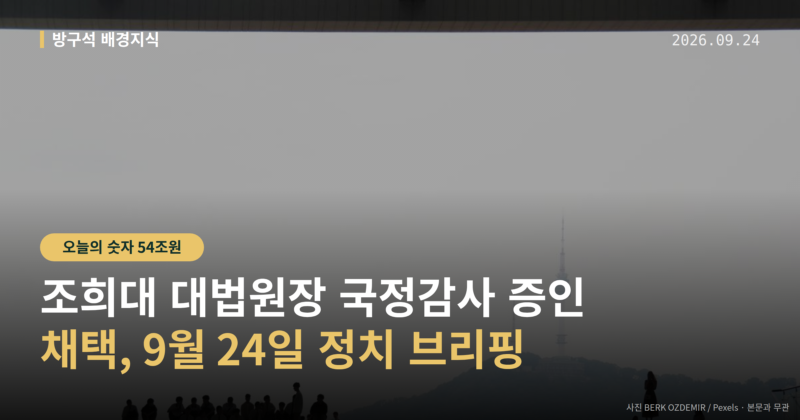
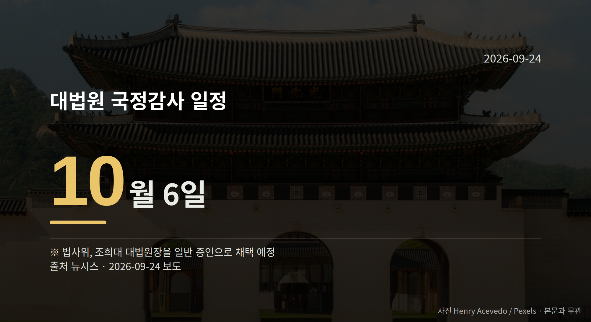

*이 글은 2026년 9월 24일 기준으로 정리한 내용입니다.*
**3줄 요약**

- 대법관 재제청 거부를 두고 여야가 정면으로 충돌했습니다.
- 법사위는 10월 6일 대법원 국정감사 증인 채택을 추진합니다.
- 연휴 뒤 법사위 긴급현안질의 일정부터 확인하면 됩니다.
조희대 대법원장 국정감사가 10월 6일로 예정되면서, 대법관 재제청 문제를 둘러싼 갈등이 국회 절차로 옮겨왔습니다. 9월 23일 더불어민주당 지도부는 대법원 앞 규탄대회를 열었고, 국민의힘 장동혁 대표는 같은 날 두 차례 기자회견을 열었습니다.

여기서 '제청'은 대법관 후보를 대통령에게 추천하는 대법원장의 권한을 말합니다. 조희대 대법원장이 재제청 요청을 거부하면서 공방이 시작됐습니다.

[이미지: 대법원 청사 외경을 담은 사진]

## 조희대 대법원장 국정감사, 증인 채택은 어떻게 되나

국회 법제사법위원회는 10월 6일 대법원 국정감사에 조 대법원장을 일반 증인으로 부를 예정입니다. 국정감사는 국회가 국가기관의 업무를 정해진 기간에 점검하는 절차입니다.

민주당은 9월 22일 긴급 의원총회에서, 23일에는 대법원 앞에서 규탄대회를 열고 자진 사퇴를 촉구했습니다. 이용우 민주당 대변인은 논평에서 조 대법원장의 행태를 "쿠데타적 행태"라고 표현했습니다.

국민의힘은 "사법부 독립성 때문에 대법원장은 증인으로 채택하지 않는다", "수십 년간 해온 관행을 어그러뜨린다"며 반발했습니다. 정점식 원내대표는 "대통령은 대법원장의 대법관 제청권을 존중해야 한다"고 말했습니다.

김민석 민주당 대표는 23일 유튜브 방송에서 국정조사와 특별검사 등 여러 절차가 있을 수 있다고 말했습니다. 당내 강경파에서는 탄핵 검토 목소리도 나오지만 신중론도 있는 것으로 전해졌고, 지도부의 확정된 방침인지는 확인되지 않았습니다.

| 언제 | 무엇이 예정돼 있나 |
| --- | --- |
| 10월 6일 | 대법원 국정감사, 조 대법원장 증인 채택 예정 |
| 추석 연휴 이후 | 법제사법위원회 긴급현안질의 |

## 여야가 서로에게 돌려준 '내란'이라는 말

장동혁 대표는 9월 23일 기자회견에서 "국민이 바라는 추석 선물은 이재명 탄핵"이라고 말했습니다. 다만 이는 공식 탄핵소추 절차에 들어간 것이 아니라 발언 차원이며, 실제 절차 진행 여부는 확인되지 않습니다.

장 대표는 이재명 정부를 '경제 내란', '안보 내란', '정치 내란', '사법 내란'으로 규정하면서 ETF 관련 손실 54조원을 언급했습니다. 이 수치는 장 대표의 주장으로, 별도 검증 자료는 제공되지 않았습니다.

민주당은 조 대법원장의 거부를 '내란적 거부'로 규정했고, 국민의힘은 "이재명 대통령의 폭정이 진짜 내란"이라고 맞받았습니다. 장 대표 발언에 대한 민주당의 직접 반론은 확인되지 않았습니다.

장 대표는 DMZ 지뢰 추정 폭발 사고를 두고 "북한이 최근 매설한 목함지뢰"라고 말했습니다. 군 당국 조사는 진행 중이어서 원인은 아직 확정되지 않은 상태입니다.

[이미지: 국회 본청 전경을 담은 사진]

## 그 밖의 오늘 소식

- 정점식 원내대표 "한동훈 복당, 당원·의원 뜻 결집돼야"
- 범보수 연대·합당 시점은 "시일을 두고 지켜봐야"
- 장 대표, 강신철 국방부 장관을 '간신철'이라 표현

**그래서 나는?**

- 정기국회를 지켜보는 유권자라면, 10월 6일 국정감사 일정을 확인해 보세요
- 법조 절차가 궁금한 분이라면, 대법관 제청권이 어떻게 다뤄지는지 볼 만합니다
- 뉴스가 어렵게 느껴지는 분이라면, 발언과 공식 절차를 나눠 보시면 편합니다

**직접 센 숫자 — 국회·여론조사 (최근 7일)**

최근 발의: 소득세법 일부개정법률안(정태호의원 등 11인)

이번 주 등록된 선거 여론조사 12건

- 전국 정기(정례)조사 대통령선거 정당지지도 국정현안 등 — (주)코리아정보리서치 · 천지일보 의뢰 · 2026-09-21~22 · 1,004명 · 무선 ARS · 응답률 4.5% · 95% 신뢰수준에 ±3.1%p
- 전국 정당지지도 대통령선거 — (주)피앰아이 · 이데일리 의뢰 · 2026-09-12~18 · 1,003명 · 인터넷조사 · 응답률 3.4% · 95% 신뢰수준에 ±3.1%p
- 전국 정기(정례)조사 국회의원선거 대통령선거 — 리서치웰 · 뉴데일리 의뢰 · 2026-09-21~22 · 1,000명 · 무선 ARS · 응답률 2.9% · 95% 신뢰수준에 ±3.1%p

*열린국회정보·중앙선거여론조사심의위원회 자료를 직접 셌습니다. 여론조사의 자세한 사항은 중앙선거여론조사심의위원회 홈페이지를 참조하세요.*
**여러분은 이번 공방에서 어떤 절차부터 눈여겨보게 되실 것 같나요?**

---

### 참고한 기사

1. **장동혁 “받고 싶은 선물, 이재명 탄핵” 추석 대여 공세**
   - [경향신문·정치](https://www.khan.co.kr/article/202609232019025)
   - [오마이뉴스·정치](https://www.ohmynews.com/NWS_Web/View/at_pg.aspx?CNTN_CD=A0003270067)
2. **이번주 국회에는 무슨 일이? [뉴시스국회토pic]**
   - [뉴시스·정치](https://www.newsis.com/view/NISX20260922_0003800199)
3. **국힘, 조희대 향한 與공세에 "폭정·독재가 진짜 내란…국민이 曺 지킬 것"(종합)**
   - [뉴시스·정치](https://www.newsis.com/view/NISX20260923_0003802320)
4. **조희대 국감장 세우려는 與, 탄핵도 거론…추석 이후 '사법전쟁' 격화할 듯**
   - [뉴시스·정치](https://www.newsis.com/view/NISX20260923_0003801845)
5. **정점식 "한동훈 복당, 당원·의원 뜻 결집될 때 가능…시일 두고 지켜봐야"**
   - [뉴시스·정치](https://www.newsis.com/view/NISX20260923_0003802754)

---

*본 글은 공개된 언론 보도를 정리한 것이며, 특정 정당·후보·인물을 지지하거나 반대하지 않습니다. 인용한 여론조사의 자세한 사항은 중앙선거여론조사심의위원회 홈페이지를 참조하세요.*
