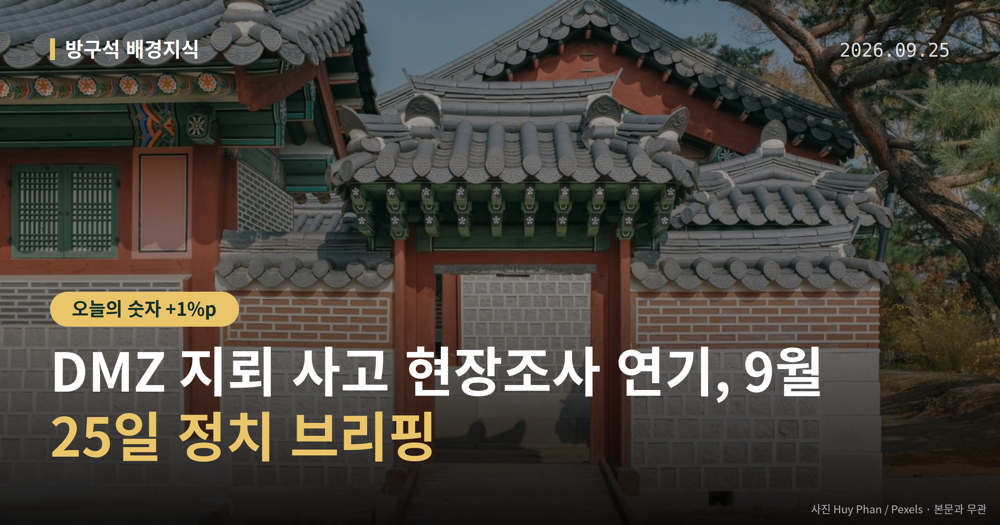
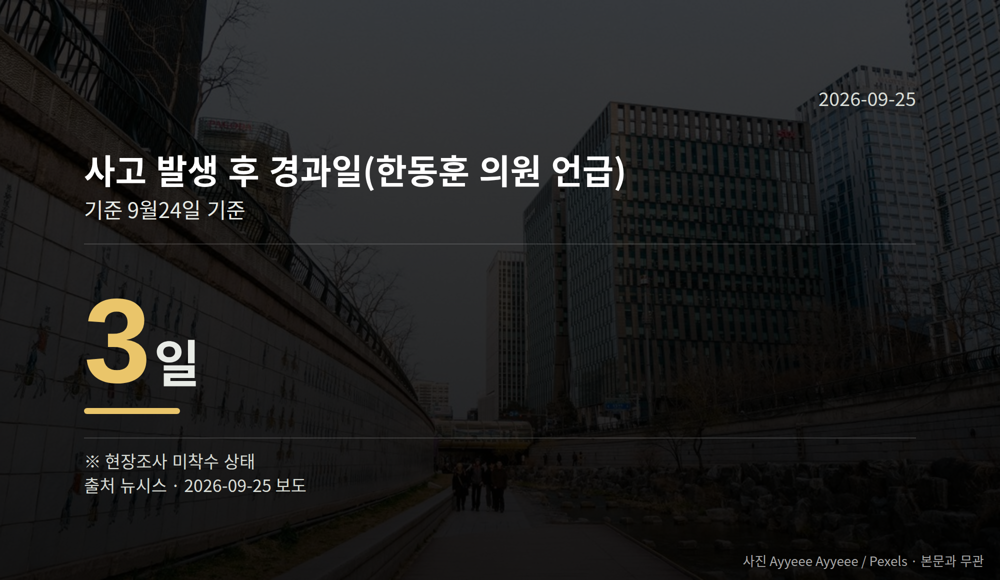

*이 글은 2026년 9월 25일 기준으로 정리한 내용입니다.*
**3줄 요약**

- 서부전선 DMZ에서 지뢰 추정 폭발, 현장조사는 추석 연휴 이후로 연기됐습니다.
- 한동훈 의원은 24일 기준 사고 사흘째까지 조사가 시작되지 않았다고 말했습니다.
- 연휴 이후 실제 조사 착수 시점과 유엔사 참여 여부가 다음 확인 지점입니다.
DMZ 지뢰 사고 현장조사가 추석 연휴 이후로 미뤄졌습니다. 서부전선 비무장지대(DMZ)에서 지뢰로 추정되는 폭발 사고가 있었지만, 아직 조사는 시작되지 않은 상태입니다.

국민의힘은 이 지연을 두고 정부와 군을 강하게 비판했습니다. 정부·여당의 공개 반박은 오늘 수집된 자료에서는 확인되지 않았습니다.

[이미지: 비무장지대 철책과 경고 표지판이 보이는 전경 사진]

## DMZ 지뢰 사고 현장조사, 왜 미뤄졌나

군 당국은 현장조사를 추석 연휴 이후로 미루겠다는 방침을 밝혔습니다. 국방부는 그 이유로 장병들의 '트라우마'를 들었습니다.

다만 조사를 언제 다시 시작하는지, 구체적인 일정은 자료에 나와 있지 않습니다. 지뢰를 누가 매설했는지도 아직 조사되지 않은 단계입니다.

한동훈 무소속 의원은 24일 기준으로 사고가 난 지 사흘이 지나도록 현장조사가 시작되지 않았다고 말했습니다.

## 야당은 무엇을 문제 삼았나

장동혁 국민의힘 대표는 유엔사(유엔군사령부)가 즉각 현장조사를 시작하려 했으나 우리 군이 이를 거부했다고 주장했습니다.

한동훈 의원은 24일 국방부 앞에서 즉각적인 현장조사를 촉구하는 1인 시위를 했습니다. 윤상현 국민의힘 의원은 국회 기자회견에서 사고 원인과 관련해 북한 목함지뢰 가능성을 언급했습니다.

이 주장들에 대한 국방부나 여당의 반박·해명은 이번 자료에 담겨 있지 않습니다. 한쪽 이야기만 전해진 상태라는 점을 감안해 읽으시는 편이 좋겠습니다.

[이미지: 국회 기자회견장에서 발언하는 의원의 모습]

## 사실과 주장은 이렇게 나뉩니다

| 구분 | 내용 |
| --- | --- |
| 확인된 사실 | DMZ 지뢰 추정 폭발 발생, 현장조사 연기 방침 |
| 아직 주장 | 유엔사 조사 거부, 북한 목함지뢰 가능성 |

매설 주체와 사고 원인은 조사 전이라 확정된 것이 없습니다. 윤 의원이 말한 목함지뢰 역시 확인된 원인이 아니라 가능성 제기 단계입니다.

그래서 DMZ 지뢰 사고 현장조사가 실제로 언제, 누구 주도로 시작되는지가 다음 단계의 갈림길입니다. 조사 방식에 따라 원인 규명 결과와 후속 대응의 수위가 달라질 수 있기 때문입니다.

당장 영향을 받는 쪽은 DMZ 인근에서 근무하는 장병들과 국방부·합참 관계자, 그리고 이 사안을 다룰 국회 국방위원회입니다.

## 그 밖의 오늘 소식

- 이재명 대통령, 22일 이정현 검찰총장 직무대행 임명안 재가
- '내란 사건 특별수사본부' 구성 검토 알려져 여야 공방
- 중대범죄수사청 출범 D-7, 청장·인력 확정 여부는 미정

**그래서 나는?**

- 군 복무 가족을 둔 분이라면, 연휴 이후 현장조사 착수 여부를 확인해 보세요.
- 안보 뉴스를 챙기는 유권자라면, 국회 국방위원회 일정도 함께 볼 만합니다.
- 지지율 기사를 보는 분이라면, 조사기관과 오차범위부터 확인해 보세요.

**직접 센 숫자 — 국회·여론조사 (최근 7일)**

국회의원 발의 법률안 **133건**. 최근 발의: 소득세법 일부개정법률안(정태호의원 등 11인)

본회의 처리 법률안 **1건** — 철회 1건

이번 주 등록된 선거 여론조사 12건

- 전국 정기(정례)조사 대통령선거 정당지지도 국정현안 등 — (주)코리아정보리서치 · 천지일보 의뢰 · 2026-09-21~22 · 1,004명 · 무선 ARS · 응답률 4.5% · 95% 신뢰수준에 ±3.1%p
- 전국 정당지지도 대통령선거 — (주)피앰아이 · 이데일리 의뢰 · 2026-09-12~18 · 1,003명 · 인터넷조사 · 응답률 3.4% · 95% 신뢰수준에 ±3.1%p
- 전국 정기(정례)조사 국회의원선거 대통령선거 — 리서치웰 · 뉴데일리 의뢰 · 2026-09-21~22 · 1,000명 · 무선 ARS · 응답률 2.9% · 95% 신뢰수준에 ±3.1%p

*열린국회정보·중앙선거여론조사심의위원회 자료를 직접 셌습니다. 여론조사의 자세한 사항은 중앙선거여론조사심의위원회 홈페이지를 참조하세요.*
**여러분은 사고 원인을 밝히는 일에서 조사의 속도와 신중함 중 어느 쪽이 더 앞서야 한다고 보시나요?**

---

### 참고한 기사

1. **野, DMZ 지뢰 추정 사고 정부 대응에 연일 공세…"즉각 현장조사 해야"(종합)**
   - [뉴시스·정치](https://www.newsis.com/view/NISX20260924_0003803142)
2. **오조준한 여권, 당신들이 베야 할 용은 대통령이 아니다**
   - [오마이뉴스·정치](https://www.ohmynews.com/NWS_Web/View/at_pg.aspx?CNTN_CD=A0003270127)
3. **국힘, 李대통령 '내란 사건 특수본' 구성 검토에 "유통기한 상실한 망상"**
   - [뉴시스·정치](https://www.newsis.com/view/NISX20260924_0003802868)
4. **중수청 출범 코앞인데…청장·인력 못 갖춘 채 문 여나[중수청·공소청 시대 D-7①]**
   - [뉴시스·정치](https://www.newsis.com/view/NISX20260923_0003802303)
5. **장동혁 “李 공소취소, 탄핵 트리거 될 것”…이정현 대행 직격**
   - [서울경제](https://news.google.com/rss/articles/CBMiUkFVX3lxTE8xV1lhYVQ0VFhpbFF4N2djTjZ1QXp2dXh5czdUMl8wUUVOM01qR2xOZm1qVEhDMF9Sai1jZ0haQlBVdEJ1S1hDS2JiLU9pdFNwWkHSAVNBVV95cUxNQ3ZzMFFVRXlXMUVPQnBXNmYzSVVGeEhCWkZRNktyVmpnTzlwUWVkX2piRm9tRGRxa2RQY3JfNmZqQjBSb2dFamxMbHE3TmFPSWl1Zw?oc=5)
   - [뉴시스·정치](https://www.newsis.com/view/NISX20260924_0003802855)

---

*본 글은 공개된 언론 보도를 정리한 것이며, 특정 정당·후보·인물을 지지하거나 반대하지 않습니다. 인용한 여론조사의 자세한 사항은 중앙선거여론조사심의위원회 홈페이지를 참조하세요.*
