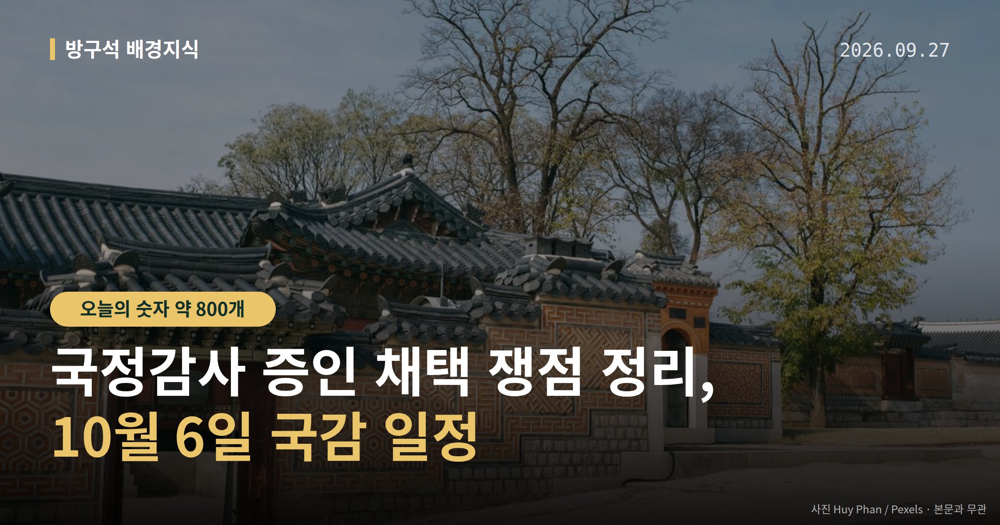
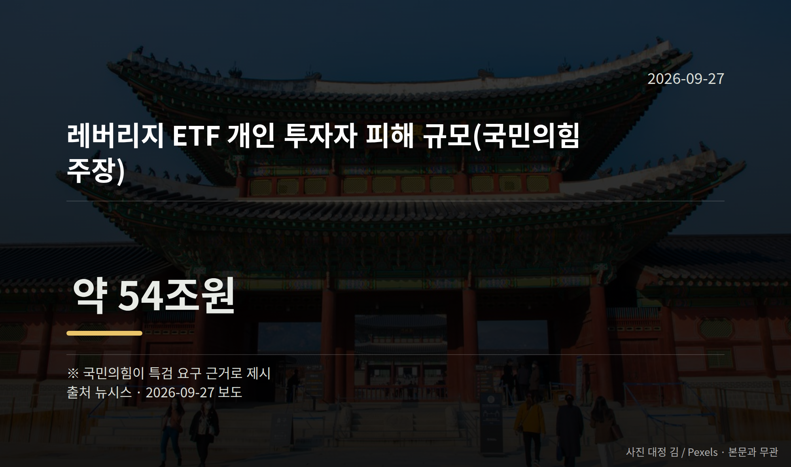
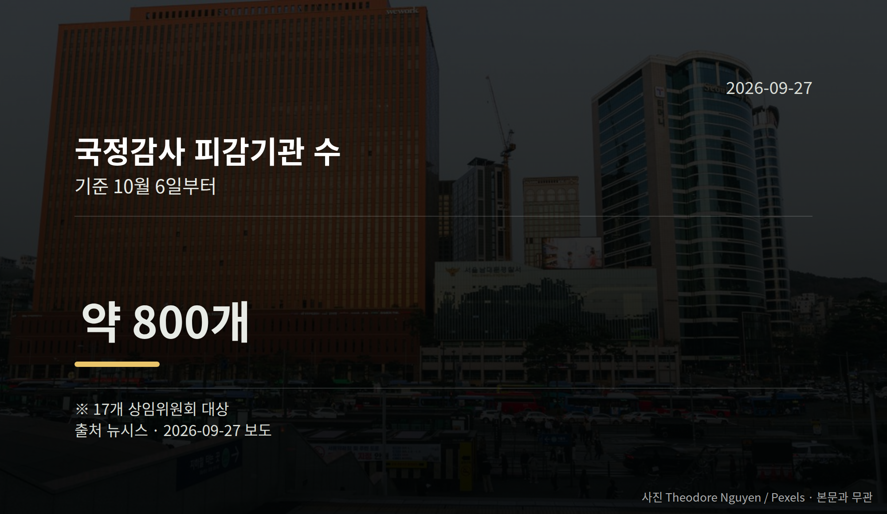

*이 글은 2026년 9월 27일 기준으로 정리한 내용입니다.*
**3줄 요약**

- 10월 6일 국정감사 앞두고 증인 채택 두고 여야 대치
- 17개 상임위·약 800개 기관 대상, ETF 54조원 공방
- 개시 전까지 상임위별 증인 명단 협의 결과를 보면 됩니다
10월 6일 시작하는 국정감사를 앞두고, 여야가 국정감사 증인 채택을 놓고 맞서고 있습니다. 국민의힘은 청와대 참모와 대기업 총수를 부르자고 요구했고, 더불어민주당은 일부 요구에 반대하고 있습니다.

증인 명단은 여야 합의가 있어야 확정됩니다. 지금은 어느 쪽도 확정된 것이 없는 상태입니다.

[이미지: 국회 본관과 상임위 회의장 전경 사진]

## 국정감사 증인 채택, 지금 무엇이 걸려 있나

국정감사는 국회가 정부와 공공기관이 1년 동안 일을 제대로 했는지 따져 묻는 정기 절차입니다. 국회에 따르면 올해는 10월 6일부터 17개 상임위원회가 약 800여 개 기관을 상대로 진행합니다.

국민의힘은 김현지 청와대 제1부속실장과 정진상 전 민주당 정무조정실장을 증인으로 불러 '김현지-정진상 인사농단 의혹'을 검증하겠다고 밝혔습니다. 아직 의혹 단계이며, 사실로 확인된 내용은 아닙니다.

지난해에도 국민의힘은 김 실장의 산림청장 인사 개입 의혹과 관련해 증인 채택을 시도했지만, 민주당의 거부로 출석은 이뤄지지 않았습니다. 올해 이 건에 대한 민주당의 구체적 입장은 자료에서 확인되지 않았습니다.

## 숫자로 본 국정감사 증인 채택 요구

| 항목 | 수치 | 성격 |
|---|---|---|
| 피감기관 수 | 약 800개 | 17개 상임위 대상 |
| 레버리지 ETF 피해 규모 | 약 54조원 | 국민의힘 주장 |
| 호남 반도체 메가클러스터 | 800조원 | 사업 규모 |

국민의힘은 단일종목 레버리지 ETF(기초 지수 등락의 배수만큼 수익과 손실이 커지도록 설계된 상장지수펀드) 도입 과정에서 개인 투자자 피해가 났다며 특검(국회가 별도 특별검사를 임명해 수사하도록 하는 제도)을 요구하고 있습니다. 위 피해 규모는 국민의힘이 특검 요구 근거로 제시한 수치입니다.

또 800조원대 호남 반도체 메가클러스터 투자 결정 과정과 관련해 이재용 삼성전자 회장, 최태원 SK그룹 회장의 증인 채택을 요구했습니다. 민주당은 이 요구에 반대하고 있습니다.

## 국정감사 증인 채택은 언제 정해지나

증인은 각 상임위에서 여야가 협의해 의결합니다. 한쪽이 동의하지 않으면 명단에 오르기 어렵습니다. 그래서 개시일인 10월 6일 직전까지 협상이 이어지는 경우가 많습니다.

여러분이 확인하실 지점은 세 가지입니다. 김현지 실장 출석 합의 여부, ETF 특검 논의 진전 여부, 그리고 기업 총수 증인 채택 여부입니다.

## 그 밖의 오늘 소식

- 민주당, 조희대 대법원장 대법관 재제청 거부 놓고 공세 이어감
- 국민의힘 박성훈 수석대변인 "사법부 겁박 중단하라"고 반박
- 민주당 내 김지용 중수청장 후보자 놓고 최고위원 간 공개 이견

**그래서 나는?**

- 주식 투자자라면, 레버리지 ETF 관련 국감 질의 내용을 확인해 보세요
- 호남 거주 주민이라면, 반도체 클러스터 관련 상임위 일정이 달라질 수 있습니다
- 유권자라면, 10월 6일 소속 지역구 의원의 상임위부터 찾아보세요

**직접 센 숫자 — 국회·여론조사 (최근 7일)**

국회의원 발의 법률안 **107건**. 최근 발의: 소득세법 일부개정법률안(정태호의원 등 11인)

이번 주 등록된 선거 여론조사 8건

- 전국 정기(정례)조사 대통령선거 정당지지도 국정현안 등 — (주)코리아정보리서치 · 천지일보 의뢰 · 2026-09-21~22 · 1,004명 · 무선 ARS · 응답률 4.5% · 95% 신뢰수준에 ±3.1%p
- 전국 정당지지도 대통령선거 — (주)피앰아이 · 이데일리 의뢰 · 2026-09-12~18 · 1,003명 · 인터넷조사 · 응답률 3.4% · 95% 신뢰수준에 ±3.1%p
- 전국 정기(정례)조사 국회의원선거 대통령선거 — 리서치웰 · 뉴데일리 의뢰 · 2026-09-21~22 · 1,000명 · 무선 ARS · 응답률 2.9% · 95% 신뢰수준에 ±3.1%p

*열린국회정보·중앙선거여론조사심의위원회 자료를 직접 셌습니다. 여론조사의 자세한 사항은 중앙선거여론조사심의위원회 홈페이지를 참조하세요.*
**여러분이 이번 국정감사에서 가장 답을 듣고 싶은 사안은 어느 쪽인가요?**

---

### 참고한 기사

1. **전열 정비한 與野, 국감서 대격돌 예고…'김현지 출석' 올해도 쟁점 부상**
   - [뉴시스·정치](https://www.newsis.com/view/NISX20260923_0003802478)
2. **與, 연휴에도 조희대 공세 지속…"尹 몰락의 길 그대로"(종합)**
   - [뉴시스·정치](https://www.newsis.com/view/NISX20260926_0003803862)
   - [dailian.co.kr](https://news.google.com/rss/articles/CBMiVEFVX3lxTFBBa3hqdEJFWFBiQXVXeVp6UHhVUTZEcWdGNDlQMkhjYnlZNTVtdkhkYVdpbWRBdHRSYkZud2V0MTVjMDA5S0NJYmc5UWhlWlEwQ0pWOA?oc=5)
3. **與, 연휴에도 조희대 향해 “정치질”…野 “李 뜻 거부하면 내란인가”**
   - [뉴시스·정치](https://www.newsis.com/view/NISX20260926_0003803697)
   - [joongang.co.kr](https://news.google.com/rss/articles/CBMiVkFVX3lxTE5TeUxXV2U1VTFEaXVQU1NHTXBhMFVRQTVTOTZ0eHFuLWFWck9pVFMtRi1OQmRRX3VIMEtjOHQ1enp6SkpsdGVJN0NySzh5cjZEdTBnU0hB?oc=5)
4. **정치·정부 (27일, 일)**
   - [뉴시스·정치](https://www.newsis.com/view/NISX20260926_0003803933)
   - [news1.kr](https://news.google.com/rss/articles/CBMiWkFVX3lxTFBrUWZvSDJpcXQ1ZWt2Uzc1M0t1SGgwWTJlRFI4T05ld21DTC01V1FQckczNXFmdkxNWmJjMlVXUDhCb0ZWMmNBNFprbUN5UXlBakdPX29TNmo5Z9IBX0FVX3lxTE9oNU5QcFo5UlFha1c1VGgzcGhGOVJERlYzRkIwVDI3ZzVYbU1nbkRNSzBPR2dmeDUzX3FFdW16N0tJMHdnSm5xOTFqUmFScFloM2tLYVpKdFFXRE1KTDRN?oc=5)
5. **김지용 임명 놓고 與 내부 이견 지속…"밀정이다" vs "야당이냐"**
   - [뉴시스·정치](https://www.newsis.com/view/NISX20260923_0003802344)

---

*본 글은 공개된 언론 보도를 정리한 것이며, 특정 정당·후보·인물을 지지하거나 반대하지 않습니다. 인용한 여론조사의 자세한 사항은 중앙선거여론조사심의위원회 홈페이지를 참조하세요.*
