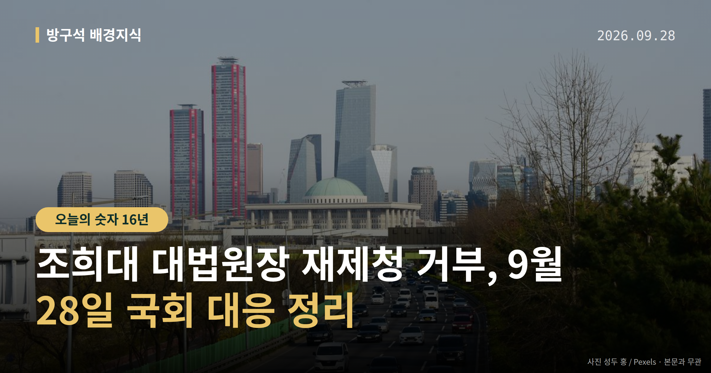
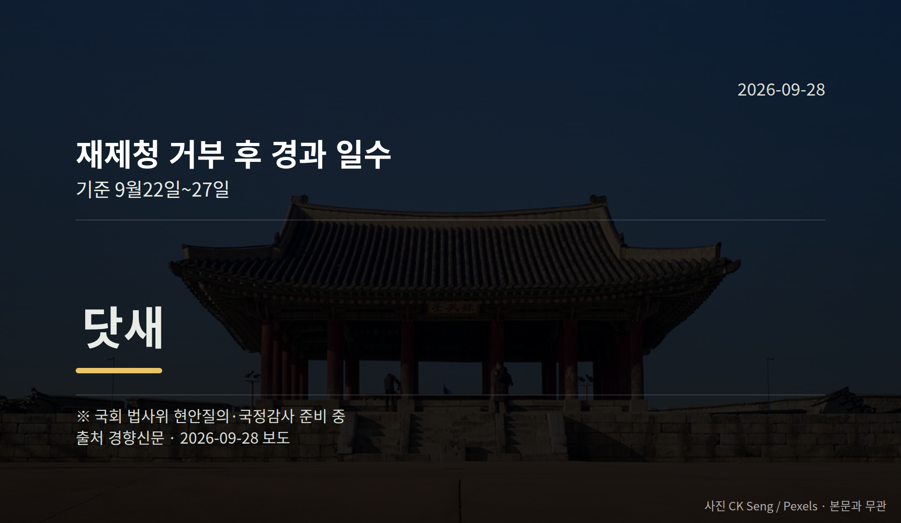

*이 글은 2026년 9월 28일 기준으로 정리한 내용입니다.*
**3줄 요약**

- 조희대 대법원장 재제청 거부 이후 국회 대응이 쟁점입니다
- 거부 닷새째인 27일, 법사위 현안질의·대법원 국감 준비 중
- 조 대법원장 출석 여부와 문서 제출 여부를 보면 됩니다
더불어민주당이 조희대 대법원장 재제청 거부에 대응해 국회 법제사법위원회 현안질의와 대법원 국정감사를 준비하고 있습니다. 27일은 거부 이후 닷새째입니다.

다만 조 대법원장 측의 직접 설명은 아직 확인되지 않았습니다. 여러분이 볼 지점은 '출석하느냐, 문서를 내느냐' 두 가지입니다.

## 조희대 대법원장 재제청 거부, 지금 어디까지 왔나

재제청은 대법원장이 대법관 후보를 대통령에게 다시 추천하는 절차입니다. 조 대법원장은 이 요청을 받아들이지 않았습니다.

민주당은 국회 법제사법위원회(법원·검찰 관련 법안을 다루는 상임위) 현안질의와 대법원 국정감사를 준비 중입니다. 국정감사는 국회가 국가기관의 업무 전반을 점검하는 절차입니다.

다만 조 대법원장의 불출석이 예상돼 별다른 성과 없이 끝날 가능성도 함께 제기됩니다.

## 민주당 주장과, 아직 확인되지 않은 쪽

민주당 이용우 대변인은 27일 "재제청 거부가 법원행정처 등의 의견도 모두 묵살한 독단적 결정이라는 주장이 제기됐다"며 "사실이라면 형법상 직권남용에 해당할 수 있다"고 말했습니다.

이 대변인은 법원행정처가 애초 재제청을 해야 한다고 결론 내고 보고했으나 조 대법원장이 거부 의견으로 다시 정리하도록 지시했다는 전언도 전하며, 관련 검토 문서 2건의 국회 제출을 요구했습니다.

이 내용은 이 대변인의 전언이며, 조희대 대법원장 측의 반박이나 해명은 오늘 자료에서 확인되지 않았습니다. 국민의힘의 구체적 입장도 확인되지 않았습니다.

민주당 안에서도 법원행정처 폐지를 담은 법원조직법 개정에는 "실익이 별로 없어 해결법이 안 보인다"는 신중론이 나옵니다.

[이미지: 국회 법제사법위원회 회의장 전경]

## 여야가 전한 추석 민심은 어떻게 달랐나

국민의힘 장동혁 대표는 27일 기자회견에서 "이번 추석 민심은 한마디로 일촉즉발이었다"고 말했습니다. 농지 전수조사와 부동산 정책을 들어 "국민 재산 약탈 즉각 중지하라"고도 했습니다.

민주당 박성준 수석대변인과 권칠승 정책위의장은 같은 날 간담회에서 "국민의힘이 DMZ 폭발 사고와 우크라이나 북한군 포로 송환을 두고 음모론까지 양산한다는 비판이 컸다"고 전했습니다. 박 수석대변인은 "억지 주장에 불과하다"고 말했습니다.

양측 모두 자체 진단이며, 이를 뒷받침하는 여론조사 수치는 오늘 자료에 없습니다.

[이미지: 추석 귀성길 기차역 풍경]

## 그 밖의 오늘 소식

- 이재명 대통령, 미국·멕시코 순방 마치고 27일 귀국
- 청와대, 우크라이나 발표에 유감 표명하며 해명·사과 요구
- 유시민 작가 발언에 민주당·조국혁신당 엇갈린 반응

| 순방 관련 수치 | 값 |
|---|---|
| 순방 기간 | 5박7일 |
| 멕시코 국빈방문 간격 | 16년 |
| 유엔총회 기조연설 연속 | 2년 |

**그래서 나는?**

- 정기국회를 지켜보는 유권자라면, 법사위 일정부터 확인해 보세요
- 농지를 가진 분이라면, 전수조사 관련 논의 흐름을 살펴볼 시점입니다
- 수출·투자 기업 관계자라면, 한·멕시코 협정 후속 절차를 챙겨 보세요

**직접 센 숫자 — 국회·여론조사 (최근 7일)**

국회의원 발의 법률안 **107건**. 최근 발의: 소득세법 일부개정법률안(정태호의원 등 11인)

이번 주 등록된 선거 여론조사 9건

- 전국 정기(정례)조사 정당지지도 — 미디어토마토 · 뉴스토마토 의뢰 · 2026-09-25~26 · 1,040명 · 무선 ARS · 응답률 2.3% · 95% 신뢰수준에 ±3.0%p
- 전국 정기(정례)조사 대통령선거 정당지지도 국정현안 등 — (주)코리아정보리서치 · 천지일보 의뢰 · 2026-09-21~22 · 1,004명 · 무선 ARS · 응답률 4.5% · 95% 신뢰수준에 ±3.1%p
- 전국 정기(정례)조사 정당지지도 9월 4주차 주간집계 — (주)리얼미터 · 에너지경제신문 의뢰 · 2026-09-22~23 · 1,005명 · 무선 ARS · 응답률 3.5% · 95% 신뢰수준에 ±3.1%p

오늘 이슈에 나온 법안은 지금 어디에

- 법원조직법 — 제22대 발의 67건 · 최근 「법원조직법 일부개정법률안」(최은석의원 등 11인, 2026-09-16) · 소관위 회부
- 형법 — 제22대 발의 183건 · 최근 「형법 일부개정법률안」(고동진의원 등 10인, 2026-08-31) · 소관위 회부

*열린국회정보·중앙선거여론조사심의위원회 자료를 직접 셌습니다. 여론조사의 자세한 사항은 중앙선거여론조사심의위원회 홈페이지를 참조하세요.*
**여러분은 국회 현안질의와 국정감사가 이번에는 어떤 답을 끌어낼 거라고 보시나요?**

---

### 참고한 기사

1. **행정안전부(9월28일 월요일)**
   - [뉴시스·정치](https://www.newsis.com/view/NISX20260926_0003803874)
   - [뉴스핌](https://news.google.com/rss/articles/CBMiXEFVX3lxTE03UjEtZ25jMkdOUjMtSjZXZWtnWVJFNkRlek5GZkFGUkZzSFZHczNnVk4tNm5zcGdlMG5oT2ZmaWVnNm1FaWhQQnZrc3FKTlNWRmdrSm1BcWY1RXlW?oc=5)
2. **장동혁 "추석 민심 일촉즉발...국민 분노 게이지 폭발 직전"**
   - [주간조선](https://news.google.com/rss/articles/CBMia0FVX3lxTE5nSkE4WE1qdXg3QkhyYVJ3dlowOEpwR1d2ZnhySVFORHVZNzRrQk5TQWNSZmFodTlNUUQ1Q29fcE5XSHRhdmJSem9SR2VZMWRWeGJYRWlOTnEyRmZLZjM2VnJrUktEZkxPY1BV?oc=5)
   - [뉴시스·정치](https://www.newsis.com/view/NISX20260927_0003804282)
3. **이 대통령, 미국·멕시코 5박7일 순방 종료[간추린 주말 뉴스]**
   - [뉴시스·정치](https://www.newsis.com/view/NISX20260927_0003804473)
   - [조선일보·정치](https://www.chosun.com/politics/politics_general/2026/09/27/RYVWYJBJE5GEPHMZBDO7KHBLE4)
4. **민주당·조국혁신당 '유시민 李 비판 발언'에 엇갈린 반응…"과유불급" "입에 쓴 약"**
   - [뉴시스·정치](https://www.newsis.com/view/NISX20260927_0003804361)
   - [연합뉴스·정치](https://www.yna.co.kr/view/AKR20260927035500001)
5. **조희대 ‘재제청 거부’에 대응책 없는 민주당…‘법원행정처 폐지’ 법원조직법 개정 ‘만지작’**
   - [경향신문·정치](https://www.khan.co.kr/article/202609272041005)
   - [뉴시스·정치](https://www.newsis.com/view/NISX20260927_0003804297)

---

*본 글은 공개된 언론 보도를 정리한 것이며, 특정 정당·후보·인물을 지지하거나 반대하지 않습니다. 인용한 여론조사의 자세한 사항은 중앙선거여론조사심의위원회 홈페이지를 참조하세요.*
