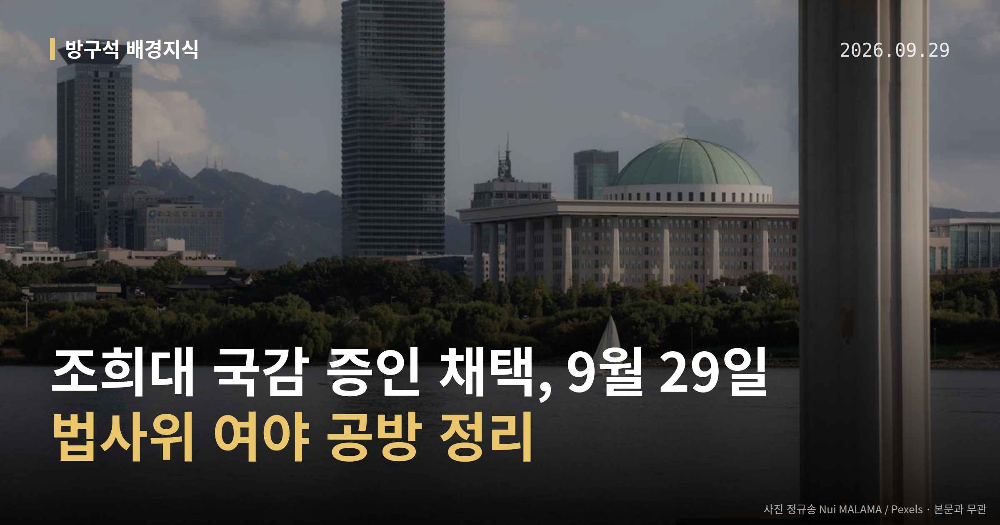
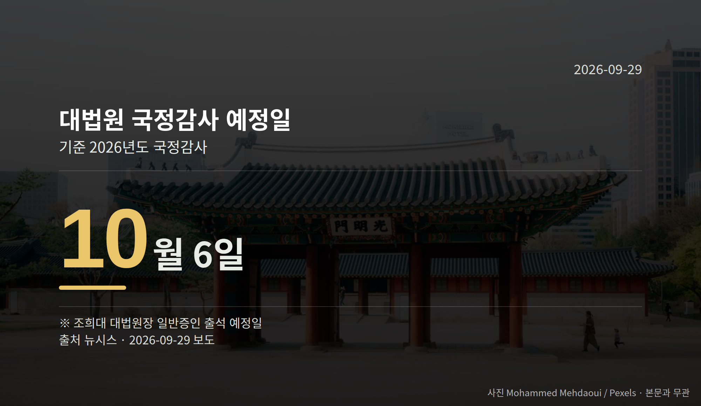

*이 글은 2026년 9월 29일 기준으로 정리한 내용입니다.*
**3줄 요약**

- 법사위가 28일 조희대 대법원장을 국감 증인으로 채택했습니다.
- 출석 예정일은 10월 6일 대법원 국정감사입니다.
- 10월 초 본회의 특검법 처리와 필리버스터 여부가 다음 관전 포인트입니다.
국회 법제사법위원회가 28일 조희대 대법원장을 10월 6일 대법원 국정감사 일반증인으로 채택했습니다. 더불어민주당 주도로 의결됐고, 국민의힘은 표결 전 회의장을 떠났습니다.

같은 날 긴급현안질의에서는 대법관 후보자 재제청을 둘러싼 의혹 제기와 대법원 측 반박이 맞붙었습니다. 오늘은 이 하나만 차근히 보겠습니다.

[이미지: 국회 법제사법위원회 회의장 전경]

## 조희대 국감 증인 채택, 28일 무슨 일이 있었나

법사위는 28일 전체회의에서 조 대법원장을 국정감사(국회가 정부·기관의 업무를 정해진 기간 동안 점검하는 절차) 일반증인으로 채택하는 안을 상정·의결했습니다.

신청 사유는 '대법관 제청 장기 미이행으로 인한 위헌 상태 초래'로 명시됐습니다. 서영교 법사위원장(민주당)은 조 대법원장이 대법관 후보자들에게 개별 전화를 했다는 의혹을 제기하며 답변을 요구했습니다.

국민의힘은 일방적인 의사 결정이라며 반발해 표결 전 이석했습니다. 박형수 간사는 사법부 독립 침해라고 주장했고, 윤상현 의원은 이재명 대통령을 증인으로 채택해야 한다고 주장했습니다.

표결 찬반 의석수 같은 구체적 수치는 공개된 자료에 없습니다.

## 날짜로 보는 조희대 국감 증인 채택 이후 일정

| 항목 | 시점 |
| --- | --- |
| 대법원 국정감사 예정일 | 10월 6일 |
| 특검법 본회의 처리 검토 시점 | 10월 1일 |
| 이재명 대통령 기자회견 | 9월 18일 |

가장 먼저 오는 것은 10월 1일 본회의입니다. 민주당은 이재명 대통령 기소 사건과 관련된 '조작수사·조작기소 진상규명 특검법'을 이날 처리하는 방안을 검토 중입니다.

다만 민주당 핵심 관계자는 28일 "고민하고 있다", "결론은 안 났다"고 밝혔습니다. 국민의힘은 처리에 반대하며 필리버스터(법안 표결을 늦추기 위해 의원이 길게 발언을 이어가는 것)를 예고했습니다.

보도된 처리 시점은 매체별로 '다음 달 초'와 '이르면 이번 주'로 갈려, 확정된 날짜로 보기는 어렵습니다.

## 격노설, 양쪽 말이 정면으로 다릅니다

같은 날 긴급현안질의에서 민주당 의원들은 조 대법원장의 재제청 거부가 '대통령의 임명 권한을 자기가 행사하려는 것'이며 '탄핵 사유'라고 주장했습니다.

노경필 법원행정처장은 '조 대법원장이 재제청 수용 의견을 격노하며 묵살했다'는 여권발 의혹에 대해 "거짓말"이라며 반박했습니다. 국민의힘 의원들은 '사법부 길들이기'라며 퇴장했습니다.

즉 이 격노설은 한쪽의 의혹 제기이고, 대법원 측은 공식 부인한 상태입니다. 진위는 확인되지 않았습니다.

[이미지: 대법원 건물 외관]

노 처장은 청와대의 손봉기 대법관 후보자 재제청 요구가 기존 제청을 반려한 것인지, 유지한 채 철회를 요구한 것인지 "명확하지 않다"고 답했습니다. 청와대 측의 직접 설명은 확인되지 않았습니다.

## 그 밖의 오늘 소식

- 법원행정처, 대법관후보추천위 새 구성안 등 검토 보고
- 29일 국민의힘 의원총회 16시, 조국혁신당 현판식 9시 30분
- 29일 교육위·문체위·보건복지위·국방위 등 회의 예정

**그래서 나는?**

- 뉴스를 처음 따라가는 분이라면, 10월 6일 국감 중계 일정만 표시해 두세요.
- 국회 일정이 궁금한 분이라면, 10월 1일 본회의 개회 여부를 확인해 보세요.
- 사법 절차에 관심 있는 분이라면, 대법관 공석 처리 방식이 달라질 수 있습니다.

**직접 센 숫자 — 국회·여론조사 (최근 7일)**

국회의원 발의 법률안 **87건**. 최근 발의: 공교육 정상화 촉진 및 선행교육 규제에 관한 특별법 일부개정법률안(김문수의원 등 11인)

이번 주 등록된 선거 여론조사 9건

- 전국 정기(정례)조사 정당지지도 — 미디어토마토 · 뉴스토마토 의뢰 · 2026-09-25~26 · 1,040명 · 무선 ARS · 응답률 2.3% · 95% 신뢰수준에 ±3.0%p
- 전국 정기(정례)조사 대통령선거 정당지지도 국정현안 등 — (주)코리아정보리서치 · 천지일보 의뢰 · 2026-09-21~22 · 1,004명 · 무선 ARS · 응답률 4.5% · 95% 신뢰수준에 ±3.1%p
- 전국 정기(정례)조사 정당지지도 9월 4주차 주간집계 — (주)리얼미터 · 에너지경제신문 의뢰 · 2026-09-22~23 · 1,005명 · 무선 ARS · 응답률 3.5% · 95% 신뢰수준에 ±3.1%p

*열린국회정보·중앙선거여론조사심의위원회 자료를 직접 셌습니다. 여론조사의 자세한 사항은 중앙선거여론조사심의위원회 홈페이지를 참조하세요.*
**여러분은 국정감사에서 어떤 질문이 가장 먼저 나와야 한다고 생각하시나요?**

---

### 참고한 기사

1. **법사위, 여당 주도로 조희대 국정감사 증인 채택…국힘은 퇴장**
   - [월요신문](https://news.google.com/rss/articles/CBMiakFVX3lxTE9YMzcwTDFTSk9USzl3N0xBWkJHRkd1TjFNNy03TXdvYmI2emFqV0tSSkZLcG1sdUdCOVpPR3NWT1FvOWF1YXhPOWREdXduZkpVQUVNQmYwQTFPTUx3VDZ6ejhiTXFZMHBRRUE?oc=5)
   - [뉴시스·정치](https://www.newsis.com/view/NISX20260928_0003805979)
2. **與, 내달초 ‘조작기소 특검법’ 본회의 처리 검토**
   - [동아일보·정치](https://www.donga.com/news/Politics/article/all/20260929/134748516/2)
   - [서울신문](https://news.google.com/rss/articles/CBMiV0FVX3lxTE9pRXFJYjk0dnExNWNIRmJtbm1oVEZTeGJCcjJxNmItUVg3S0NDRk8tbmwxQ2JLdGxQSk1ld25aU24xM29Ba29ta0EtQTI4TVN3MHE3bWY5QQ?oc=5)
3. **(29일·화)**
   - [연합뉴스·정치](https://www.yna.co.kr/view/AKR20260928159200001)
   - [뉴스핌](https://news.google.com/rss/articles/CBMiXEFVX3lxTE45TWRYbjlZZ2NoZjNMZGVZMlg3cXlyOWptNW92OVBsZFhrSkw2emRfNmFUT0RPSkNxSVBaNWpTV05mZ2M2RWxkTkhWcFdpcW1KNmFnQmFZakxtVFZW?oc=5)
4. **與 “조희대, 임명권 침해” 국감증인 채택… 대법 “曺 격노설 거짓말”**
   - [동아일보·정치](https://www.donga.com/news/Politics/article/all/20260929/134747869/2)
   - [공공뉴스](https://news.google.com/rss/articles/CBMia0FVX3lxTFAyT2hwSmMyMnNvQVI0bUgzX25WX2o0bTlNcG5aQVRIX0FPQk5NaDdadnRlQXVsSHQyUkppb3EzQWhQYkRndWJUU3ppT0U0LVFERGxfRmFsd1hMcU55ZmZxa1NTSlVrUTMxZzl30gFuQVVfeXFMTlctSlVlMzVySS01QlVyWU9hNXBvRUo3RzBGZTR4czJqVEpOZUhsWlprSzFHT1paRnBhR0pLZTFpRmVpSHlDVGdiNVN2ak4zWmk5WHR4TWNJYjZQSndYcS1EeV84ZE1pcXFKNlIxMVE?oc=5)
5. **법원행정처장 “靑, 제청 반려인지 철회 요청인지 명확치 않아”**
   - [동아일보·정치](https://www.donga.com/news/Politics/article/all/20260928/134746759/1)
   - [뉴시스·정치](https://www.newsis.com/view/NISX20260928_0003805927)

---

*본 글은 공개된 언론 보도를 정리한 것이며, 특정 정당·후보·인물을 지지하거나 반대하지 않습니다. 인용한 여론조사의 자세한 사항은 중앙선거여론조사심의위원회 홈페이지를 참조하세요.*
