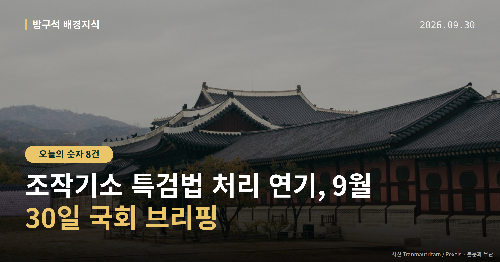
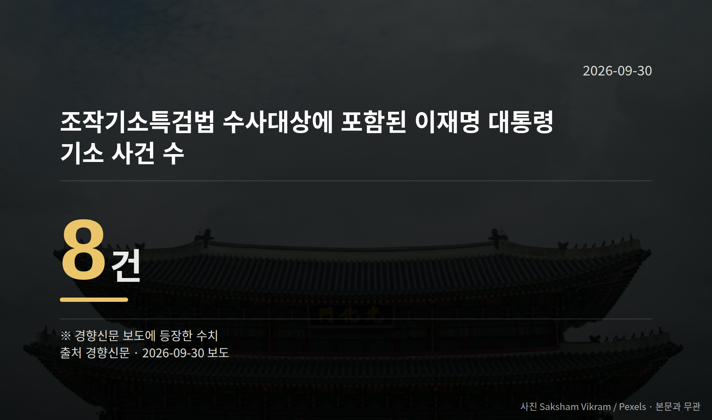

*이 글은 2026년 9월 30일 기준으로 정리한 내용입니다.*
**3줄 요약**

- 민주당, 조작기소 특검법 처리를 10월 국감 이후로 미뤘습니다
- 법안 수사대상에는 이재명 대통령 기소 사건 8건이 포함돼 있습니다
- 10월 1일 본회의 안건과 국감 증인 채택 협의를 보면 됩니다
오늘(9월 29일) 더불어민주당이 '조작수사·조작기소 진상규명 특검법'의 처리 시점을 10월 국정감사 이후로 미루기로 했습니다. 10월 1일 본회의에는 산업안전보건법과 도로교통법 등만 올라갑니다.

국정감사는 10월 말 마무리됩니다. 즉 쟁점 법안의 표결은 그 뒤로 넘어간 상태입니다.

## 조작기소 특검법 처리 연기, 어떻게 결정됐나

전은수 민주당 원내대변인은 9월 29일 의원총회 직후 "특검법 처리 필요성에 대해서는 당내 공감대가 형성됐지만 여론을 수렴해 국정감사 이후에 할 것"이라고 말했습니다.

함께 본회의 처리가 검토됐던 민주유공자 예우에 관한 법률(민주유공자법)도 같이 미뤄졌습니다. 특검법은 특정 사건을 수사하기 위해 별도의 특별검사를 임명하도록 하는 법입니다.

이재명 대통령은 9월 18일 현안 기자회견에서 "기존 기소 사건들에 대한 이송 또는 처분에 관한 조항들은 삭제"해 달라고 밝힌 바 있습니다.

한국일보는 이번 속도조절 배경에 '대통령 방탄용'이라는 반발과 역풍 우려가 있다고 보도했습니다. 다만 그 비판의 구체적 발언 주체는 자료에 없고, 국민의힘이 특검법 자체에 대해 내놓은 공식 반응도 이번 자료에서는 확인되지 않았습니다.

## 8건이라는 숫자가 가리키는 것

경향신문 보도에 따르면 이 법안의 수사 대상에는 이재명 대통령이 기소된 사건 8건이 포함돼 있습니다. 이 사건들을 법안에서 어떻게 다룰지가 조항 논의의 중심에 있습니다.

조작기소 특검법 처리 연기로, 공소취소 조항 포함 여부를 포함한 법안 내용은 아직 확정되지 않은 상태로 남았습니다.

[이미지: 국회 본회의장 전경]

## 국감 증인 채택, 여야는 이렇게 말했습니다

국회 법제사법위원회는 9월 28일 민주당 주도로 조희대 대법원장을 국정감사 일반증인으로 채택했습니다. 민주당은 추석 직전 대법관 재제청 거부 과정을 따져 묻겠다는 입장입니다.

한병도 민주당 원내대표는 "조 대법원장은 법사위 증인으로 채택됐으니 약속대로 국정감사에 나와 재제청 거부 결정의 전 과정을 국민 앞에 소상히 설명하기 바란다"고 말했습니다.

국민의힘은 채택 당일 법사위 전체회의에서 퇴장했습니다. 정점식 원내대표는 "민주당이 일방적으로 조 대법원장을 국감 일반증인으로 채택한 것은 삼권분립을 정면으로 짓밟는 반헌법적 폭거"라고 말했습니다.

국민의힘은 김현지 청와대 제1부속실장을 운영위 증인으로, 김용범 전 정책실장을 정무위·재정경제위 증인으로 채택하려 하지만 민주당이 반대해 합의에 이르지 못했습니다. 김 전 실장 관련 의혹은 국민의힘 측 주장이며, 당사자 해명은 자료에 없습니다.

[이미지: 대법원 건물 외관]

## 그 밖의 오늘 소식

- 문체위, 박진영 JYP 대표 10월 국감 증인 채택
- 민주당 대표, 제주·전남광주·대구경북 예산정책협의회
- 국무총리실, 제3차 범부처 주택 신속공급 점검회의 개최

**그래서 나는?**

- 직장인이라면, 10월 1일 본회의의 산업안전보건법 처리 결과를 확인해 보세요
- 운전자라면, 같은 날 상정되는 도로교통법 개정 내용이 달라질 수 있습니다
- 뉴스를 따라가는 유권자라면, 10월 말 국감 종료 시점이 다음 분기점입니다

**직접 센 숫자 — 국회·여론조사 (최근 7일)**

국회의원 발의 법률안 **63건**. 최근 발의: 섬진강수계 물관리 및 주민지원 등에 관한 법률안(안호영의원 등 10인)

본회의 처리 법률안 **1건** — 철회 1건

이번 주 등록된 선거 여론조사 6건

- 전국 정당지지도 정기(정례)조사 대통령선거 — 한길리서치 · KNA25/폴리뉴스 의뢰 · 2026-09-27~28 · 1,011명 · 무선 ARS · 응답률 2.6% · 95% 신뢰수준에 ±3.1%p
- 전국 정기(정례)조사 정당지지도 — 미디어토마토 · 뉴스토마토 의뢰 · 2026-09-25~26 · 1,040명 · 무선 ARS · 응답률 2.3% · 95% 신뢰수준에 ±3.0%p
- 전국 정기(정례)조사 대통령선거 정당지지도 국정현안 등 — (주)코리아정보리서치 · 천지일보 의뢰 · 2026-09-21~22 · 1,004명 · 무선 ARS · 응답률 4.5% · 95% 신뢰수준에 ±3.1%p

오늘 이슈에 나온 법안은 지금 어디에

- 반헌법 — 제22대 발의 2건(계류 2) · 최근 「반헌법행위조사특별위원회 설치ㆍ운영에 관한 특별법안」(김선민의원 등 13인, 2025-08-29) · 소관위 상정
- 산업안전보건법 — 제22대 발의 136건 · 최근 「산업안전보건법 일부개정법률안」(이용우의원 등 12인, 2026-09-02) · 소관위 회부
- 도로교통법 — 제22대 발의 153건 · 최근 「도로교통법 일부개정법률안」(김대식의원 등 11인, 2026-09-22) · 소관위 회부

*열린국회정보·중앙선거여론조사심의위원회 자료를 직접 셌습니다. 여론조사의 자세한 사항은 중앙선거여론조사심의위원회 홈페이지를 참조하세요.*
**여러분은 이번 국정감사에서 어느 상임위의 어떤 질의를 가장 눈여겨보고 계신가요?**

---

### 참고한 기사

1. **與, ‘조작기소 특검법’ 국감 이후로 처리 미뤄**
   - [동아일보·정치](https://www.donga.com/news/Politics/article/all/20260930/134756634/2)
   - [조선일보·정치](https://www.chosun.com/politics/assembly/2026/09/30/5QC5MYGDN5GOLCLI25NQHCDP44)
2. **민주 "조작 기소 특검법, 다음 달 1일 본회의 상정 안 해"**
   - [YTN](https://news.google.com/rss/articles/CBMiXkFVX3lxTE9PQXhfTWR2bUpCOFlNUXpyTzEtSmhHYnZKWk1GSVFvQ2RpOGJibElTZkZsMTdENEJVa05QbXJiZUd3bzY2Uk9vM3VzT3c4TUMwUHIxdUJRYkpERzVRQkE?oc=5)
   - [한국일보](https://news.google.com/rss/articles/CBMibkFVX3lxTFByNTNRakljSEJMcEI1T2xxOXMwNmVWamtsUWVEMVRzZTJ1ODFFd202VkRrclhoOUVBWlJMLVAxZ3lCVlVUeG5Xbll1UUxrTk5aUTEzYkRIbENpSHFoUjFESTJKVWhWUFdZZ2N3RGhB0gFzQVVfeXFMUEl3NHYwR0lCaFFkQl96dEZEZTNmZ1hTblZoaHplc3JtUlR5eHp1aDJ2bENPU19RRGFxemNjRV9OM0ZVWnRiRWFUQlNDOUxaU0ZEOGxiVng4eHlWUVl0b1FZWk1xUDFrWUxneWtmTktPVndrOA?oc=5)
3. **행정안전부(9월30일 수요일)**
   - [뉴스핌](https://news.google.com/rss/articles/CBMiXEFVX3lxTE1OSGVFck5qaWFfOElVYWxiR1JaS2JZNXZTalMxQVg1RS1Vb0k0X0J6NUJhS3FwMnBjOWM1djFfcFVyM0RHOGpLckhkY2RTTUxuUkFfdjZ6Rmx3bVVk?oc=5)
   - [뉴시스·정치](https://www.newsis.com/view/NISX20260929_0003807764)
4. **한병도 "다음 주 국감 시작...야당 정치 공세 단호하게 대응해야" [TF사진관]**
   - [뉴시스·정치](https://www.newsis.com/view/NISX20260929_0003807541)
   - [v.daum.net](https://news.google.com/rss/articles/CBMiVEFVX3lxTE01NmxoeG90anZBbTkzRWg1c0U4Wnk4ZC1MOWUyUlM0dXdxaE9FRU5DZVNfZjBQRWtIYXlJOXJmV21UdHN2M0hJSGppem5lQjA0czdtdQ?oc=5)
5. **與野, 국감 앞두고 증인부터 기싸움…조희대·김현지·김용범서 박진영까지**
   - [뉴시스·정치](https://www.newsis.com/view/NISX20260929_0003807655)
   - [조선일보·정치](https://www.chosun.com/politics/assembly/2026/09/30/6QB65KOIGVCA3DYIIMCVHIK2HQ)

---

*본 글은 공개된 언론 보도를 정리한 것이며, 특정 정당·후보·인물을 지지하거나 반대하지 않습니다. 인용한 여론조사의 자세한 사항은 중앙선거여론조사심의위원회 홈페이지를 참조하세요.*
