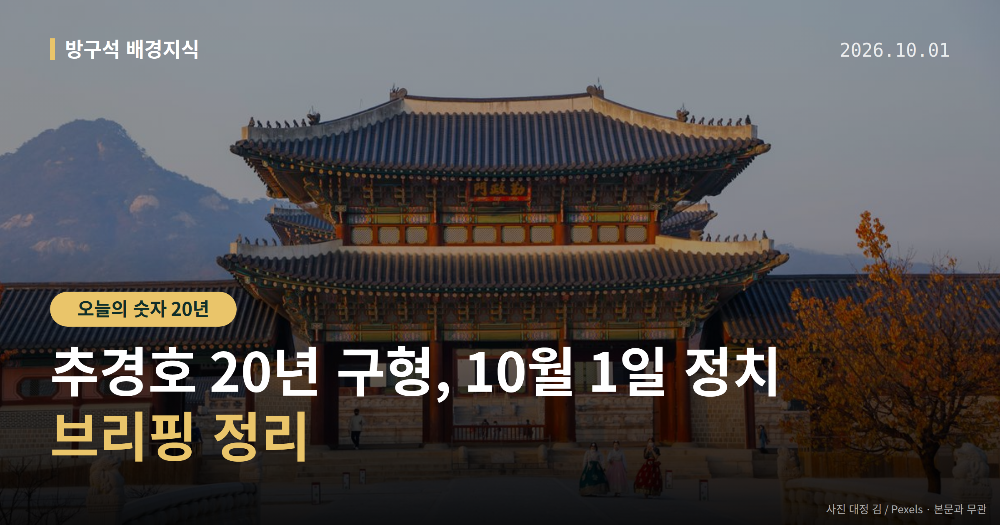
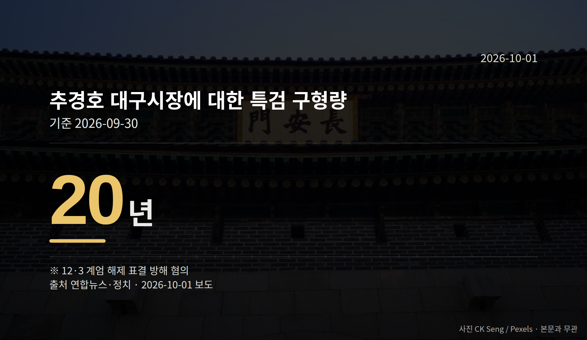

*이 글은 2026년 10월 1일 기준으로 정리한 내용입니다.*
**3줄 요약**

- 특검이 계엄 표결 방해 혐의로 추경호 대구시장에게 구형했습니다.
- 구형량은 징역 20년, 아직 1심 선고 전 단계입니다.
- 같은 날 오후 본회의 쟁점법안 처리와 필리버스터 검토도 함께 보세요.
특검이 12·3 비상계엄 해제 표결을 방해한 혐의로 기소된 추경호 대구시장에게 **징역 20년**을 구형했습니다. 추경호 20년 구형 소식에 여야는 각각 다른 평가를 내놨고, 유·무죄 판단은 법원에 남아 있습니다.

같은 날 오후 2시 국회 본회의에서는 쟁점법안 처리도 예정돼 있습니다. 하루에 사법과 입법 이슈가 겹친 날입니다.

## 추경호 20년 구형, 무슨 일이 있었나

특검은 지난달 30일 추경호 대구시장(전 국민의힘 원내대표)에게 이 형량을 구형했습니다. 혐의는 12·3 계엄 해제 표결을 방해했다는 것입니다.

구형은 검찰이나 특검이 "이만큼의 형이 적당하다"고 재판부에 의견을 내는 절차입니다. 실제 형량은 재판부가 선고로 정하므로, 구형량과 선고량은 다를 수 있습니다.

추경호 대구시장은 현재 1심 선고 전 단계이며, 유죄가 확정된 상태가 아닙니다.

## 여야는 추경호 20년 구형을 어떻게 봤나

전은수 더불어민주당 원내대변인은 "추 전 원내대표는 법의 심판은 물론 역사의 심판도 피할 수 없을 것"이라고 말했습니다. 또 특검 주장대로 추 전 원내대표가 대통령 전화를 받은 뒤 의원총회 장소를 세 차례 변경해 표결 참여를 가로막는 데 핵심 역할을 했다고 주장했습니다.

장동혁 국민의힘 대표는 "특검의 구형은 전혀 의미가 없다"며 "법원이 증거조사와 법리에 따라 반드시 무죄를 선고할 것"이라고 말했습니다. 페이스북에는 "명백한 정치 보복이자 터무니없는 내란몰이"라고 적었습니다.

장 대표는 당 의원과 참고인들의 법정 증언을 근거로 "표결 방해 행위는 없었다는 것이 증거조사를 통해 입증됐다"고 주장했습니다. 양쪽 모두 주장이며, 사실 판단은 재판 결과로 확인됩니다.

[이미지: 국회 본회의장 전경]

## 오후 2시 본회의, 필리버스터는 왜 거론되나

국회는 1일 오후 2시 본회의를 열어 산업안전보건법 개정안과 도시정비법 개정안 처리를 시도합니다. 민주당은 지난달 의원총회에서 두 법안 처리 방침을 정했고, 조작기소 특검법은 국정감사 이후로 미뤘습니다.

국민의힘은 산업안전보건법의 반복적 산재 기업 과징금 규모가 과도하다고 지적하고, 도시정비법 용적률에도 이견을 보이며 필리버스터(무제한 토론으로 표결을 늦추는 절차)를 검토하고 있습니다.

한병도 민주당 원내대표는 "국민의힘이 필리버스터에 나서면 이번만큼은 토론 종결 표결을 하지 않을 작정"이라고 밝혔습니다. 정점식 국민의힘 원내대표는 "안 해주면 굉장히 감사하다"고 맞받았고, 김승수 원내운영수석은 "필리버스터에 자신감을 가진 의원이 많고 자원자도 많다"고 말했습니다.

국민의힘 원내 관계자는 막판 협상으로 필리버스터 없이 처리될 가능성도 언급했습니다. 처리 여부와 방식은 아직 확정되지 않았습니다.

[이미지: 법원 앞 모습]

## 그 밖의 오늘 소식

- 청와대, 선관위 특검 보고 의혹에 "사실 아니다" 반박
- 김영진 의원, 김지용 중수청장 후보 '친윤' 비판에 반박
- 이재명 대통령, X에 "후보자 반윤 행적 확인된 사실" 게시

여러분이 눈여겨볼 다음 일정은 본회의 처리 결과와 추경호 대구시장 1심 선고, 김지용 후보자 인사청문회입니다.

**그래서 나는?**

- 이번 선거 유권자라면, 구형과 선고가 다른 절차임을 확인해 두세요.
- 제조·건설업 종사자라면, 산업안전보건법 개정안 처리 결과가 달라질 수 있습니다.
- 재건축 조합원이라면, 도시정비법 용적률 논의 일정을 살펴보세요.

**직접 센 숫자 — 국회·여론조사 (최근 7일)**

국회의원 발의 법률안 **79건**. 최근 발의: 한국투자공사법 일부개정법률안(김태년의원 등 10인)

본회의 처리 법률안 **1건** — 철회 1건

이번 주 등록된 선거 여론조사 6건

- 전국 정기(정례)조사 정당지지도 국회의원선거 — (주)리서치뷰 · 리서치뷰 의뢰 · 2026-09-28~30 · 1,000명 · 무선 ARS · 응답률 2.8% · 95% 신뢰수준에 ±3.1%p
- 전국 정기(정례)조사 대통령선거 정당지지도 국정현안 등 — (주)코리아정보리서치 · 천지일보 의뢰 · 2026-09-28~29 · 1,002명 · 무선 ARS · 응답률 4% · 95% 신뢰수준에 ±3.1%p
- 전국 정기(정례)조사 정당지지도 — (주)에이스리서치 · 뉴시스 의뢰 · 2026-09-28~29 · 1,010명 · 무선 ARS · 응답률 2.7% · 95% 신뢰수준에 ±3.1%p

오늘 이슈에 나온 법안은 지금 어디에

- 산업안전보건법 — 제22대 발의 136건 · 최근 「산업안전보건법 일부개정법률안」(이용우의원 등 12인, 2026-09-02) · 소관위 회부

*열린국회정보·중앙선거여론조사심의위원회 자료를 직접 셌습니다. 여론조사의 자세한 사항은 중앙선거여론조사심의위원회 홈페이지를 참조하세요.*
**여러분은 '구형'과 '선고'의 차이를 평소 뉴스에서 구분해 보고 계셨나요?**

---

### 참고한 기사

1. **폴리뉴스 모닝브리핑 10월 1일 목요일**
   - [폴리뉴스 Polinews](https://news.google.com/rss/articles/CBMibkFVX3lxTE50bXh2bnNsNktUT1BWa3NfdjRYQVlFbE1WSDVRbHM5bW9rWmZUbzVoN1FkS1hvZjAzanlCNGphajFvdm9HVFZoNUhHb2JDeWJZQzZuWV9uTWQ5dXFPdnp5cnVSZ0lmQ0YycDUwa0pR?oc=5)
   - [청주일보](https://news.google.com/rss/articles/CBMia0FVX3lxTE5BcTVGa0F3UWdHUVh5WTRkX1RfUkVxZDhtVFo4ajE0TmY1TDFHM2JsbnVCYTUtdVBsb3hPWmNjTFhPTHlla2o4UjlNNWxOajdENEt1ZjJfUHhxbVlzb1QtNzRud0hHd1h4ZERJ?oc=5)
2. **장동혁 대표, 추경호 20년 구형에…“명백한 정치 보복”**
   - [연합투데이](https://news.google.com/rss/articles/CBMib0FVX3lxTFA1dkFybFV1c0F3UkU2MDlubGt3VXJrd3NmcVNRbzRKbTUwYVl4ZkxzZEtGaXdNV2lzSkhua1ZCRm5vYnR1LWZNREFrWXV1MGRickJyWjJDVTI1dE1LbTRCZHRhVGtPVHh0TlZHWmdqY9IBb0FVX3lxTFA1dkFybFV1c0F3UkU2MDlubGt3VXJrd3NmcVNRbzRKbTUwYVl4ZkxzZEtGaXdNV2lzSkhua1ZCRm5vYnR1LWZNREFrWXV1MGRickJyWjJDVTI1dE1LbTRCZHRhVGtPVHh0TlZHWmdqYw?oc=5)
   - [연합뉴스TV](https://news.google.com/rss/articles/CBMiZ0FVX3lxTE1sUGlJalNQaVB1LW9lNlJmdGRXa3RGMnBNMEwwemRGNHJaSEZxRHE2cFd1MGJCNDlzY0RMdG9VamxtNFhhMmxRX1FhcjlVZ0s1dllfc1F5YzZld3hWck03OXZVeWR1MTA?oc=5)
3. **[뉴스인사이드 정치톡톡] 국회 오늘 본회의…산업안전보건법 등 논의 外**
   - [뉴스인사이드](https://news.google.com/rss/articles/CBMibkFVX3lxTE9XMDd4NVFpbUJ4VkhoNmVrbVZTNWNuN0J6RjZyaDZiZUJRczRsc2tJekFiZkNpOVI3b1pQZGNoOExUd1gzZTFYQ3hhUlJMMDRlX0hNVzg2cjlwYXUyQVF1THctSVFHYlNrbWFCRDJB?oc=5)
   - [재경일보](https://news.google.com/rss/articles/CBMiS0FVX3lxTE1Zdlg1MWpoZmZtWi1SU2RPWVBYUGtWenpHQ0RsSHNDbTlGeG05dWRBT0ZxdlBCMGc4Ny12bnl1cDFNRlBnVGR1cF9URQ?oc=5)
4. **靑, '李대통령 선관위 특검 보고' 野공세에…"사실아냐"**
   - [이슈밸리](https://news.google.com/rss/articles/CBMibkFVX3lxTE5kZm5wdDlIcTNPZ0cxaUlOTE84TmdnOWtrWFgxMHp1aWxnWGtyVUpfclNTc2FLMVBnUzd1bTFkQzNFN0V1ODBHWmphRy1fTDZWa0Q4cjB5aWZrMVRiZ2I2aXh0VVBBOFA1eWxrXzdR?oc=5)
   - [KBC광주방송](https://news.google.com/rss/articles/CBMiYEFVX3lxTE9xZWI2TERpaGJYTTl2N0VIc2ZjcEtsWVA4RkkxMlE1WjU3cml2TnpoTlNNTjRZSWdmQmdFeExucDdWTWRlc2tnNmw4V3kwT3U0TExvbjZGamRuY1RQeWhwUQ?oc=5)
5. **김영진 "김지용, 秋 법무장관 당시 발탁…좌천된 사람을 '친윤 검사'라 낙인"**
   - [뉴시스·정치](https://www.newsis.com/view/NISX20261001_0003810051)

---

*본 글은 공개된 언론 보도를 정리한 것이며, 특정 정당·후보·인물을 지지하거나 반대하지 않습니다. 인용한 여론조사의 자세한 사항은 중앙선거여론조사심의위원회 홈페이지를 참조하세요.*
