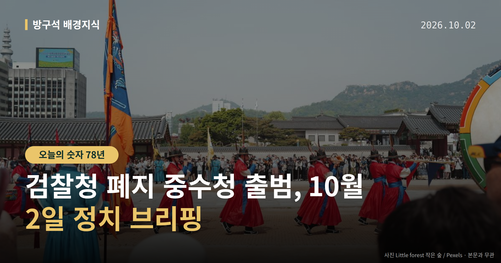
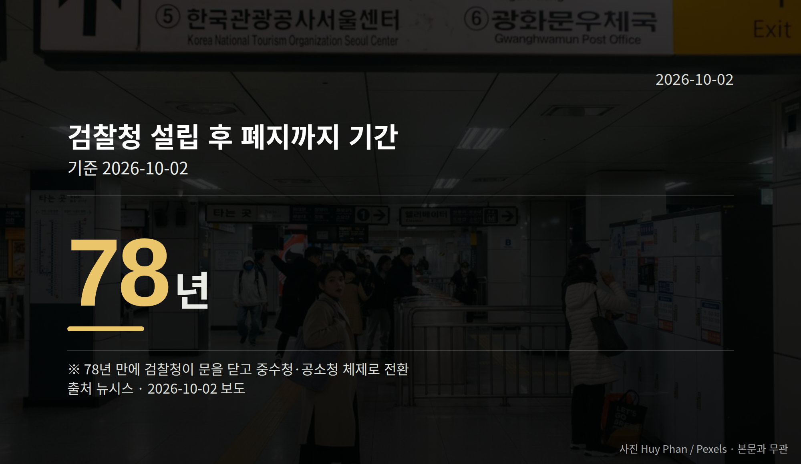

*이 글은 2026년 10월 2일 기준으로 정리한 내용입니다.*
**3줄 요약**

- 10월 2일 검찰청 폐지, 수사와 기소가 분리됐습니다
- 설립 78년 만의 폐지, 고소·고발은 경찰·중수청 접수
- 중수청장은 공석, 김지용 후보자 청문 절차가 남았습니다
여러분, 10월 2일부터 형사사건을 다루는 창구가 바뀝니다. 검찰청 폐지 중수청 출범으로 수사와 기소가 완전히 분리되고, 고소·고발은 경찰과 중대범죄수사청으로 접수됩니다.

다만 중수청의 수장 자리는 아직 비어 있는 상태로 제도가 시행됐습니다. 오늘은 이 한 가지를 중심으로 정리해 보겠습니다.

[이미지: 검찰청 간판과 법원 건물 외관을 담은 사진]

## 검찰청 폐지 중수청 출범, 무엇이 바뀌었나

수사는 경찰과 중대범죄수사청(중수청)이 맡고, 기소와 공소 유지는 공소청이 맡습니다. 기소는 재판에 넘기는 절차를 말합니다.

공소청 검사와 수사관은 직접 수사를 할 수 없습니다. 검사의 직접 보완수사권(기소하기 전 부족한 부분을 검사가 직접 더 조사하는 권한)도 폐지됐습니다.

앞으로 고소·고발은 경찰·중수청으로 접수됩니다. 뉴시스에 따르면 검찰청은 설립 78년 만에 문을 닫게 됩니다.

## 검찰청 폐지 중수청 출범과 김지용 청문 절차

이재명 대통령은 10월 1일 김지용 중수청장 후보자에 대한 인사청문요청안을 재가했습니다. 청와대는 같은 날 "금명간 인사청문요청안을 국회에 보낼 예정"이라고 밝혔습니다.

브리핑은 성기홍 청와대 홍보소통수석이 했습니다. 경향신문 보도에 따르면 이 대통령은 김 내정자가 '친윤석열·반개혁 인사'라는 여권 일각의 주장이 사실과 다르다고 판단했습니다. 이 주장을 제기한 주체는 자료에 구체적으로 나와 있지 않습니다.

경향신문은 수장이 공석이고 후속 법령 정비가 끝나지 않은 상태에서 2일 출범하게 돼 초기 혼란 가능성이 있다고 전했습니다. 청문요청안이 국회에 제출되면 인사청문회 절차가 남습니다.

## 찬성과 반대, 양쪽 말은 이렇습니다

조국 조국혁신당 혁신정책연구원장은 10월 1일 유튜브 '박시영TV'에서 김 후보자를 "검찰주의자"라고 평가했습니다. 초대 중수청장은 "표적·먼지떨이·정치 수사 안 할 사람"이어야 한다며 김 후보자가 이에 맞는지 의문이라고 말했습니다.

조 원장은 친윤 여부에 대해서는 "회색지대에 있었다"면서도 "검찰주의자였던 것은 아무도 부인하지 않을 것"이라고 했습니다. 이는 조 원장 본인의 평가이며, 김 후보자의 반박이나 해명은 확인되지 않았습니다.

반대편 발언도 있습니다. 청와대는 "김지용, 검찰개혁 의지 확고"라는 입장을 밝혔고, 이 대통령은 "검사 출신 배제 안 돼"라고 말했습니다. 박균택 민주당 의원은 "초대 중수청장에 적임자"라고, 박지원 의원은 "윤석열 장모를 감옥에 보내자고 한 사람이면 의로운 검사였다"고 말했습니다.

다만 임명을 반대해온 다른 범여권 법사위원들의 입장은 그대로였다고 보도됐습니다. 이들의 명단과 반대 논리는 자료에 담겨 있지 않습니다.

[이미지: 국회 인사청문회장 좌석과 명패를 담은 사진]

## 그 밖의 오늘 소식

- 김민석 민주당 대표 수첩에 '한동훈 file' 메모 포착
- 한동훈 무소속 의원, 페이스북에 '공작'이라고 주장
- 조희대 대법원장, 국군의 날 행사 불참(건강상 이유)

**그래서 나는?**

- 고소·고발을 준비 중이라면, 접수 창구가 경찰·중수청으로 바뀝니다
- 형사사건 당사자라면, 수사·기소 주체가 달라진 점을 확인해 보세요
- 유권자라면, 국회 인사청문회 일정 공개 여부를 지켜보면 됩니다

**직접 센 숫자 — 국회·여론조사 (최근 7일)**

국회의원 발의 법률안 **115건**. 최근 발의: 5·18민주화운동 관련자 보상 등에 관한 법률 일부개정법률안(이진숙의원 등 11인)

본회의 처리 법률안 **65건** — 원안가결 47건 · 수정가결 16건 · 부결 1건 · 철회 1건

이번 주 등록된 선거 여론조사 8건

- 전국 정기(정례)조사 정당지지도 대통령선거 — (주)비전코리아 · 올리서치 의뢰 · 2026-09-30~10-01 · 1,051명 · 무선 ARS · 응답률 3.7% · 95% 신뢰수준에 ±3.0%p
- 전국 정기(정례)조사 정당지지도 국회의원선거 — (주)리서치뷰 · 리서치뷰 의뢰 · 2026-09-28~30 · 1,000명 · 무선 ARS · 응답률 2.8% · 95% 신뢰수준에 ±3.1%p
- 전국 정기(정례)조사 정당지지도 정치 사회 현안 — (주)코리아리서치인터내셔널 · ㈜코리아리서치인터내셔널, ㈜엠브레인퍼블릭, 케이스탯리서치, ㈜한국리서치 의뢰 · 2026-09-28~30 · 1,000명 · 무선전화면접 · 응답률 18.8% · 95% 신뢰수준에 ±3.1%p

*열린국회정보·중앙선거여론조사심의위원회 자료를 직접 셌습니다. 여론조사의 자세한 사항은 중앙선거여론조사심의위원회 홈페이지를 참조하세요.*
**여러분이 직접 고소·고발을 해야 하는 상황이라면, 바뀐 접수 창구 가운데 어디부터 알아보시겠어요?**

---

### 참고한 기사

1. **행정안전부(10월2일 금요일)**
   - [뉴시스·정치](https://www.newsis.com/view/NISX20261001_0003811411)
   - [뉴스핌](https://news.google.com/rss/articles/CBMiXEFVX3lxTE13OGloX21qNFAxbVRpQXF2dG4tTUFUdTJmdjJ2UldyTFJhZnBrVWVqdlhudmE5T2RsOEZIZ0RjTy04Y1N2T0V2UzJEMzVhMGZVWFk5V0trRUc4NE5p?oc=5)
2. **김민석 수첩에 또 '한동훈'...韓 "정치 좀 '좌아하게' 하라"**
   - [뉴시스·정치](https://www.newsis.com/view/NISX20261001_0003811575)
   - [머니투데이](https://news.google.com/rss/articles/CBMibEFVX3lxTFBfUXJhT29vbW8tdWVKNUoyZTNaU21PQ1d0QzY3dmpZcjhFVkJuSWpEa25pOVRSMTJLendLM1RQOG9xekZJakF0ZjlEU2JhejNQSXNRVm4zOFMyNHBKUHI3Y001OHdpWktFTTVDctIBckFVX3lxTE1ueTg4S3B0dFJXRXFIVGNXbWZCTFgyRzRPVUpIdTRtaXEtYlNBY0Zlem5EZHYzSnl1Slp4V0ZWVFpWa0xGYzVlMWRCVm1NWDNHZ2JVX1Y0R2I1QTJkZDRIV0FhUHBqOW5HbWFpWE8wNGt2dw?oc=5)
3. **이 대통령, 김지용 중수청장 후보자 청문요청안 재가**
   - [뉴시스·정치](https://www.newsis.com/view/NISX20261002_0003811658)
   - [연합뉴스·정치](https://www.yna.co.kr/view/AKR20261002011600001)
4. **조국 "초대 중수청장, 檢개혁 부응하는 인물이어야…김지용, 검찰주의자"**
   - [뉴시스·정치](https://www.newsis.com/view/NISX20261001_0003811582)
   - [경향신문·정치](https://www.khan.co.kr/article/202610012203005)
5. **'김지용 임명 수순' 청와대 결정에 엇갈린 범여권**
   - [오마이뉴스·정치](https://www.ohmynews.com/NWS_Web/View/at_pg.aspx?CNTN_CD=A0003271962)

---

*본 글은 공개된 언론 보도를 정리한 것이며, 특정 정당·후보·인물을 지지하거나 반대하지 않습니다. 인용한 여론조사의 자세한 사항은 중앙선거여론조사심의위원회 홈페이지를 참조하세요.*
