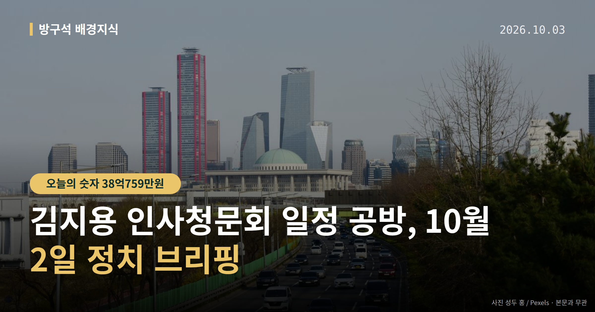
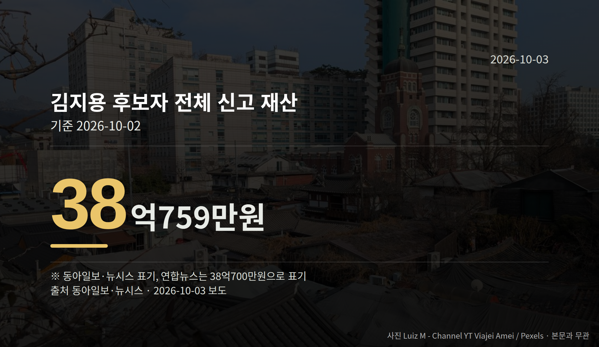

*이 글은 2026년 10월 3일 기준으로 정리한 내용입니다.*
**3줄 요약**

- 김지용 인사청문회 일정, 국감 중·국감 후로 여야 이견
- 후보자 재산 38억759만원 신고, 3년 전보다 11억1300만원 증가
- 요청안 제출일로부터 20일 이내 청문 마감 기한이 변수
오늘 정치 뉴스의 중심에는 김지용 인사청문회 일정이 있습니다. 김지용 중대범죄수사청장 후보자의 인사청문요청안은 10월 2일 국회로 넘어갔지만, 청문회를 언제 열지는 아직 정해지지 않았습니다.

같은 날 중대범죄수사청(중수청)과 공소청은 모두 수장 없이 업무를 시작했습니다.

[이미지: 국회 본청 외부 전경 사진]

## 김지용 인사청문회 일정, 어디서 멈춰 있나

여당은 국정감사 기간 중에 청문회를 조속히 열자는 입장입니다. 야당은 국정감사가 끝난 뒤에 열자는 입장입니다. 브리핑 자료에는 양측의 구체적 정당명이 명시돼 있지 않아, 여기서도 '여당·야당'으로만 적습니다.

인사청문회법에는 요청안이 제출된 날로부터 20일 안에 청문 절차를 마쳐야 한다는 규정이 있습니다. 즉 김지용 인사청문회 일정을 둘러싼 줄다리기가 길어지면 이 기한이 변수가 됩니다.

청문회 시기가 좁혀지지 않으면 중수청장 공백이 길어질 수 있다는 우려도 제기된 상태입니다. 다만 공소청 수장 인선이 늦어진 구체적 경위는 자료에 나와 있지 않습니다.

## 재산 38억원 신고, 숫자로 보면

김 후보자는 본인과 배우자, 두 자녀 명의로 약 38억759만원을 신고했습니다. 같은 금액을 연합뉴스는 38억700만원으로 적었습니다.

| 항목 | 신고액 |
|---|---|
| 전체 재산 | 38억759만원 |
| 2023년 대비 증가 | 11억1300만원 |
| 분당 이매동 아파트(단독) | 11억7400만원 |
| 분당 정자동 아파트(전체) | 17억4000만원 |
| 서초동 아파트 전세권(전체) | 14억5000만원 |

2023년 광주고검 차장검사 시절 신고액은 26억9457만원이었습니다. 이 증가액의 배경은 자료에 설명돼 있지 않습니다.

배우자는 KT·SK하이닉스 주식 등 약 1억2300만원의 증권과, 비트코인·이더리움·리플 등 약 2600만원의 가상자산을 신고했습니다. 재산 신고 내용은 청문회 심사 자료로 쓰이기 때문에, 아파트 2채 보유 등이 질의 근거가 될 수 있습니다.

## 이재명 대통령은 무엇을 말했나

이재명 대통령은 10월 2일 엑스(X)에 김 후보자 임명 반대 글을 공유하며 입장을 밝혔습니다. 김 후보자가 윤석열 전 대통령 장모 모해위증교사 무혐의 사건에 재수사명령을 내린 뒤 좌천됐다는 점을 들어 "최소한 친윤이라 단정하기는 어렵지 않을까요"라고 했습니다.

이 대통령은 "100% 완벽한 후보라고 하지는 못하겠지만 국회의 청문기회를 박탈해야 할 정도로는 보이지 않는다"고도 밝혔습니다. 국민추천과 독립된 추천위원회의 4배수 압축, 행안부 장관 제청을 거쳤다며 청문 결과를 본 뒤 임명 여부를 정하겠다고 했습니다.

한편 더불어민주당 강경파는 "청산 없는 개혁은 반쪽"이라며 반발했습니다. '친윤' 논란을 제기한 주체와, 이 대통령 발언에 대한 반대 측의 공식 반응은 자료에서 확인되지 않았습니다.

[이미지: 스마트폰으로 소셜미디어 게시글을 확인하는 손 사진]

## 그 밖의 오늘 소식

- 국회 운영위, 김태규 의원 제명 촉구 결의안 의결
- 김태규 의원 "오해의 빌미가 된 점 유감" (한국경제 보도)
- 야당 숭례문 장외집회 10월 3일 예고, 일각서 신중론

**그래서 나는?**

- 뉴스를 처음 따라가는 분이라면, 청문회 '20일 기한'만 기억해 두세요
- 수사·고소 절차가 궁금한 분이라면, 중수청 수장 공백 기간을 확인해 보세요
- 이번 선거 유권자라면, 인사 절차 공방이 정당별 쟁점이 될 수 있습니다

**직접 센 숫자 — 국회·여론조사 (최근 7일)**

국회의원 발의 법률안 **156건**. 최근 발의: 근로자퇴직급여 보장법 일부개정법률안(이용우의원 등 12인)

본회의 처리 법률안 **65건** — 원안가결 47건 · 수정가결 16건 · 부결 1건 · 철회 1건

이번 주 등록된 선거 여론조사 8건

- 전국 정기(정례)조사 정당지지도 대통령선거 — (주)비전코리아 · 올리서치 의뢰 · 2026-09-30~10-01 · 1,051명 · 무선 ARS · 응답률 3.7% · 95% 신뢰수준에 ±3.0%p
- 전국 정기(정례)조사 정당지지도 국회의원선거 — (주)리서치뷰 · 리서치뷰 의뢰 · 2026-09-28~30 · 1,000명 · 무선 ARS · 응답률 2.8% · 95% 신뢰수준에 ±3.1%p
- 전국 정기(정례)조사 정당지지도 정치 사회 현안 — (주)코리아리서치인터내셔널 · ㈜코리아리서치인터내셔널, ㈜엠브레인퍼블릭, 케이스탯리서치, ㈜한국리서치 의뢰 · 2026-09-28~30 · 1,000명 · 무선전화면접 · 응답률 18.8% · 95% 신뢰수준에 ±3.1%p

*열린국회정보·중앙선거여론조사심의위원회 자료를 직접 셌습니다. 여론조사의 자세한 사항은 중앙선거여론조사심의위원회 홈페이지를 참조하세요.*
**여러분은 고위 공직 후보자를 볼 때 어떤 자료를 가장 먼저 찾아보시나요?**

---

### 참고한 기사

1. **국회 운영위, '전두환 내란 아냐' 김태규 제명 촉구 결의안 의결**
   - [TV서울](https://news.google.com/rss/articles/CBMiWEFVX3lxTFBVemNoS1loTUFES201MG5yM2gyRVFrRnlaQk9NOUFDWkJfcVRVSDRvYVRCWURScHlFQlVOVGx4VUlVenZpaDVDWkdfdVoyUnYwUjVpU2dCUkU?oc=5)
   - [일간경기](https://news.google.com/rss/articles/CBMiaEFVX3lxTE5MUHZtTzdjLVExcldSTVEyMHU3Wm5Oa09jd3h0N2ExMGtnbUY2NS1sdVVBeUVxSVVLRm9hWk5jWnJGRXVtcUlBbl9zT05uS3ZvMnFIUllhTVRrRk5NcDQ5M1RaWDJNajZU?oc=5)
2. **①李정부 2년차 국감…與 '정책국감' vs 野 '정권심판' 격돌**
   - [뉴시스·정치](https://www.newsis.com/view/NISX20261002_0003813002)
3. **李대통령 “김지용, ‘친윤’ 단정 어려워…인청 거쳐야”**
   - [동방일보](https://news.google.com/rss/articles/CBMic0FVX3lxTE1maGpSSFdvSDdZU3Z1emtjbDRWNWNoLTJDekQ1OXZ2NU9GSndmNVJnUWtBakc3elIzeGJvdjNuRV9fbVRaaHlUV0V4X3VvazdCOGlGel90dFplbmt6bnRyajZYY2tzdzk1NVVnVkdNd3Q4WDQ?oc=5)
   - [조선일보·정치](https://www.chosun.com/politics/politics_general/2026/10/02/ONYMYIQEV5E73NW3BQIFH5TFRQ)
4. **김지용, 재산 38억원 신고… 분당에 아파트 2채**
   - [동아일보·정치](https://www.donga.com/news/Politics/article/all/20261002/134779182/2)
   - [뉴시스·정치](https://www.newsis.com/view/NISX20261002_0003812885)
5. **중수청장 청문 신경전, 공소청 인선 막혀… 수장공백 장기화 우려**
   - [동아일보·정치](https://www.donga.com/news/Politics/article/all/20261002/134779187/2)

---

*본 글은 공개된 언론 보도를 정리한 것이며, 특정 정당·후보·인물을 지지하거나 반대하지 않습니다. 인용한 여론조사의 자세한 사항은 중앙선거여론조사심의위원회 홈페이지를 참조하세요.*
