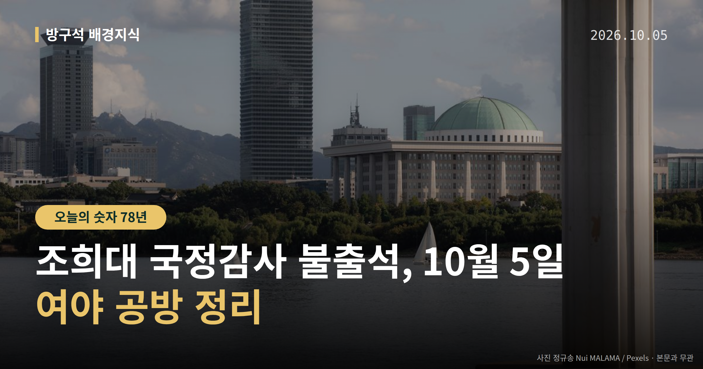
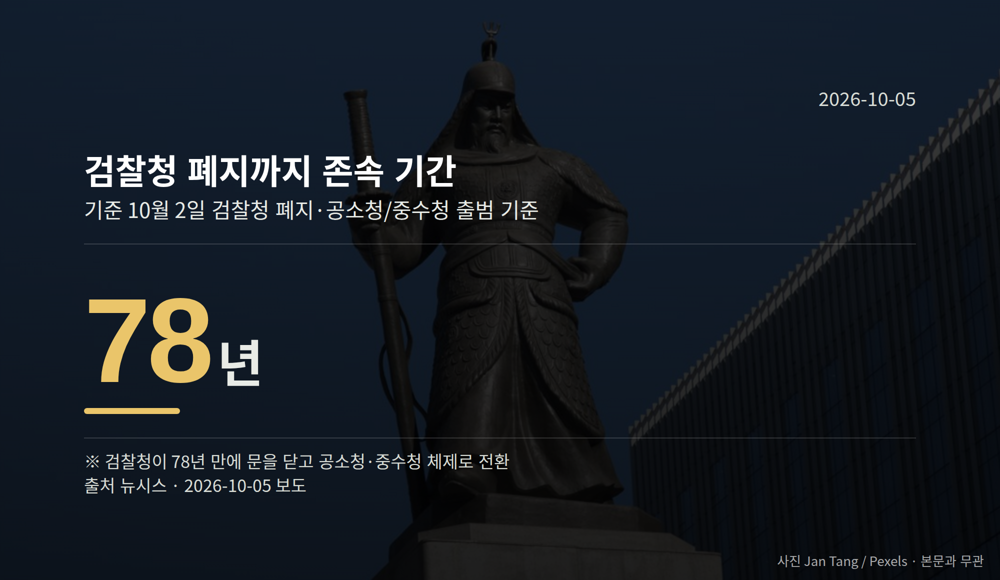

*이 글은 2026년 10월 5일 기준으로 정리한 내용입니다.*
**3줄 요약**

- 조희대 대법원장, 6일 법사위 국감 불출석 의견서 제출
- 검찰청은 2일 78년 만에 폐지, 공소청·중수청 출범
- 6일 실제 출석 형태와 여당 후속 조치 여부가 관전 지점
조희대 국정감사 불출석 의견서가 어제 하루 국회를 흔들었습니다. 여당은 사퇴를 요구했고, 야당은 "겁박 정치"라는 표현으로 맞섰습니다. 6일 당일 실제 출석 형태가 다음 확인 지점입니다.

[이미지: 국회 법제사법위원회 국정감사장 전경]

## 조희대 국정감사 불출석, 무슨 일이었나

조 대법원장은 지난 2일 서영교 법사위원장실에 '출석요구에 대한 의견서'를 제출했습니다. 6일 대법원 국정감사에 일반증인으로 나가기 어렵다는 내용입니다.

의견서에서 조 대법원장은 "대통령과의 협의 내용을 구체적으로 공개하는 것은 적절하지 않다"고 밝혔습니다. 또 국회가 대법원장의 헌법상 독립적 권한인 제청권(대법관 후보를 대통령에게 올리는 권한) 행사에 관해 증언하게 하는 것은 삼권분립 취지와 사법권 독립에 반하고, 국정감사의 권력분립상 한계를 벗어난다고 했습니다.

배경에는 노태악 전 대법관 후임 제청을 둘러싼 청와대와 대법원 사이의 갈등이 있습니다.

국회법 제121조는 국무총리·국무위원·정부위원의 국회 출석·답변 의무를 정하고 있습니다. 다만 대법원장·헌법재판소장·중앙선관위원장·감사원장에게는 같은 의무를 부과하지 않습니다.

## 여야는 각각 어떻게 말했나

더불어민주당 서영교 법사위원장은 4일 "국정감사에 나오지 않으려면 사퇴하라"며 "출석하지 않겠다는 것은 국회법 위반"이라고 말했습니다. 경향신문 보도에 따르면 "증언 거부는 법 위의 군림"이라고도 했습니다.

여당 간사 김의겸 의원은 조 대법원장이 국정감사에서 직접 얘기하겠다고 밝힌 바 있다며, 불출석 사유서 제출은 스스로 발언을 번복한 것이라고 지적했습니다. 이용우 민주당 대변인은 증언을 거부할 수 있는 경우가 본인이나 친족의 형사 책임이 드러날 염려가 있거나 변호사 등 특정 직역의 법무상 비밀에 해당하는 경우로 한정된다고 설명했습니다.

국민의힘 최은석 원내수석대변인은 "검증이 아니라 불러 세워 망신 주겠다는 겁박 정치로밖에 보이지 않는다"고 비판했습니다. 또 민주당이 '단종레' 관련 1월 13일 청와대 회의 참석자의 증인 채택을 막았고, 운영위 국정감사의 김현지·정진상 증인 채택도 지켜보겠다고 주장했습니다.

[이미지: 대법원 청사 외관 사진]

## 조희대 국정감사 불출석, 6일에 볼 것

동아일보는 조 대법원장이 지난해처럼 기관장 자격으로 나와 인사말만 한 뒤 이석할 것으로 전망했습니다. 그렇게 되면 증인 선서를 통한 직접 답변은 이뤄지지 않고, 제청 갈등 설명도 인사말 수준에 머물 수 있습니다.

여당이 거론한 동행명령장(증인을 국회로 데려오도록 하는 명령서) 발부나 국회증언감정법에 따른 조치는 아직 가능성 언급 단계입니다. 실제 조치로 이어지는지가 당일 관전 지점입니다.

## 그 밖의 오늘 소식

- 2일 검찰청 78년 만에 폐지, 공소청·중수청 출범
- 김지용 중수청장 후보자 '친윤 검사' 의혹, 이 대통령은 반박
- 6일 행안위 국감, 중수청·지방교부세 쟁점 예상

여러분은 대법원장의 국회 출석 문제를 어느 절차의 영역이라고 보시나요?

**그래서 나는?**

- 뉴스로만 국회를 보는 분이라면, 기관장 출석과 증인 출석의 차이를 알아두면 좋습니다
- 이번 국감 일정을 챙기는 유권자라면, 6일 오전 10시 법사위·행안위를 확인해 보세요
- 지방 재정에 관심 있는 분이라면, 행안위 국감의 지방교부세 질의가 변수일 수 있습니다

**직접 센 숫자 — 국회·여론조사 (최근 7일)**

국회의원 발의 법률안 **156건**. 최근 발의: 근로자퇴직급여 보장법 일부개정법률안(이용우의원 등 12인)

본회의 처리 법률안 **65건** — 원안가결 47건 · 수정가결 16건 · 부결 1건 · 철회 1건

이번 주 등록된 선거 여론조사 10건

- 전국 정기(정례)조사 정당지지도 — (주)여론조사꽃 · 2026-10-02~03 · 1,003명 · 무선전화면접 · 응답률 9.7% · 95% 신뢰수준에 ±3.1%p
- 전국 정기(정례)조사 정당지지도 — (주)여론조사꽃 · 2026-10-02~03 · 1,004명 · 무선 ARS · 응답률 2% · 95% 신뢰수준에 ±3.1%p
- 전국 정기(정례)조사 정당지지도 10월 1주차 주간집계 — (주)리얼미터 · 에너지경제신문 의뢰 · 2026-10-01~02 · 1,009명 · 무선 ARS · 응답률 3% · 95% 신뢰수준에 ±3.1%p

오늘 이슈에 나온 법안은 지금 어디에

- 국회법 — 제22대 발의 268건 · 최근 「국회법 일부개정법률안」(강승규의원 등 11인, 2026-10-02) · 발의(계류)

*열린국회정보·중앙선거여론조사심의위원회 자료를 직접 셌습니다. 여론조사의 자세한 사항은 중앙선거여론조사심의위원회 홈페이지를 참조하세요.*
**여러분은 대법원장의 국회 출석 문제를 어느 절차의 영역이라고 보시나요?**

---

### 참고한 기사

1. **조희대 “국감증인 불출석… 李와 협의 공개 부적절”**
   - [동아일보·정치](https://www.donga.com/news/Society/article/all/20261004/134784275/2)
   - [한국경제·정치](https://www.hankyung.com/article/2026100428361)
2. **조희대 ‘증인 불출석’ 의견서…여 “안 나올 거면 사퇴하라”**
   - [경향신문·정치](https://www.khan.co.kr/article/202610042107055)
   - [조선일보·정치](https://www.chosun.com/politics/assembly/2026/10/04/CUO4ZQCX4FAOBOWAQEXCQRZRZA)
3. **김지용 인선에 말 아끼는 與…강경파 비판 계속되자 "엄정 검증" 원론 입장**
   - [뉴시스·정치](https://www.newsis.com/view/NISX20261002_0003813148)
4. **내일 행안부 국감…중수청 개문발차·미래기금 교부세 '쟁점'**
   - [뉴시스·정치](https://www.newsis.com/view/NISX20261004_0003813969)
5. **조희대 국감 불출석에 여야 충돌… “사퇴하라” “정치적 겁박”**
   - [천지일보](https://news.google.com/rss/articles/CBMiakFVX3lxTE1JbXZ1dHQyOG1ZbVVJU0V6Z3ByVl9vS2NTVFVubUttOUZrMWVFa2s1Z3hsbEkwN1hxZHMzOWVNNjBFdnhQNW1zWnBNT2xFNks1cU1PSEZSZ3lJc2N4dktiVEFUQzlILUY3bGc?oc=5)
   - [뉴시스·정치](https://www.newsis.com/view/NISX20261004_0003814002)

---

*본 글은 공개된 언론 보도를 정리한 것이며, 특정 정당·후보·인물을 지지하거나 반대하지 않습니다. 인용한 여론조사의 자세한 사항은 중앙선거여론조사심의위원회 홈페이지를 참조하세요.*
