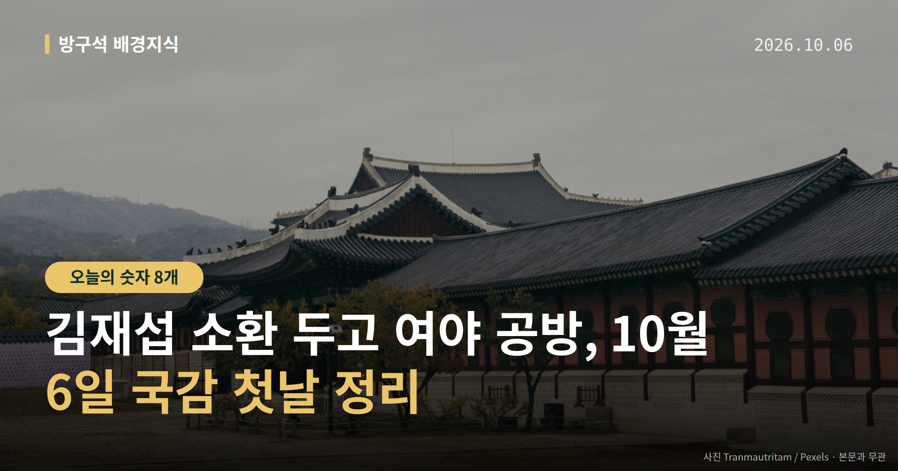
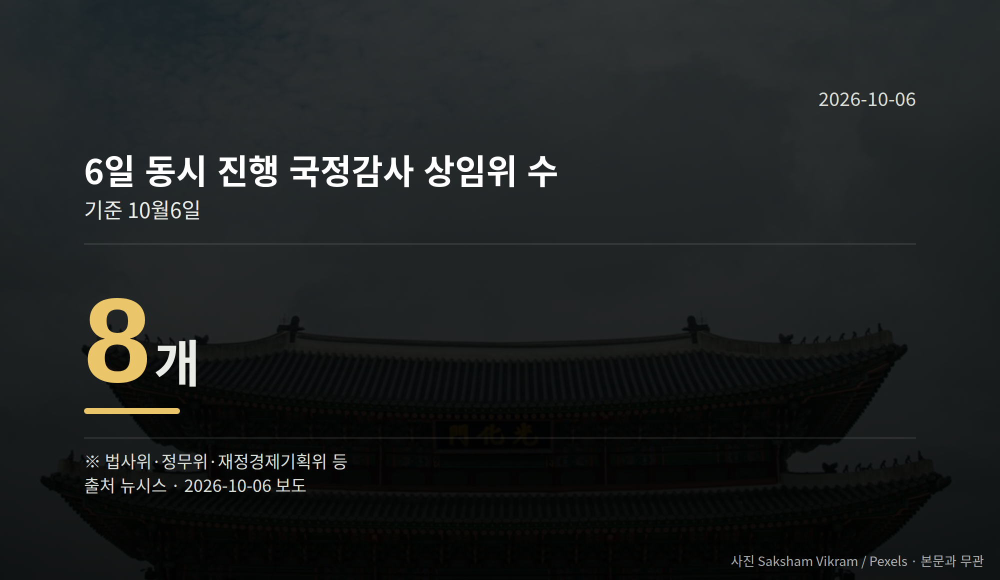
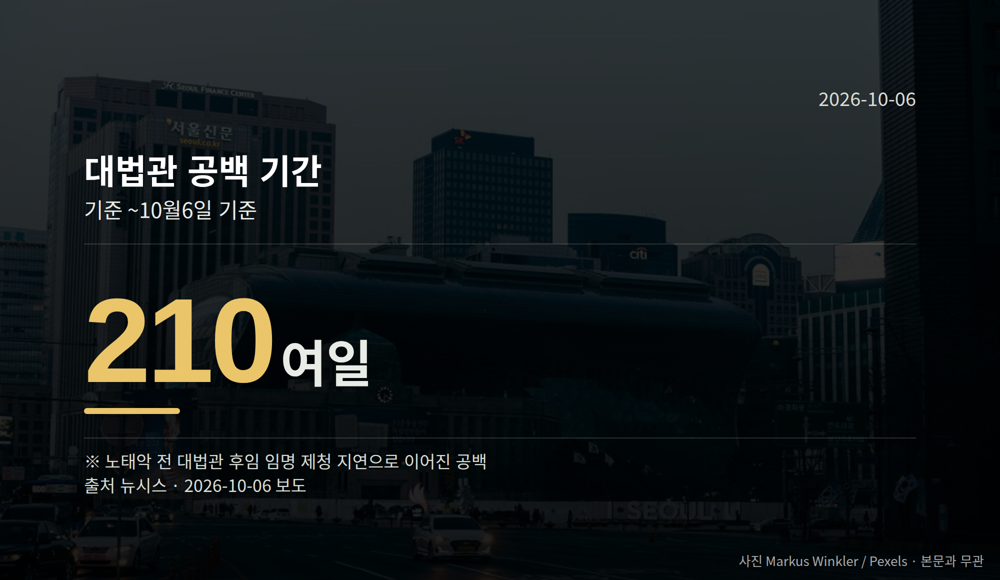

*이 글은 2026년 10월 6일 기준으로 정리한 내용입니다.*
**3줄 요약**

- 국감 첫날 경찰이 김재섭 의원을 피의자로 소환 조사했습니다
- 같은 날 8개 상임위가 국정감사를 일괄 개시했습니다
- 조사 뒤 국민의힘이 예고한 후속 조치를 지켜보면 됩니다
국정감사 첫날인 10월 6일, **김재섭 소환**이 하루의 가장 큰 쟁점이 됐습니다. 경찰이 국민의힘 김재섭 의원을 피의자 신분으로 불러 조사했고, 국민의힘은 "정치 보복"이라며 반발했습니다.

같은 날 국회에서는 8개 상임위원회가 오전 10시 국정감사를 일괄 시작했습니다.

[이미지: 국회 국정감사가 열리는 상임위 회의장 전경 사진]

## 김재섭 소환, 어떤 사건인가

국정감사(국회가 정해진 기간에 정부와 기관의 업무를 집중 점검하는 절차) 첫날, 김 의원은 피의자 신분(수사기관이 혐의가 있다고 보고 조사하는 대상)으로 경찰에 출석했습니다.

서울경찰청 광역수사단 공공범죄수사대는 공직선거법상 허위사실 공표·후보자 비방 등 혐의로 김 의원을 조사했습니다.

김 의원은 지난 3월 31일 국회 기자회견에서 정원오 전 서울시장 후보가 성동구청장 재임 때 공무원 임모씨와 멕시코 칸쿤 출장을 다녀왔고, 출장 심사의결서의 임씨 성별이 '남성'으로 조작돼 있었다는 의혹을 제기했습니다. 재채용 과정의 인사 특혜 의혹도 함께 제기했습니다.

더불어민주당은 기자회견 당일 김 의원을 낙선 목적 허위사실 공표 혐의로 고발했고, 임씨도 4월 김 의원 등을 명예훼손 혐의로 고소했습니다.

## 김재섭 소환을 둘러싼 양쪽 주장

김 의원은 경찰서 앞에서 "명백한 정치 탄압이자 정권의 노골적인 죽이기"라고 말했고, "발언 중 허위는 하나도 없다"고 주장했습니다.

국민의힘 정점식 원내대표는 국정감사대책회의에서 "정치경찰의 보복 수사"라며 "검찰을 해체하고 경찰에 권력을 몰아준 이재명 정부에 대한 정치경찰의 조공"이라고 말했습니다. 정희용 사무총장은 "의혹을 제기한 야당 의원부터 피의자로 불러세우는 것"이라고 비판했습니다.

권영진 의원은 민주당 김병기 전 원내대표 수사와 비교하며 "여당의 전 원내대표의 권력형 비리 수사에 대해서는 시간을 끌어 검찰수사를 피할 기회를 만들어줬다"고 말했습니다. 김미애 원내정책수석은 페이스북에 "민주무죄, 국힘유죄"라고 썼습니다.

반대편 설명도 있습니다. 정 전 후보 측은 임씨가 해외 업무 담당자이고 칸쿤은 경유지였으며, 성별 표기는 구청의 단순 실수였다고 반박했습니다.

다만 소환 시점에 대한 경찰 측 설명과 김재섭 소환에 대한 민주당의 공식 반응은 확인되지 않았습니다. 이 사안은 아직 수사 단계이고, 양쪽 주장이 엇갈린다는 점을 함께 보셔야 합니다.

## 그 밖의 오늘 소식

- 조희대 대법원장, 대법원 국감에 불출석 의견서 제출
- 노태악 전 대법관 후임 공백, 6일 기준 210여 일
- 민주당, 김지용 중수청장 후보자 청문회 14일 개최 발표

김 의원 조사 이후 국민의힘이 예고한 후속 조치, 7일 행정안전위원회 전체회의의 인사청문계획서 의결 여부가 다음 확인 지점입니다.

**그래서 나는?**

- 뉴스로만 정치를 보는 분이라면, 수사 결과와 주장은 따로 봐야 합니다
- 국감 일정을 챙기는 분이라면, 14일 중수청장 청문회를 확인해 보세요
- 재판 일정을 기다리는 분이라면, 대법관 공백 해소 시점이 변수입니다

**직접 센 숫자 — 국회·여론조사 (최근 7일)**

국회의원 발의 법률안 **136건**. 최근 발의: 근로자퇴직급여 보장법 일부개정법률안(이용우의원 등 12인)

본회의 처리 법률안 **65건** — 원안가결 47건 · 수정가결 16건 · 부결 1건 · 철회 1건

이번 주 등록된 선거 여론조사 10건

- 전국 전체 정기(정례)조사정당지지도대통령선거 — (주)여론조사꽃 · 2026-10-02~03 · 1,003명 · 무선전화면접 · 응답률 9.7% · 95% 신뢰수준에 ±3.1%p
- 전국 전체 정기(정례)조사정당지지도대통령선거 — (주)여론조사꽃 · 2026-10-02~03 · 1,004명 · 무선 ARS · 응답률 2% · 95% 신뢰수준에 ±3.1%p
- 전국 정기(정례)조사 정당지지도 10월 1주차 주간집계 — (주)리얼미터 · 에너지경제신문 의뢰 · 2026-10-01~02 · 1,009명 · 무선 ARS · 응답률 3% · 95% 신뢰수준에 ±3.1%p

오늘 이슈에 나온 법안은 지금 어디에

- 공직선거법 — 제22대 발의 325건 · 최근 「공직선거법 일부개정법률안」(박지혜의원 등 10인, 2026-09-28) · 소관위 회부

*열린국회정보·중앙선거여론조사심의위원회 자료를 직접 셌습니다. 여론조사의 자세한 사항은 중앙선거여론조사심의위원회 홈페이지를 참조하세요.*
**여러분은 수사 일정과 정치 일정이 겹칠 때, 어느 쪽 설명을 먼저 확인하시나요?**

---

### 참고한 기사

1. **국힘, '김재섭 소환'에 "정치경찰, 보복 수사로 李정부에 조공"**
   - [연합뉴스·정치](https://www.yna.co.kr/view/AKR20261006060100001)
   - [뉴시스·정치](https://www.newsis.com/view/NISX20261006_0003815164)
2. **'정원오 칸쿤 출장 의혹 제기' 김재섭 경찰 출석…"야당 탄압"**
   - [한국경제·정치](https://www.hankyung.com/article/202610064728H)
   - [뉴시스·정치](https://www.newsis.com/view/NISX20261006_0003814998)
3. **대법원 국감 오늘 돌입…‘대법관 재제청’ 정면충돌 예고**
   - [팩트인뉴스](https://news.google.com/rss/articles/CBMicEFVX3lxTFB5RGpYVnZaMk1Ldk9ielMtc0pkWlJXM0VsWVVqRGNndlBBMTZHVXB6WkJMVXlVOTFxVTViaFBtaGJGQV9FbVZOSHdGWFFUUlNVLUNoU0hQTnE4UHR0UlB6NXhnOUVjV2FDUEl1Y0ZRTXbSAXRBVV95cUxNZ19pbVJYM0lrNjluYjRHbkZHajU5S0wzMm1MUk9YdlM5XzA5Q0YyczlFeWgxWjdkMmV6NGdHN2tFSks1WWM2MnlUeDlCRXNpeG1ZYWo0QVVpaFhtNkJGMlpGZ2l2UjlFVzhlR1RDanlHelM4dQ?oc=5)
   - [한국일보](https://news.google.com/rss/articles/CBMibkFVX3lxTE5fZTRIM05BNEJ2b0NyTldFR0xnSTNxRlJMSng5a3BVWE5ZTV82Nm1iODhRaWcxNUJ5U1Ryc0JLM3piRVZvQUxZeVpSLXB2S1VTRUNhekZXdy1NSFlkbmIwQkVKVG5zeTBmOUNkS1BR0gFzQVVfeXFMTkJ1M3VnZnU3SGRvbVJ5VXNUTHF0Xy15R0ZLVGlVSTVhM2JrNmJiOGVyQmV1UkowVkRBbG5vN0RQSU94ZGl5ejN5Z0J5cGVWVnI0dmVaNWNkLVdWdEJlbW9la2kyME5iZTU1THNybTFTVWdYUQ?oc=5)
4. **행정안전부(10월6일 화요일)**
   - [뉴시스·정치](https://www.newsis.com/view/NISX20261004_0003813834)
5. **與 “김지용 중수청장 후보자 인사청문회 14일 개최”**
   - [동아일보·정치](https://www.donga.com/news/Politics/article/all/20261006/134791586/1)
   - [연합뉴스·정치](https://www.yna.co.kr/view/AKR20261006061500001)

---

*본 글은 공개된 언론 보도를 정리한 것이며, 특정 정당·후보·인물을 지지하거나 반대하지 않습니다. 인용한 여론조사의 자세한 사항은 중앙선거여론조사심의위원회 홈페이지를 참조하세요.*
