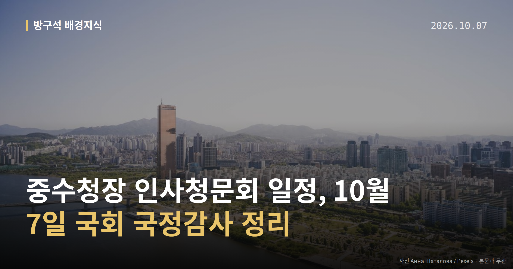
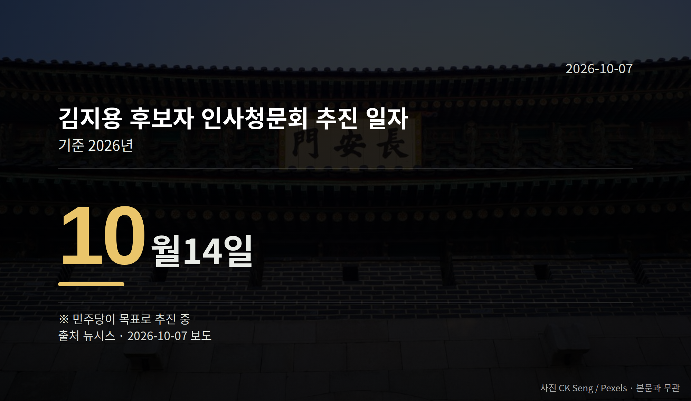

*이 글은 2026년 10월 7일 기준으로 정리한 내용입니다.*
**3줄 요약**

- 민주당, 김지용 중수청장 후보 청문회를 10월 14일 추진
- 인사청문요청안은 10월 2일 제출, 중수청은 청장 없이 출범
- 7일 행안위 전체회의의 청문계획서 채택 여부를 보면 됩니다
10월 7일 국회 행정안전위원회 전체회의에서 인사청문계획서가 채택되면, 중수청장 인사청문회 일정은 10월 14일로 굳어집니다. 더불어민주당이 김지용 초대 중대범죄수사청(중수청)장 후보자를 두고 잡은 날짜입니다.

중수청은 청장 자리가 빈 채 10월 2일 출범해 있습니다.

[이미지: 국회 상임위원회 회의장 전경 사진]

## 중수청장 인사청문회 일정, 어디까지 왔나

중수청은 검찰의 수사권과 기소권을 나누는 과정에서 만들어진 수사기관입니다. 인사청문회는 국회가 고위공직 후보자를 불러 자격을 따져 묻는 절차입니다.

김 후보자는 윤호중 행정안전부 장관의 제청(장관이 대통령에게 임명을 요청하는 절차)을 거쳐 이재명 대통령이 지명했습니다. 요청안은 대통령 재가를 거쳐 국회로 넘어왔습니다.

| 절차 | 날짜 |
|---|---|
| 인사청문요청안 국회 제출 | 10월 2일 |
| 인사청문회 추진 일자 | 10월 14일 |

(자료: 뉴시스. 14일은 민주당이 목표로 추진하는 날짜입니다.)

## '밀정' 비판과 반박, 양쪽 말 그대로

윤호중 장관은 10월 6일 행안위 국정감사에서 김 후보자를 향한 '밀정' 비판에 "그랬다면 제청 안 했을 것"이라고 반박했습니다. 중수청이 정권 입맛에 맞는 수사기관이 되는 것 아니냐는 박상웅 국민의힘 의원 질의에는 "추호도 그런 생각이 없다"고 답했습니다.

다만 '밀정' 주장을 처음 제기한 당사자와 그 맥락은 이번 자료에서 확인되지 않았습니다.

반대 목소리는 여당 쪽에서도 나왔습니다. 민주당 김용민 의원은 SNS에 "개혁하는 자리에 개혁의 대상이 들어가는 것은 옳지 않다"고 적었고, 조국혁신당 황현선 최고위원도 반대 의견을 냈습니다. 추미애 경기지사는 "등 뒤에서 다시 총알이 날아와"라고 비판했습니다.

이재명 대통령은 SNS에서 "검찰개혁을 빙자해 사심으로 인사와 구체적 수사공소 업무까지 좌지우지하려 해서는 안 될 것"이라고 밝혔고, 김민석 민주당 대표는 당 유튜브 채널에서 "당에서 조금 제어를 할 때도 됐다"고 말했습니다.

## 중수청장 인사청문회 일정에서 볼 지점

윤 장관은 수사·기소권 분리를 위해 중수청을 행안부 산하에 뒀다고 설명하면서, 공수처(고위공직자범죄수사처)와 업무가 겹치면 공수처가 수사 우선권을 갖는다고 밝혔습니다.

같은 날 오전 임은정 광주지방중대범죄수사청장은 중수청 출범 준비가 미흡하다고 공개 지적했고, 윤 장관은 "다 정확하게 사실은 아닌 것 같다"고 답했습니다.

청장 공석과 조직 준비 문제는 중수청장 인사청문회 일정 전까지 남은 쟁점입니다.

[이미지: 수사기관 사무실의 서류와 법봉 사진]

## 그 밖의 오늘 소식

- 법사위 국감서 조희대 대법원장 이석 두고 여야 충돌
- 조 대법원장, 삼권분립 이유로 증인선서·증언 거부
- 7일 교육위·국방위 등 10개 상임위 국감 이틀째

**그래서 나는?**

- 검찰개혁 흐름을 보는 유권자라면, 7일 행안위 전체회의 결과를 확인해 보세요
- 중수청이 낯선 분이라면, 14일 청문회에서 역할과 권한을 짚어볼 수 있습니다
- 국감을 챙기는 직장인이라면, 7일 10개 상임위 중계 일정을 참고해 보세요

**직접 센 숫자 — 국회·여론조사 (최근 7일)**

국회의원 발의 법률안 **146건**. 최근 발의: 병역법 일부개정법률안(주호영의원 등 10인)

본회의 처리 법률안 **65건** — 철회 1건 · 원안가결 47건 · 수정가결 16건 · 부결 1건

이번 주 등록된 선거 여론조사 10건

- 전국 정기(정례)조사 정당지지도 대통령선거 — 조원씨앤아이 · 스트레이트뉴스 의뢰 · 2026-10-03~05 · 2,000명 · 무선 ARS · 응답률 4.1% · 95% 신뢰수준에 ±2.2%p
- 전국 정기(정례)조사 정당지지도 — 여론조사공정(주) · 펜앤마이크 의뢰 · 2026-10-04~05 · 1,002명 · 무선 ARS · 응답률 3.1% · 95% 신뢰수준에 ±3.1%p
- 전국 전체 정기(정례)조사정당지지도대통령선거 — (주)여론조사꽃 · 2026-10-02~03 · 1,003명 · 무선전화면접 · 응답률 9.7% · 95% 신뢰수준에 ±3.1%p

*열린국회정보·중앙선거여론조사심의위원회 자료를 직접 셌습니다. 여론조사의 자세한 사항은 중앙선거여론조사심의위원회 홈페이지를 참조하세요.*
**여러분은 새로 생긴 수사기관의 첫 책임자에게 무엇을 가장 먼저 묻고 싶으신가요?**

---

### 참고한 기사

1. **與 "조희대, 국가원수 맞먹으면 안돼"·野 "대통령 대법관쇼핑"(종합2보)**
   - [연합뉴스·정치](https://www.yna.co.kr/view/AKR20261006075452001)
   - [뉴시스·정치](https://www.newsis.com/view/NISX20261006_0003816106)
2. **윤호중, 김지용 '밀정' 비판 일축…"그랬다면 제청 안 했을 것"(종합2보)**
   - [뉴시스·정치](https://www.newsis.com/view/NISX20261006_0003816387)
   - [연합뉴스·정치](https://www.yna.co.kr/view/AKR20261006098752530)
3. **폴리뉴스 모닝브리핑 10월 7일 화요일**
   - [폴리뉴스 Polinews](https://news.google.com/rss/articles/CBMibkFVX3lxTE9WNGJ5aHJUWDNmVW1oRzBSNkRhWWRYUWt5bjB6VVlPQ2VYUHF3dXZ6d2xBZ0JVc3JNelBRQmlHUlFvMVd3RHFVbHY0WHRKdjFTZnRJbjFiR0VBU0QzcC14cmxGQmV3dGh5aUEzZ1pB?oc=5)
   - [일요서울i](https://news.google.com/rss/articles/CBMib0FVX3lxTE90SDdHMlJZNmZYMmRGSkRPbjZSQmZPWXBNRExvV3Zhcl9HMk1LSFhwSFhQa1dqNmtqU0g2eUswNmdJZVYzYWxSRjBLRjJtVE5GYXBiQnBRdW5OcU5fNkdTYnkxNjZLZUI5dDR5YVo4bw?oc=5)
4. **與, 김지용 청문회 14일 개최 추진…강경파 제어 나선 김민석**
   - [뉴시스·정치](https://www.newsis.com/view/NISX20261006_0003816220)
5. **10개 상임위 국감 격돌…DMZ 지뢰·선관위·집값·‘암살자(들)’ 정조준**
   - [독립신문](https://news.google.com/rss/articles/CBMia0FVX3lxTE93dV9oSVBFQTNLQjRlNzdRTEdJWkNOTWhSMFE3T2k1c05EMFM1S0U3QTBLS2FuUzJTd3NEaTlTMEZVNEhpLW1ya0MzN3lwaUdkMkpFemhnbU9raUtXZ0RwRHJoeENDel9PQlZF?oc=5)
   - [뉴시안](https://news.google.com/rss/articles/CBMia0FVX3lxTFAtdzZkMXVsS09rdnZPaUtrVzdlcFBTYnBWUlRyVU1VU09MUFFkT28ySU1qaldtTlU3X0lKNUhGX2FJR3BZWG90Y1NaMVd4cmRnSXY4TXJObndvbjJFUUhESjdmbmJwTXhqNVk00gFuQVVfeXFMTWl4eHZOUTQySmE3R1JWVXk5NGNfREUySlpybnN2VGUxRWZyYjAzUzI3VDY5Nnk2ZWRfSHBiQmF4bV9uUDNpUFV6RTltUXNoQjBpakF3OTRDOUhVS3VWNEpoS3I0Umw4QXlXc1FRMHc?oc=5)

---

*본 글은 공개된 언론 보도를 정리한 것이며, 특정 정당·후보·인물을 지지하거나 반대하지 않습니다. 인용한 여론조사의 자세한 사항은 중앙선거여론조사심의위원회 홈페이지를 참조하세요.*
