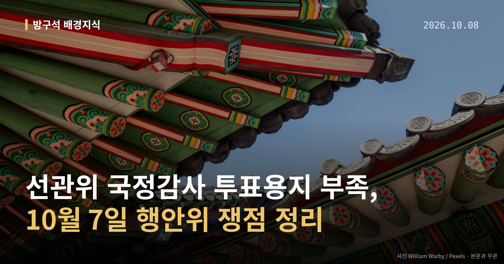
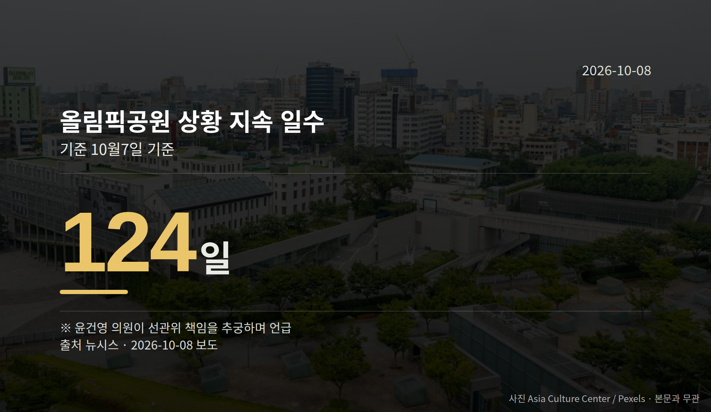

*이 글은 2026년 10월 8일 기준으로 정리한 내용입니다.*
**3줄 요약**

- 7일 행안위 선관위 국정감사에서 투표용지 부족이 쟁점이 됐습니다
- 올림픽공원 상황 124일째, 선거관리규칙 개정은 10월 2일자입니다
- 선관위원장 공석 해소를 위한 여야 추가 논의가 남았습니다
7일 국회 행정안전위원회에서 **선관위 국정감사**가 열렸습니다. 투표용지 부족 사태와 올림픽공원 상황을 두고 여야가 함께 선관위를 질타했고, 선관위원장 공석 문제에서는 이견이 갈렸습니다.

국정감사(국회가 정부 기관의 일을 따져 묻는 절차)는 이날 선관위와 인사혁신처, 소방청을 대상으로 진행됐습니다.

[이미지: 국회 상임위원회 회의장 전경]

## 선관위 국정감사에서 무슨 말이 나왔나

윤건영 더불어민주당 의원은 올림픽공원 상황이 124일째 이어지고 있다며 선관위 책임을 추궁했습니다. 이에 강동완 선관위 사무총장 직무대행은 "저희들이 직접 요청하지 않았다. 특검 쪽에서 협조를 구했다"고 답했습니다.

양부남 민주당 의원은 중앙 선거관리규칙 제71조의2가 10월 2일 개정된 점을 들어, 투표용지 인쇄 매수 기준을 바꾼 절차를 문제 삼았습니다.

박상웅 국민의힘 의원은 6·3 지방선거 당시 선관위 업무 혼란을 두고 "대한민국 민주주의가 전 세계의 웃음거리로 전락했다"고 말했습니다. 여야 모두 선관위를 상대로 질의를 쏟아낸 셈입니다.

## 숫자로 본 두 가지 쟁점

이번 **선관위 국정감사**에서 반복해 언급된 수치는 두 개입니다.

| 항목 | 내용 |
| --- | --- |
| 올림픽공원 상황 지속 일수 | 124일 (10월 7일 기준) |
| 선거관리규칙 제71조의2 개정일 | 2026년 10월 2일 |

앞의 일수는 윤건영 의원이 책임을 묻는 근거로 든 수치이고, 뒤의 날짜는 양부남 의원이 절차를 문제 삼은 근거입니다. 둘 다 의원들의 질의 과정에서 제시된 내용입니다.

## 선관위원장 공석, 여야는 어디서 갈렸나

투표용지 문제에서는 양측이 함께 질타했지만, 선관위원장 공석을 어떻게 풀지에서는 여야가 합의에 이르지 못했습니다. 다만 각 당이 구체적으로 어떤 안을 제시했는지는 공개된 자료에 담기지 않았습니다.

정리하면 책임 소재, 재검표 협조를 누가 요청했는지, 규칙 개정 절차가 국정조사특위 전후로 어떻게 달라졌는지가 이날의 축이었습니다. 공석 문제는 결론 없이 남았고, 여야 추가 논의 여부가 다음 관전 포인트입니다.

[이미지: 투표용지와 투표함이 놓인 투표소 모습]

## 그 밖의 오늘 소식

- 8일 법무부 국감, 검찰 폐지·공소취소 놓고 여야 격돌 예고
- 김태규 의원 '부엉이 바위' 발언에 서영교 위원장이 발언권 정지
- 야당은 김현지 제1부속실장 국감 출석 요구, 여당은 부정적

김태규 의원 발언을 두고 7일 국민의힘 법사위원들은 소통관에서 발언권 정지에 항의하는 기자회견을 열었습니다. 민주당 법사위원들은 성명을 내고 당직 박탈과 윤리특위 구성 협조를 요구했습니다.

양측 모두 공개 입장을 냈고, 국민의힘이 민주당의 요구에 어떻게 답할지는 아직 확인되지 않았습니다.

**그래서 나는?**

- 이번 선거 유권자라면, 투표용지 인쇄 기준이 어떻게 바뀌는지 확인해 보세요
- 국감 일정을 챘기는 분이라면, 8일 법무부 국정감사 쟁점을 보시면 됩니다
- 절차에 관심 있는 분이라면, 선관위원장 공석 해소 논의 진행을 지켜보세요

**직접 센 숫자 — 국회·여론조사 (최근 7일)**

국회의원 발의 법률안 **119건**. 최근 발의: 생활화학제품 및 살생물제의 안전관리에 관한 법률 일부개정법률안(윤재옥의원 등 12인)

본회의 처리 법률안 **66건** — 철회 2건 · 원안가결 47건 · 수정가결 16건 · 부결 1건

이번 주 등록된 선거 여론조사 10건

- 전국 정기(정례)조사 대통령선거 정당지지도 국정현안 등 — (주)코리아정보리서치 · 천지일보 의뢰 · 2026-10-05~06 · 1,003명 · 무선 ARS · 응답률 4.3% · 95% 신뢰수준에 ±3.1%p
- 전국 정기(정례)조사 정당지지도 — 미디어토마토 · 뉴스토마토 의뢰 · 2026-10-05~06 · 1,033명 · 무선 ARS · 응답률 2.3% · 95% 신뢰수준에 ±3.0%p
- 전남광주통합특별시 전체 정당지지도 — 한길리서치 · 뉴시스 전남광주 취재본부/무등일보/광주MBC 의뢰 · 2026-10-03~05 · 1,001명 · 무선 ARS · 응답률 0.5% · 95% 신뢰수준에 ±3.1%p

*열린국회정보·중앙선거여론조사심의위원회 자료를 직접 셌습니다. 여론조사의 자세한 사항은 중앙선거여론조사심의위원회 홈페이지를 참조하세요.*
**여러분은 투표소에서 용지가 모자란 상황을 겪어 보신 적이 있으신가요?**

---

### 참고한 기사

1. **행안위 국감서 선관위 질타에 입 모은 여야, 선관위원장 공석 두고는 이견**
   - [한국일보](https://news.google.com/rss/articles/CBMic0FVX3lxTE9LQnh2SGJ1ZjBDLVhtRHFJVlF2RmwtbkF0YlhzdFRIZ2FscDZRclFicUF3OFN4MHBxb0tYRWtfbHRPdVVBemhkZlh4SlBXOVV2RDZfdnR6SFBMWExuQ3JGblF2RWF1X0VscDRhZzU5WUlqMTjSAXNBVV95cUxPS0J4dkhidWYwQy1YbURxSVZRdkZsLW5BdGJYc3RUSGdhbHA2UXJRYnFBdzhTeDBwcW9LWEVrX2x0T3VVQXpoZGZYeEpQVzlVdkQ2X3Z0ekhQTFhMbkNyRm5RdkVhdV9FbHA0YWc1OVlJajE4?oc=5)
   - [뉴시스·정치](https://www.newsis.com/view/NISX20261007_0003817871)
2. **행정안전부(10월8일 목요일)**
   - [뉴시스·정치](https://www.newsis.com/view/NISX20261007_0003818061)
   - [뉴스핌](https://news.google.com/rss/articles/CBMiXEFVX3lxTE9xcFVXdUQxazdRdF8yT0xUU2RLZzJyZnZLZXJ5QUZTaFJJSlJGVzZua1ZEazJKd3c0bzdlUG4ybG16UGJFeVZ5NF95SmhvclBVMVZLVk1UY2dfWnRn?oc=5)
3. **野 김현지 국감 출석 공세에 與는 부정적…올해도 불출석하나**
   - [뉴시스·정치](https://www.newsis.com/view/NISX20261007_0003818013)
4. **오늘 법무부 국감…與野, 검찰 폐지·공소취소 등 놓고 격돌 예고**
   - [뉴시스·정치](https://www.newsis.com/view/NISX20261007_0003818023)
5. **與 법사위 의원들, 野 발언권 정지 항의에 "김태규 '부엉이 바위' 발언 사죄부터"**
   - [뉴시스·정치](https://www.newsis.com/view/NISX20261007_0003818024)

---

*본 글은 공개된 언론 보도를 정리한 것이며, 특정 정당·후보·인물을 지지하거나 반대하지 않습니다. 인용한 여론조사의 자세한 사항은 중앙선거여론조사심의위원회 홈페이지를 참조하세요.*
