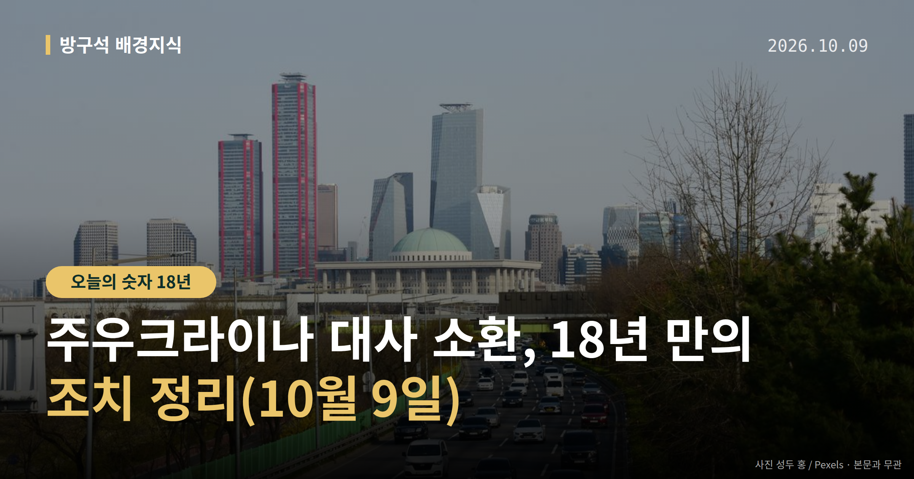
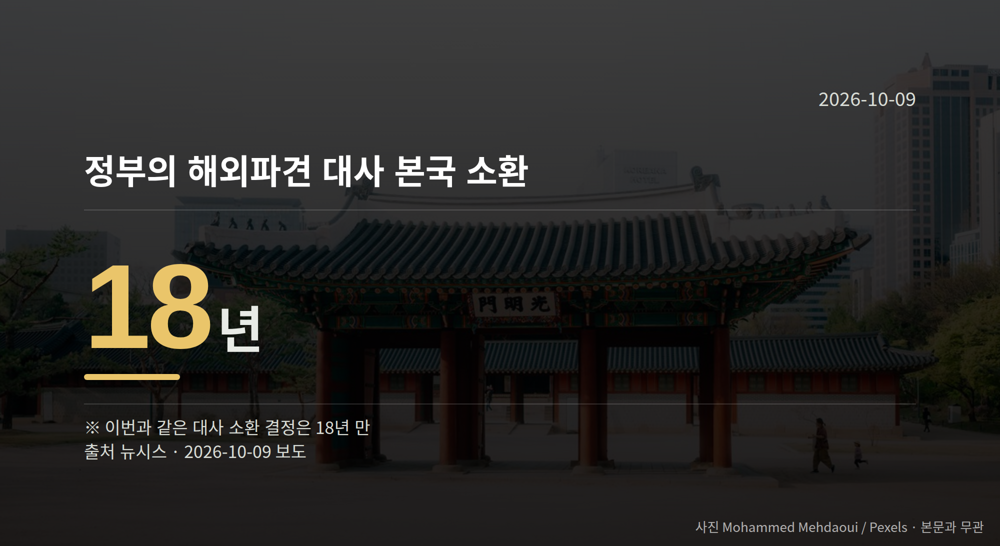

*이 글은 2026년 10월 9일 기준으로 정리한 내용입니다.*
**3줄 요약**

- 외교부가 8일 주우크라이나 대사 소환을 결정했다고 밝혔습니다.
- 정부가 해외 파견 대사를 불러들인 것은 18년 만입니다(뉴시스).
- 박기창 대사 귀국과 다음 주초 외교장관 대면보고를 보면 됩니다.
안녕하세요, 방구석 배경지식입니다. 8일 정부가 주우크라이나 대사 소환을 결정했습니다. 북한군 포로 송환 사실이 사전 협의 없이 공개된 데 따른 항의 조치입니다.

같은 날 국회에서는 법무부 국정감사를 둘러싼 여야 공방도 이어졌습니다.

[이미지: 외교부 청사 전경 사진]

## 주우크라이나 대사 소환, 무슨 일이 있었나

외교부는 8일 "정부는 주우크라이나 대사를 본국으로 소환하기로 결정했다"고 밝혔습니다.

이는 우크라이나 정부가 한국과 충분한 사전 협의 없이 북한군 포로 송환 사실을 공개하고, 비공개 합의를 부정하며 공개 사과도 거부한 데 따른 조치로 풀이됩니다.

앞서 외교부는 지난달 28일 주한우크라이나대사대리를 초치(상대국 공관 관계자를 외교부로 불러 항의 뜻을 전하는 절차)해 강력한 유감을 표명하고 사과를 요구한 바 있습니다.

우크라이나 측 입장도 나왔습니다. 우크라이나 외무부는 8일(현지시간) 한국 정부의 결정에도 한국과 건설적인 대화 재개에 열려 있다는 입장을 밝혔습니다.

다만 키이우 측의 공식 반응이 아직 없다는 보도와 위 입장 표명 보도가 함께 있습니다. 시점에 따라 반응이 달라 보일 수 있다는 점은 감안해서 보시면 좋겠습니다.

## 18년 만이라는 숫자는 어떤 뜻인가

정부가 해외에 파견한 대사를 본국으로 불러들인 것은 18년 만이라고 뉴시스는 전했습니다.

대사 소환은 초치보다 한 단계 높은 외교적 항의 조치로 분류됩니다. 보도에 따르면 다음 단계로 외교관 추방이나 공관 철수가 거론되지만, 외교부 내에서는 그 가능성이 낮다는 시각이 많다고 합니다.

즉 이번 결정은 항의 수준을 한 칸 올린 조치이고, 관계를 끊는 단계와는 거리가 있다는 뜻으로 읽힙니다.

## 주우크라이나 대사 소환 이후 일정은

박기창 주우크라이나 대사는 이르면 이번 주말께 귀국할 계획입니다. 다음 주초 조현 외교부 장관에게 우크라이나 측 입장과 현지 동향, 대응 방안을 대면보고한다는 일정입니다.

현지 상황에 따라 이 일정이 지연될 가능성도 함께 전해졌습니다. 주우크라이나 대사 소환 이후 정부가 추가 협의에 나설지가 다음 관전 포인트입니다.

[이미지: 국회 상임위 국정감사 회의장 모습 사진]

## 그 밖의 오늘 소식

- 이진수 법무부 장관 직무대행, 대행 기간 공소취소 지휘 안 한다고 밝힘
- 이 대행, 이화영 전 경기 평화부지사 가석방 신청 사실 없다고 답변
- 법사위·재경위 국정감사에서 여야 간사 항의와 피켓시위 이어짐

**그래서 나는?**

- 뉴스 흐름을 챙기는 유권자라면, 다음 주초 외교장관 대면보고 내용을 확인해 보세요
- 해외 파견·교민 소식에 관심 있다면, 한-우크라이나 협의 일정이 달라질 수 있습니다
- 국정감사를 지켜보는 분이라면, 법사위·재경위 남은 감사 일정을 확인해 보세요

**직접 센 숫자 — 국회·여론조사 (최근 7일)**

국회의원 발의 법률안 **110건**. 최근 발의: 지능형 로봇 개발 및 보급 촉진법 전부개정법률안(백혜련의원 등 10인)

본회의 처리 법률안 **3건** — 철회 3건

이번 주 등록된 선거 여론조사 8건

- 전국 정기(정례)조사 대통령선거 정당지지도 국정현안 등 — (주)코리아정보리서치 · 천지일보 의뢰 · 2026-10-05~06 · 1,003명 · 무선 ARS · 응답률 4.3% · 95% 신뢰수준에 ±3.1%p
- 전국 정기(정례)조사 정당지지도 — 미디어토마토 · 뉴스토마토 의뢰 · 2026-10-05~06 · 1,033명 · 무선 ARS · 응답률 2.3% · 95% 신뢰수준에 ±3.0%p
- 전남광주통합특별시 전체 정당지지도 — 한길리서치 · 뉴시스 전남광주 취재본부/무등일보/광주MBC 의뢰 · 2026-10-03~05 · 1,001명 · 무선 ARS · 응답률 0.5% · 95% 신뢰수준에 ±3.1%p

*열린국회정보·중앙선거여론조사심의위원회 자료를 직접 셌습니다. 여론조사의 자세한 사항은 중앙선거여론조사심의위원회 홈페이지를 참조하세요.*
**외교 갈등 소식을 들을 때 여러분은 어느 대목부터 궁금해지시나요, 사실관계일까요 아니면 다음 절차일까요?**

---

### 참고한 기사

1. **이진수 "공소취소 지휘 안해…이화영, 가석방 신청 안했다"(종합2보)**
   - [뉴시스·정치](https://www.newsis.com/view/NISX20261008_0003819979)
   - [연합뉴스·정치](https://www.yna.co.kr/view/AKR20261008124851004)
2. **"제2윤석열" "북동영" "개기고 있다"…국감 첫 주 논란의 말말말**
   - [뉴시스·정치](https://www.newsis.com/view/NISX20261008_0003819782)
3. **李정부 2년차 국감 초반 여야 충돌 심화…'발언권 정지' '피켓시위' '퇴장' 곳곳 파행**
   - [뉴시스·정치](https://www.newsis.com/view/NISX20261008_0003819821)
4. **법사위 법무부 국감 충돌…與 "檢 조작기소 인정하라" 野 "공소취소하면 이적행위"(종합)**
   - [뉴시스·정치](https://www.newsis.com/view/NISX20261008_0003819780)
5. **외교부, 주우크라이나 대사 소환**
   - [조선일보·정치](https://www.chosun.com/politics/diplomacy-defense/2026/10/09/UY6HWNQBPJASHOFXJF6AS6WCM4)
   - [OBC 뉴스](https://news.google.com/rss/articles/CBMiakFVX3lxTE9wdzRrOTNKa1ZVQnZzelJ2djJyal92STg0UUNVYjJtQkRObFZNUFg0djhSN0JiSS1TNm92NUNxWTltd2VWSEt5Z3FkQzVYSEp4TVZ2dExvcGNNWjNMWG9naVMwOGstbDR2X2c?oc=5)

---

*본 글은 공개된 언론 보도를 정리한 것이며, 특정 정당·후보·인물을 지지하거나 반대하지 않습니다. 인용한 여론조사의 자세한 사항은 중앙선거여론조사심의위원회 홈페이지를 참조하세요.*
