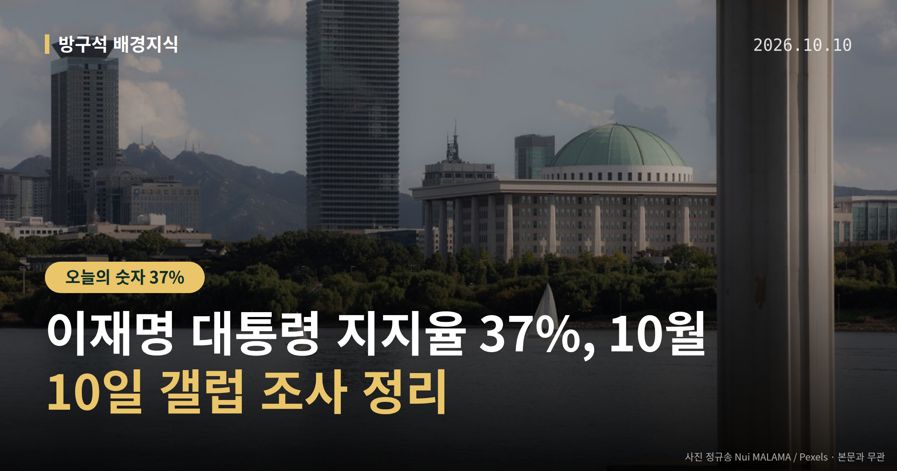
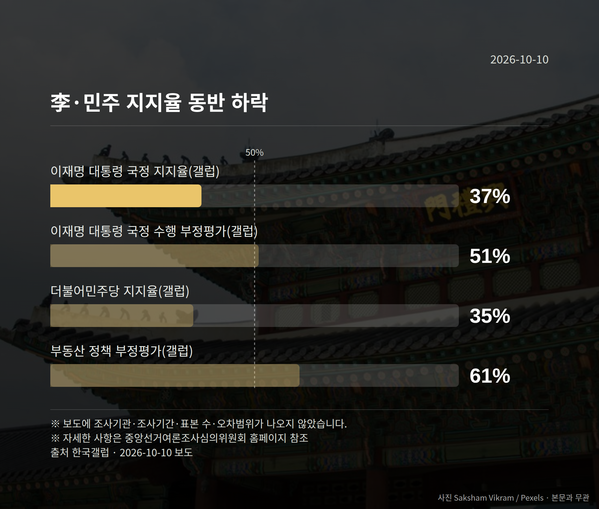

*이 글은 2026년 10월 10일 기준으로 정리한 내용입니다.*
**3줄 요약**

- 갤럽 조사서 이재명 대통령 지지율 37%, 부정평가 51% 보도
- 민주당 35%·부동산 정책 부정평가 61%, 출범 후 최저 표현 등장
- 조사기간·오차범위 미표기, 매체별 하락 표현도 엇갈려 확인 필요
> ① 갤럽 조사서 이재명 대통령 지지율 37%, 부정평가 51% 보도
> ② 민주당 35%·부동산 정책 부정평가 61%, 출범 후 최저 표현 등장
> ③ 조사기간·오차범위 미표기, 매체별 하락 표현도 엇갈려 확인 필요

한국갤럽 조사 결과로 이재명 대통령 지지율이 37%라는 수치가 여러 매체에 보도됐습니다. 더불어민주당 지지율은 35%로, 정부 출범 이후 최저치라는 표현이 함께 나왔습니다.

다만 조사기간과 오차범위가 기사에 적혀 있지 않습니다. 그래서 숫자를 읽을 때 전제도 같이 봐야 합니다.

## 이재명 대통령 지지율 37%, 숫자부터 보겠습니다

오늘 보도된 한국갤럽 수치를 한 표로 모았습니다.

| 항목 | 수치 |
| --- | --- |
| 대통령 국정 수행 긍정평가 | 37% |
| 대통령 국정 수행 부정평가 | 51% |
| 더불어민주당 지지율 | 35% |
| 부동산 정책 부정평가 | 61% |

이 가운데 민주당 수치에 대해 '정부 출범 이후 최저치'라는 표현이 붙어 보도됐습니다. 부동산 정책 항목은 네 수치 중 부정평가가 가장 높게 나온 분야입니다.

## 이 수치, 어디까지 말할 수 있을까요

여론조사 기사에는 보통 조사기간과 오차범위(표본을 뽑아 조사할 때 생기는 통계적 오차의 범위)가 함께 적힙니다. 이번 보도에서는 두 항목이 확인되지 않았습니다.

그래서 앞서 본 수치들이 이전 조사와 비교해 통계적으로 의미 있는 차이인지는 자료만으로는 판단할 수 없습니다.

표현도 엇갈립니다. 한겨레는 대통령 부정평가가 5%p 하락했다고 보도했고, 다른 매체들은 부정평가가 51%라는 수치만 제시했습니다. 어떤 지표가 실제로 내려갔는지는 추가 확인이 필요한 대목입니다.

[이미지: 여론조사 설문지와 계산기가 놓인 책상 사진]

## 이재명 대통령 지지율 보도와 같은 날 나온 발언

이 대통령은 10월 9일 자신의 X(옛 트위터)에 "순수한 급진성도 문제겠지만, 능력도 안 되면서 큰 자리를 요구하고 인사나 국가 정책까지 자기 뜻대로 하려다가 잘 안 되니 대의명분 삼아 급진 개혁을 내세우며 내부 공격하는 것이 더 문제"라고 적었습니다.

언론은 이를 김지용 중대범죄수사청(중수청)장 후보자 지명에 반발하는 범여권 강경파를 겨냥한 것으로 풀이했습니다. 다만 대통령이 특정 인물을 직접 지목하지는 않았습니다.

청와대에서는 "당과 상관없이 개인 정치를 해온 인사들에게 직격탄을 날린 것"이라는 말이 나왔다고 보도됐습니다. 비판 대상으로 추정된 인사들의 반론이나 해명은 오늘 자료에서 확인되지 않았습니다.

[이미지: 국회 본청 전경 사진]

## 그 밖의 오늘 소식

- 국민의힘 조경태 의원, 봉하마을 노무현 전 대통령 묘소 참배
- 국감 증인 채택 두고 여야 충돌 보도, 세부 경위는 미확인
- 국민의힘, 장외집회 거리두고 원내투쟁 집중 방침 보도

**그래서 나는?**

- 여론조사를 참고하는 유권자라면, 조사기간과 오차범위 표기부터 확인해 보세요
- 부동산 정책에 관심 있다면, 부정평가 항목이 어떻게 바뀌는지 추이를 보면 됩니다
- 국정감사를 지켜보는 분이라면, 증인 채택 결과가 언제 확정되는지 보시면 됩니다

**직접 센 숫자 — 국회·여론조사 (최근 7일)**

국회의원 발의 법률안 **69건**. 최근 발의: 지능형 로봇 개발 및 보급 촉진법 전부개정법률안(백혜련의원 등 10인)

본회의 처리 법률안 **3건** — 철회 3건

이번 주 등록된 선거 여론조사 8건

- 전국 정기(정례)조사 정당지지도 — 한국갤럽조사연구소 · 한국갤럽 자체 조사 의뢰 · 2026-10-06~08 · 1,000명 · 무선전화면접 · 응답률 9.7% · 95% 신뢰수준에 ±3.1%p
- 전국 정기(정례)조사 대통령선거 정당지지도 국정현안 등 — (주)코리아정보리서치 · 천지일보 의뢰 · 2026-10-05~06 · 1,003명 · 무선 ARS · 응답률 4.3% · 95% 신뢰수준에 ±3.1%p
- 전국 정기(정례)조사 정당지지도 — 미디어토마토 · 뉴스토마토 의뢰 · 2026-10-05~06 · 1,033명 · 무선 ARS · 응답률 2.3% · 95% 신뢰수준에 ±3.0%p

*열린국회정보·중앙선거여론조사심의위원회 자료를 직접 셌습니다. 여론조사의 자세한 사항은 중앙선거여론조사심의위원회 홈페이지를 참조하세요.*
**여러분은 여론조사 기사를 볼 때 숫자보다 먼저 확인하는 항목이 있으신가요?**

---

### 참고한 기사

1. **민주 지지율 35%, 정부 출범 뒤 최저…이 대통령 부정평가 5%p↓ [갤럽]**
   - [한겨레](https://news.google.com/rss/articles/CBMidEFVX3lxTE1KTmFYUnczaGtvUW1HSS1qNjhZRjVhaDdHdlgtMWVzTWRVZGRnbkRqSUUxUFI2d3NfVUg1MDZ2dWUwWGZDSGJRSXBEaUk0SC03bUFpWjR3TWVVM2EtLTN5VWdqZjVqeUtZX0ZBSXpBZXN3YnBf?oc=5)
   - [신문고뉴스](https://news.google.com/rss/articles/CBMiR0FVX3lxTFBoYjVxVS0tb0RCUldTTEFfOWdVQ0xDLTJ0VVpxMFEzWi1uVHF6LXZpRlRuSnZfWGFjSzZaZ0lHREhaZXpZR25n?oc=5)
2. **조희대·김현지·김용범…국감 달군 여야의 증인 채택 충돌**
   - [뉴시스·정치](https://www.newsis.com/view/NISX20261008_0003819297)
3. **李대통령 “능력도 안 되면서 큰자리 요구…안 되니 급진개혁 내세워 내부 공격”**
   - [더 데일리가드](https://news.google.com/rss/articles/CBMicEFVX3lxTE5PUzgtWldJTVFFVTV3aTJnV1RKMExjX1VMUVdLZTRkS090YVdOTGVtNVhXTEQxbjAxWlUweG5fX1I0ZnZ5cVZUVGJ0ZFpZYWpnYkRrWjVWajVBa2pZVENwNG0zOTF2RXdNQnZUemRaMjE?oc=5)
   - [동아일보·정치](https://www.donga.com/news/Politics/article/all/20261009/134816636/2)
4. **조경태, 봉하마을서 노무현 묘역 참배…“부끄럽고 죄송”**
   - [스페셜타임스](https://news.google.com/rss/articles/CBMickFVX3lxTE11UklSSDhCNFpiRFl3Y294UUlpaktMQjI5RFotZW9lSEw1RWNoVDljOFVSZVVhMkpiY1diVWJpVjR4U3RTS0w5bWFqSDY3dUZLamZrZ0o1OG9WU3YyUlRhVW9ZcExUMHJ6TXBZaEh5NlBFdw?oc=5)
   - [천지일보](https://news.google.com/rss/articles/CBMiakFVX3lxTE42Z2FiamN6dFltS3JMa3dURXFqSUVUSzJtdjdVb2U3Y1dQcEVzZGtDbGxVTnBERU0xVm5Fb0R2Z2FnMGFFZmhfODVzc0tiX3VBaXNvN2xldzIyYTJoVWlmV2F1SEFRRVZvYVE?oc=5)
5. **국힘, 국감 계기 對與공세 강화…장외집회 거리두고 원내투쟁에 집중**
   - [뉴시스·정치](https://www.newsis.com/view/NISX20261008_0003819629)

---

*본 글은 공개된 언론 보도를 정리한 것이며, 특정 정당·후보·인물을 지지하거나 반대하지 않습니다. 인용한 여론조사의 자세한 사항은 중앙선거여론조사심의위원회 홈페이지를 참조하세요.*
